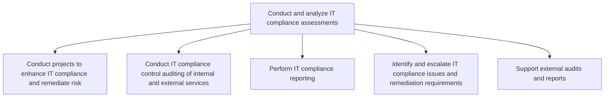
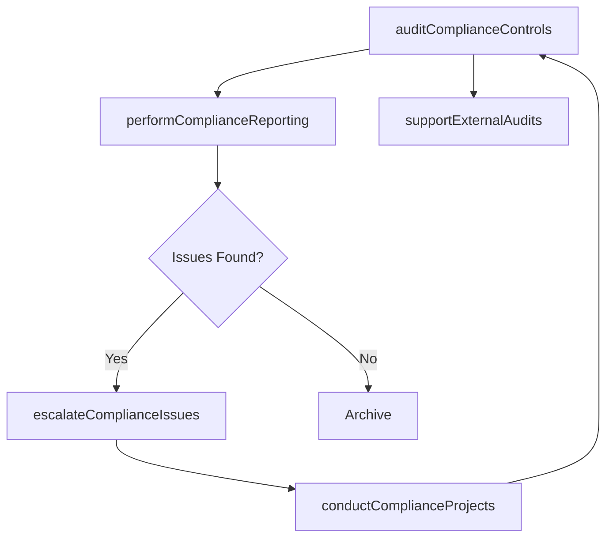

# Conduct and analyze IT compliance assessments

> Business-as-Code definition for IT compliance assessment and analysis. Models the process of conducting compliance audits, performing compliance reporting, escalating issues, and supporting external audit engagements.

## Overview

Evaluate and analyze the IT environment for the compliance of industry regulations and government legislation. Ensure that IT capability and resources meet the set standards.

## Process Hierarchy



## GraphDL

```yaml
conduct:
  object: And Analyze IT Compliance Assessments
  actor: ITComplianceAuditor
  result: ComplianceAssessmentReport
```

## Actions

| Action | Description |
|--------|-------------|
| conductComplianceProjects | Run projects to enhance IT compliance and remediate risk |
| auditComplianceControls | Conduct compliance control auditing of internal and external services |
| performComplianceReporting | Generate and distribute IT compliance reports |
| escalateComplianceIssues | Identify, escalate, and track IT compliance issues |
| supportExternalAudits | Provide documentation and evidence for external audit engagements |

## Events

| Event | Description |
|-------|-------------|
| complianceProjectsConducted | Compliance enhancement project completed |
| complianceControlsAudited | Compliance control audit findings reported |
| complianceReportingPerformed | IT compliance report generated and distributed |
| complianceIssuesEscalated | Compliance issues identified and escalated to management |
| externalAuditsSupported | External audit support materials provided |

## Searches

| Search | Description |
|--------|-------------|
| findComplianceFindings | List compliance audit findings by severity or regulation |
| getComplianceReports | Retrieve compliance reports by period or regulation |
| findOpenComplianceIssues | List unresolved compliance issues by priority |
| getAuditSchedule | Get upcoming internal and external audit schedule |

## Process Flow



## RACI Matrix

| Activity | Responsible | Accountable | Consulted | Informed |
|----------|-------------|-------------|-----------|----------|
| auditComplianceControls | ITComplianceAuditor | ITComplianceManager | ITOperations | CISO |
| performComplianceReporting | ITComplianceAnalyst | ITComplianceAuditor | Legal | CIO |
| escalateComplianceIssues | ITComplianceAuditor | CISO | Legal | CIO |
| supportExternalAudits | ITComplianceAuditor | ITComplianceManager | InternalAudit | Legal |

## Sub-Processes

| ID | Name | Description |
|----|------|-------------|
| 8.3.6.1 | Conduct projects to enhance IT compliance and remediate risk | Conducting projects in order to enhance set standards, established guidelines, and risk preventive m |
| 8.3.6.2 | Conduct IT compliance control auditing of internal and external services | Examine compliance control systems and tools implemented for internal and external IT services. |
| 8.3.6.3 | Perform IT compliance reporting | Execute IT compliance reporting in order to review processes, standards, regulations, and laws are f |
| 8.3.6.4 | Identify and escalate IT compliance issues and remediation requirements | Identify and escalate issues related to IT compliance to ensure that corrective measures are taken. |
| 8.3.6.5 | Support external audits and reports | Supporting audits and reports through external resources. This process requires the organization to  |

## Related Processes

| Process | Relationship |
|---------|-------------|
| 8.3.3 Control IT risk, compliance, and security | Upstream - compliance controls are the subject of assessment |
| 8.3.1 Develop IT compliance, risk, and security strategy | Upstream - strategy defines compliance scope |
| 11.0 Manage Business Risk | Parallel - IT compliance findings feed enterprise risk reporting |

## Related Departments

| Department | Role |
|-----------|------|
| IT Compliance | Primary owner of compliance assessment activities |
| Internal Audit | Provides independent assurance and methodology |
| Legal | Interprets regulatory requirements and obligations |
| IT Operations | Provides evidence and operational data for audits |

## Related Occupations

| Occupation | Involvement |
|-----------|-------------|
| IT Compliance Auditor | Leads compliance assessment and audit activities |
| IT Compliance Analyst | Supports reporting and issue tracking |
| Internal Auditor | Provides audit methodology and independent review |

## KPIs

| KPI | Description | Unit |
|-----|-------------|------|
| Audit Finding Resolution Rate | Percentage of audit findings remediated within SLA | % |
| Compliance Report Timeliness | Percentage of compliance reports delivered on schedule | % |
| External Audit Readiness | Preparedness score for external audits | Score (1-10) |
| Compliance Issue Backlog | Number of unresolved compliance issues | Count |

## Usage

```typescript
import { conductAndAnalyzeITComplianceAssessments } from '@headlessly/conduct-and-analyze-it-compliance-assessments'

const compliance = conductAndAnalyzeITComplianceAssessments()

// Audit compliance controls
const auditResults = await compliance.auditComplianceControls({
  scope: 'SOC2-Type-II',
  services: ['cloud-hosting', 'data-processing'],
  period: 'H2-2025'
})

// Perform compliance reporting
const report = await compliance.performComplianceReporting({
  regulations: ['SOC2', 'GDPR'],
  audience: 'board-audit-committee'
})
```
