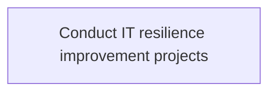
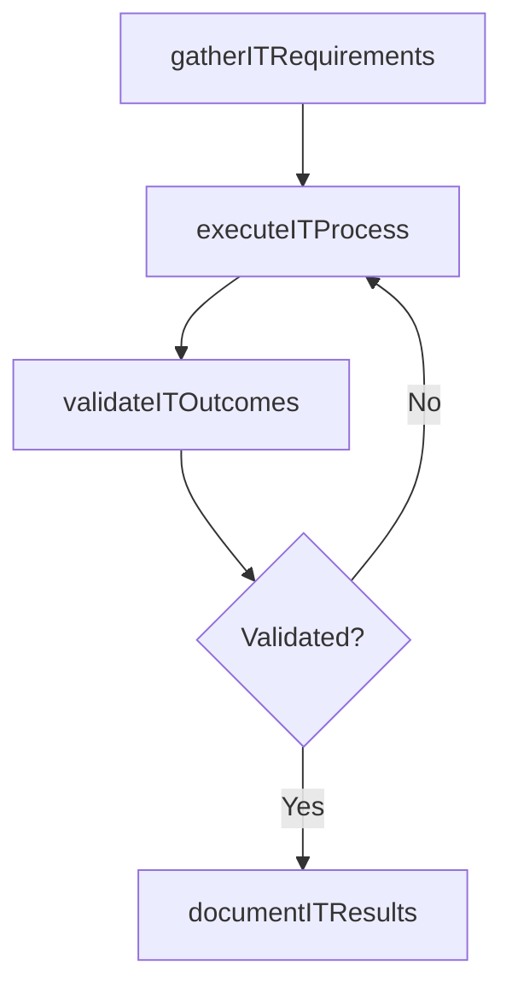

# Conduct IT resilience improvement projects

> Business-as-Code definition for conduct it resilience improvement projects. Models the process of conducting projects to improve the strategy and process for rapidly adapting to any threat in it.

## Overview

Conducting projects to improve the strategy and process for rapidly adapting to any threat in IT.

## Process Hierarchy



## GraphDL

```yaml
conduct:
  object: IT Resilience Improvement Projects
  actor: IdentityAccessManager
  result: ConductItResilienceImprovementProjects
```

## Actions

| Action | Description |
|--------|-------------|
| gatherITRequirements | Collect requirements and inputs for conduct it resilience improvement projects |
| executeITProcess | Perform the core activities of conduct it resilience improvement projects |
| validateITOutcomes | Verify that outcomes meet defined criteria and standards |
| documentITResults | Record findings and results for stakeholder review |

## Events

| Event | Description |
|-------|-------------|
| itRequirementsGathered | Requirements for conduct it resilience improvement projects collected |
| itProcessExecuted | Core activities of conduct it resilience improvement projects completed |
| itOutcomesValidated | Outcomes verified against defined criteria |
| itResultsDocumented | Results recorded and distributed to stakeholders |

## Searches

| Search | Description |
|--------|-------------|
| getITStatus | Retrieve current status of conduct it resilience improvement projects |
| findITRecords | List records related to conduct it resilience improvement projects by date or status |
| getITReport | Retrieve summary report for conduct it resilience improvement projects |

## Process Flow



## RACI Matrix

| Activity | Responsible | Accountable | Consulted | Informed |
|----------|-------------|-------------|-----------|----------|
| gatherITRequirements | IdentityAccessManager | ITRiskAnalyst | BusinessUnitLeaders | CIO |
| executeITProcess | IdentityAccessManager | ITRiskAnalyst | ITOperations | ITServiceManager |
| validateITOutcomes | IdentityAccessManager | ITRiskAnalyst | QualityAssurance | ITServiceManager |

## Related Processes

| Process | Relationship |
|---------|-------------|
| 8.3.7 Parent process | Parent - provides context and governance |
| 8.3.7.2 Sibling activity | Parallel - complementary activity in the same process |

## Related Departments

| Department | Role |
|-----------|------|
| IT Risk and Compliance | Manages risk assessment and compliance |
| IT Security | Implements security controls and monitoring |
| Legal | Advises on regulatory requirements |

## Related Occupations

| Occupation | Involvement |
|-----------|-------------|
| IT Risk Analyst | Assesses and monitors IT risks |
| IT Compliance Analyst | Evaluates regulatory compliance |

## KPIs

| KPI | Description | Unit |
|-----|-------------|------|
| Completion Rate | Percentage of conduct it resilience improvement projects activities completed on schedule | % |
| Quality Score | Quality assessment score for conduct it resilience improvement projects outputs | Score (1-10) |
| Cycle Time | Average time to complete conduct it resilience improvement projects | Days |

## Usage

```typescript
import { conductItResilienceImprovementProjects } from '@headlessly/conduct-it-resilience-improvement-projects'

const process = conductItResilienceImprovementProjects()

// Execute the core process
const result = await process.executeITProcess({
  scope: 'department',
  priority: 'high'
})

// Validate outcomes
const validation = await process.validateITOutcomes({
  criteria: 'standard',
  period: 'Q4-2025'
})
```
