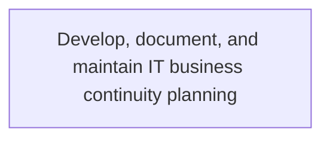
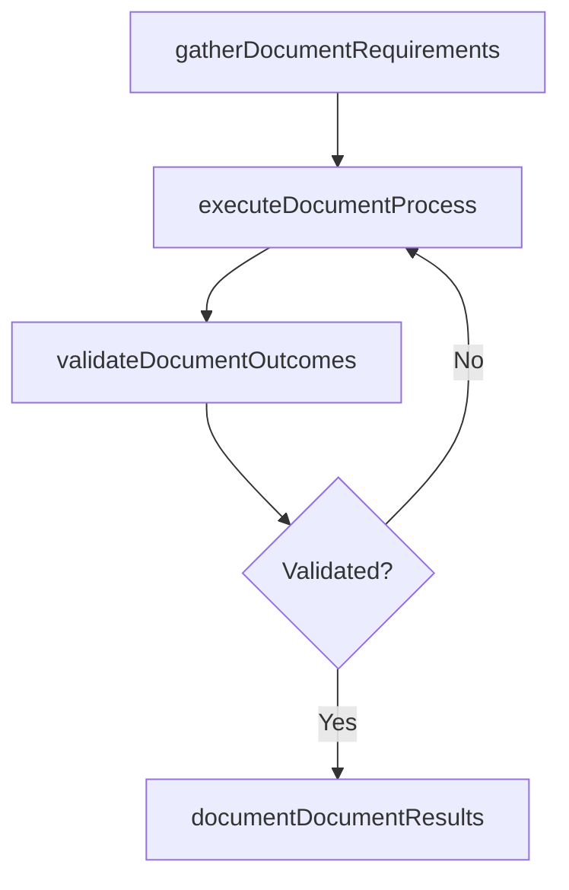

# Develop, document, and maintain IT business continuity planning

> Business-as-Code definition for develop, document, and maintain it business continuity planning. Models the process of develop, document, and maintain plans to ensure uninterrupted operations of critical it services. determine resources su.

## Overview

Develop, document, and maintain plans to ensure uninterrupted operations of critical IT services. Determine resources such as specialized personnel, equipment, support infrastructure, legal and financial aspects.

## Process Hierarchy



## GraphDL

```yaml
develop,:
  object: Document, And Maintain IT Business Continuity Planning
  actor: ITRiskAnalyst
  result: DevelopDocumentAndMaintainItBusinessContinuityPlanning
```

## Actions

| Action | Description |
|--------|-------------|
| gatherDocumentRequirements | Collect requirements and inputs for develop, document, and maintain it business continuity planning |
| executeDocumentProcess | Perform the core activities of develop, document, and maintain it business continuity planning |
| validateDocumentOutcomes | Verify that outcomes meet defined criteria and standards |
| documentDocumentResults | Record findings and results for stakeholder review |

## Events

| Event | Description |
|-------|-------------|
| documentRequirementsGathered | Requirements for develop, document, and maintain it business continuity planning collected |
| documentProcessExecuted | Core activities of develop, document, and maintain it business continuity planning completed |
| documentOutcomesValidated | Outcomes verified against defined criteria |
| documentResultsDocumented | Results recorded and distributed to stakeholders |

## Searches

| Search | Description |
|--------|-------------|
| getDocumentStatus | Retrieve current status of develop, document, and maintain it business continuity planning |
| findDocumentRecords | List records related to develop, document, and maintain it business continuity planning by date or status |
| getDocumentReport | Retrieve summary report for develop, document, and maintain it business continuity planning |

## Process Flow



## RACI Matrix

| Activity | Responsible | Accountable | Consulted | Informed |
|----------|-------------|-------------|-----------|----------|
| gatherDocumentRequirements | ITRiskAnalyst | ITComplianceAnalyst | BusinessUnitLeaders | CIO |
| executeDocumentProcess | ITRiskAnalyst | ITComplianceAnalyst | ITOperations | ITServiceManager |
| validateDocumentOutcomes | ITRiskAnalyst | ITComplianceAnalyst | QualityAssurance | ITServiceManager |

## Related Processes

| Process | Relationship |
|---------|-------------|
| 8.3.7 Parent process | Parent - provides context and governance |
| 8.3.7.3 Sibling activity | Parallel - complementary activity in the same process |

## Related Departments

| Department | Role |
|-----------|------|
| IT Risk and Compliance | Manages risk assessment and compliance |
| IT Security | Implements security controls and monitoring |
| Legal | Advises on regulatory requirements |

## Related Occupations

| Occupation | Involvement |
|-----------|-------------|
| IT Risk Analyst | Assesses and monitors IT risks |
| IT Compliance Analyst | Evaluates regulatory compliance |

## KPIs

| KPI | Description | Unit |
|-----|-------------|------|
| Completion Rate | Percentage of develop, document, and maintain it business continuity planning activities completed on schedule | % |
| Quality Score | Quality assessment score for develop, document, and maintain it business continuity planning outputs | Score (1-10) |
| Cycle Time | Average time to complete develop, document, and maintain it business continuity planning | Days |

## Usage

```typescript
import { developDocumentAndMaintainItBusinessContinuityPlanning } from '@headlessly/develop-document-and-maintain-it-business-continuity-planning'

const process = developDocumentAndMaintainItBusinessContinuityPlanning()

// Execute the core process
const result = await process.executeDocumentProcess({
  scope: 'department',
  priority: 'high'
})

// Validate outcomes
const validation = await process.validateDocumentOutcomes({
  criteria: 'standard',
  period: 'Q4-2025'
})
```
