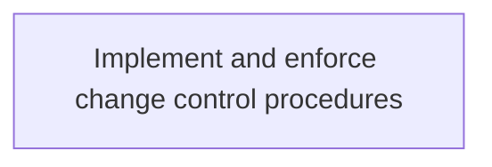
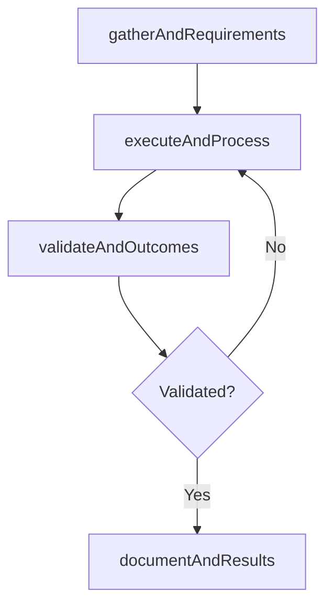

# Implement and enforce change control procedures

> Business-as-Code definition for implement and enforce change control procedures. Models the process of implement and enforce procedures and policies in order to control changes in it services and solutions. manage changes i.

## Overview

Implement and enforce procedures and policies in order to control changes in IT services and solutions. Manage changes in a rational and predictable manner for optimum resource utilization.

## Process Hierarchy



## GraphDL

```yaml
implement:
  object: And Enforce Change Control Procedures
  actor: ITRiskAnalyst
  result: ImplementAndEnforceChangeControlProcedures
```

## Actions

| Action | Description |
|--------|-------------|
| gatherAndRequirements | Collect requirements and inputs for implement and enforce change control procedures |
| executeAndProcess | Perform the core activities of implement and enforce change control procedures |
| validateAndOutcomes | Verify that outcomes meet defined criteria and standards |
| documentAndResults | Record findings and results for stakeholder review |

## Events

| Event | Description |
|-------|-------------|
| andRequirementsGathered | Requirements for implement and enforce change control procedures collected |
| andProcessExecuted | Core activities of implement and enforce change control procedures completed |
| andOutcomesValidated | Outcomes verified against defined criteria |
| andResultsDocumented | Results recorded and distributed to stakeholders |

## Searches

| Search | Description |
|--------|-------------|
| getAndStatus | Retrieve current status of implement and enforce change control procedures |
| findAndRecords | List records related to implement and enforce change control procedures by date or status |
| getAndReport | Retrieve summary report for implement and enforce change control procedures |

## Process Flow



## RACI Matrix

| Activity | Responsible | Accountable | Consulted | Informed |
|----------|-------------|-------------|-----------|----------|
| gatherAndRequirements | ITRiskAnalyst | ITComplianceAnalyst | BusinessUnitLeaders | CIO |
| executeAndProcess | ITRiskAnalyst | ITComplianceAnalyst | ITOperations | ITServiceManager |
| validateAndOutcomes | ITRiskAnalyst | ITComplianceAnalyst | QualityAssurance | ITServiceManager |

## Related Processes

| Process | Relationship |
|---------|-------------|
| 8.3.7 Parent process | Parent - provides context and governance |
| 8.3.7.4 Sibling activity | Parallel - complementary activity in the same process |

## Related Departments

| Department | Role |
|-----------|------|
| IT Risk and Compliance | Manages risk assessment and compliance |
| IT Security | Implements security controls and monitoring |
| Legal | Advises on regulatory requirements |

## Related Occupations

| Occupation | Involvement |
|-----------|-------------|
| IT Risk Analyst | Assesses and monitors IT risks |
| IT Compliance Analyst | Evaluates regulatory compliance |

## KPIs

| KPI | Description | Unit |
|-----|-------------|------|
| Completion Rate | Percentage of implement and enforce change control procedures activities completed on schedule | % |
| Quality Score | Quality assessment score for implement and enforce change control procedures outputs | Score (1-10) |
| Cycle Time | Average time to complete implement and enforce change control procedures | Days |

## Usage

```typescript
import { implementAndEnforceChangeControlProcedures } from '@headlessly/implement-and-enforce-change-control-procedures'

const process = implementAndEnforceChangeControlProcedures()

// Execute the core process
const result = await process.executeAndProcess({
  scope: 'department',
  priority: 'high'
})

// Validate outcomes
const validation = await process.validateAndOutcomes({
  criteria: 'standard',
  period: 'Q4-2025'
})
```
