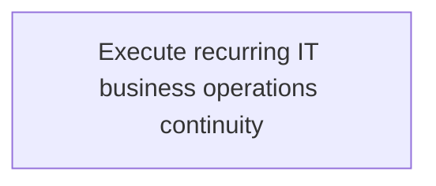
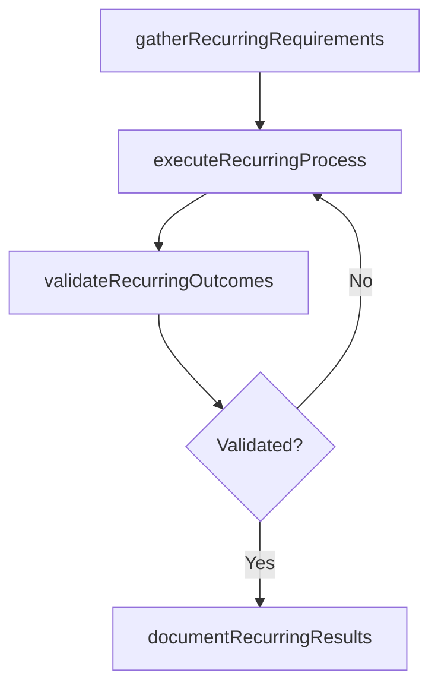

# Execute recurring IT business operations continuity

> Business-as-Code definition for execute recurring it business operations continuity. Models the process of implement regular resources supporting uninterrupted operations of critical it services.

## Overview

Implement regular resources supporting uninterrupted operations of critical IT services.

## Process Hierarchy



## GraphDL

```yaml
execute:
  object: Recurring IT Business Operations Continuity
  actor: ITComplianceAnalyst
  result: ExecuteRecurringItBusinessOperationsContinuity
```

## Actions

| Action | Description |
|--------|-------------|
| gatherRecurringRequirements | Collect requirements and inputs for execute recurring it business operations continuity |
| executeRecurringProcess | Perform the core activities of execute recurring it business operations continuity |
| validateRecurringOutcomes | Verify that outcomes meet defined criteria and standards |
| documentRecurringResults | Record findings and results for stakeholder review |

## Events

| Event | Description |
|-------|-------------|
| recurringRequirementsGathered | Requirements for execute recurring it business operations continuity collected |
| recurringProcessExecuted | Core activities of execute recurring it business operations continuity completed |
| recurringOutcomesValidated | Outcomes verified against defined criteria |
| recurringResultsDocumented | Results recorded and distributed to stakeholders |

## Searches

| Search | Description |
|--------|-------------|
| getRecurringStatus | Retrieve current status of execute recurring it business operations continuity |
| findRecurringRecords | List records related to execute recurring it business operations continuity by date or status |
| getRecurringReport | Retrieve summary report for execute recurring it business operations continuity |

## Process Flow



## RACI Matrix

| Activity | Responsible | Accountable | Consulted | Informed |
|----------|-------------|-------------|-----------|----------|
| gatherRecurringRequirements | ITComplianceAnalyst | ITSecurityManager | BusinessUnitLeaders | CIO |
| executeRecurringProcess | ITComplianceAnalyst | ITSecurityManager | ITOperations | ITServiceManager |
| validateRecurringOutcomes | ITComplianceAnalyst | ITSecurityManager | QualityAssurance | ITServiceManager |

## Related Processes

| Process | Relationship |
|---------|-------------|
| 8.3.7 Parent process | Parent - provides context and governance |
| 8.3.7.7 Sibling activity | Parallel - complementary activity in the same process |

## Related Departments

| Department | Role |
|-----------|------|
| IT Risk and Compliance | Manages risk assessment and compliance |
| IT Security | Implements security controls and monitoring |
| Legal | Advises on regulatory requirements |

## Related Occupations

| Occupation | Involvement |
|-----------|-------------|
| IT Risk Analyst | Assesses and monitors IT risks |
| IT Compliance Analyst | Evaluates regulatory compliance |

## KPIs

| KPI | Description | Unit |
|-----|-------------|------|
| Completion Rate | Percentage of execute recurring it business operations continuity activities completed on schedule | % |
| Quality Score | Quality assessment score for execute recurring it business operations continuity outputs | Score (1-10) |
| Cycle Time | Average time to complete execute recurring it business operations continuity | Days |

## Usage

```typescript
import { executeRecurringItBusinessOperationsContinuity } from '@headlessly/execute-recurring-it-business-operations-continuity'

const process = executeRecurringItBusinessOperationsContinuity()

// Execute the core process
const result = await process.executeRecurringProcess({
  scope: 'department',
  priority: 'high'
})

// Validate outcomes
const validation = await process.validateRecurringOutcomes({
  criteria: 'standard',
  period: 'Q4-2025'
})
```
