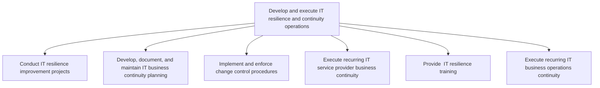
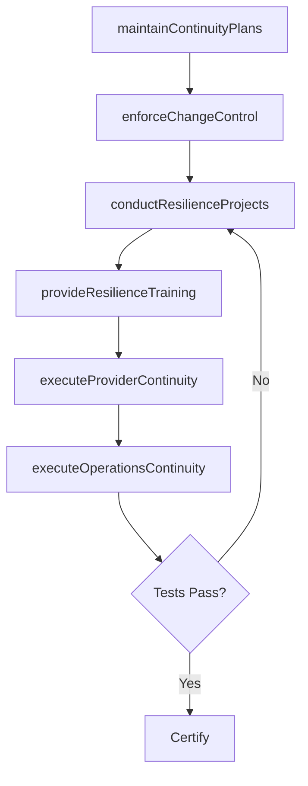

# Develop and execute IT resilience and continuity operations

> Business-as-Code definition for IT resilience and continuity operations. Models the process of conducting resilience improvement projects, maintaining business continuity plans, enforcing change control, executing recurring continuity testing, and providing resilience training.

## Overview

Create and execute a process to rapidly adapt and respond to any internal or external opportunity, demand, disruption, or threat in IT. Maintain continuous IT operations to protect employees, assets, and overall brand equity.

## Process Hierarchy



## GraphDL

```yaml
develop:
  object: And Execute IT Resilience And Continuity Operations
  actor: ITResilienceOperationsManager
  result: ResilienceOperationsReport
```

## Actions

| Action | Description |
|--------|-------------|
| conductResilienceProjects | Execute projects to improve IT resilience capabilities |
| maintainContinuityPlans | Develop, document, and update IT business continuity plans |
| enforceChangeControl | Implement and enforce change control procedures |
| executeProviderContinuity | Run recurring IT service provider continuity exercises |
| provideResilienceTraining | Deliver IT resilience training to staff and stakeholders |
| executeOperationsContinuity | Run recurring IT business operations continuity tests |

## Events

| Event | Description |
|-------|-------------|
| resilienceProjectsConducted | IT resilience improvement project completed |
| continuityPlansMaintained | IT business continuity plans updated and validated |
| changeControlEnforced | Change control procedures implemented and active |
| providerContinuityExecuted | IT service provider continuity test completed |
| resilienceTrainingProvided | IT resilience training program delivered |
| operationsContinuityExecuted | IT business operations continuity test completed |

## Searches

| Search | Description |
|--------|-------------|
| findResilienceProjects | List resilience improvement projects by status or priority |
| getContinuityPlans | Retrieve current IT business continuity plans |
| getChangeControlLog | Get change control procedure audit trail |
| getContinuityTestResults | Retrieve results from recent continuity tests |

## Process Flow



## RACI Matrix

| Activity | Responsible | Accountable | Consulted | Informed |
|----------|-------------|-------------|-----------|----------|
| conductResilienceProjects | ResilienceProjectManager | ITResilienceOperationsManager | ITOperations | CISO |
| maintainContinuityPlans | ITContinuityPlanner | ITResilienceOperationsManager | BusinessUnitLeaders | CIO |
| enforceChangeControl | ChangeManager | ITResilienceOperationsManager | ITOperations | ITServiceManager |
| provideResilienceTraining | ITTrainingCoordinator | ITResilienceOperationsManager | HumanResources | AllITStaff |

## Sub-Processes

| ID | Name | Description |
|----|------|-------------|
| 8.3.7.1 | Conduct IT resilience improvement projects | Conducting projects to improve the strategy and process for rapidly adapting to any threat in IT. |
| 8.3.7.2 | Develop, document, and maintain IT business continuity planning | Develop, document, and maintain plans to ensure uninterrupted operations of critical IT services. De |
| 8.3.7.3 | Implement and enforce change control procedures | Implement and enforce procedures and policies in order to control changes in IT services and solutio |
| 8.3.7.4 | Execute recurring IT service provider business continuity | Review and implement resources (including external parties) necessary to support uninterrupted opera |
| 8.3.7.5 | Provide  IT resilience training | Conduct and manage employee training programs on IT resilience so that prospective risks can be avoi |
| 8.3.7.6 | Execute recurring IT business operations continuity | Implement regular resources supporting uninterrupted operations of critical IT services. |

## Related Processes

| Process | Relationship |
|---------|-------------|
| 8.3.2 Develop IT resilience strategy | Upstream - resilience strategy drives operational execution |
| 8.3.4 Plan and manage IT continuity | Upstream - continuity plans are executed operationally |
| 8.6 Deploy services/solutions | Parallel - change control governs service deployments |

## Related Departments

| Department | Role |
|-----------|------|
| IT Resilience Operations | Primary owner of resilience execution and testing |
| IT Change Management | Enforces change control procedures |
| IT Training | Delivers resilience training programs |
| IT Operations | Executes continuity tests and recovery procedures |

## Related Occupations

| Occupation | Involvement |
|-----------|-------------|
| IT Resilience Operations Manager | Leads resilience and continuity operations |
| Change Manager | Enforces change control procedures |
| IT Continuity Planner | Maintains and tests continuity plans |

## KPIs

| KPI | Description | Unit |
|-----|-------------|------|
| Continuity Test Pass Rate | Percentage of continuity tests meeting RTO/RPO targets | % |
| Change Success Rate | Percentage of changes deployed without incidents | % |
| Resilience Training Completion | Percentage of IT staff completing resilience training | % |
| Resilience Project Delivery Rate | Percentage of resilience projects completed on schedule | % |

## Usage

```typescript
import { developAndExecuteITResilienceAndContinuityOperations } from '@headlessly/develop-and-execute-it-resilience-and-continuity-operations'

const operations = developAndExecuteITResilienceAndContinuityOperations()

// Execute continuity test
const test = await operations.executeOperationsContinuity({
  systems: ['erp', 'email', 'payment-gateway'],
  testType: 'tabletop-exercise',
  participants: ['it-ops', 'business-leads']
})

// Provide resilience training
const training = await operations.provideResilienceTraining({
  audience: 'all-it-staff',
  modules: ['incident-response', 'disaster-recovery', 'change-management'],
  deliveryMethod: 'online'
})
```
