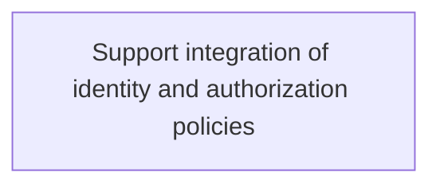
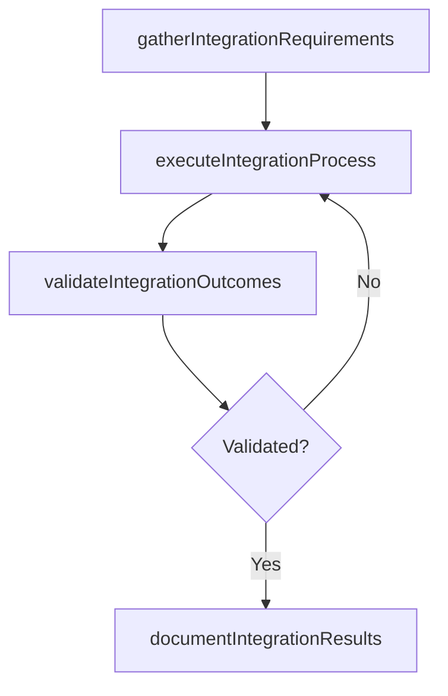

# Support integration of identity and authorization policies

> Business-as-Code definition for support integration of identity and authorization policies. Models the process of create and implement policies that integrate authorization policies with authorized profiles of users meant to access ne.

## Overview

Create and implement policies that integrate authorization policies with authorized profiles of users meant to access network resources.

## Process Hierarchy



## GraphDL

```yaml
support:
  object: Integration Of Identity And Authorization Policies
  actor: IdentityAccessManager
  result: SupportIntegrationOfIdentityAndAuthorizationPolicies
```

## Actions

| Action | Description |
|--------|-------------|
| gatherIntegrationRequirements | Collect requirements and inputs for support integration of identity and authorization policies |
| executeIntegrationProcess | Perform the core activities of support integration of identity and authorization policies |
| validateIntegrationOutcomes | Verify that outcomes meet defined criteria and standards |
| documentIntegrationResults | Record findings and results for stakeholder review |

## Events

| Event | Description |
|-------|-------------|
| integrationRequirementsGathered | Requirements for support integration of identity and authorization policies collected |
| integrationProcessExecuted | Core activities of support integration of identity and authorization policies completed |
| integrationOutcomesValidated | Outcomes verified against defined criteria |
| integrationResultsDocumented | Results recorded and distributed to stakeholders |

## Searches

| Search | Description |
|--------|-------------|
| getIntegrationStatus | Retrieve current status of support integration of identity and authorization policies |
| findIntegrationRecords | List records related to support integration of identity and authorization policies by date or status |
| getIntegrationReport | Retrieve summary report for support integration of identity and authorization policies |

## Process Flow



## RACI Matrix

| Activity | Responsible | Accountable | Consulted | Informed |
|----------|-------------|-------------|-----------|----------|
| gatherIntegrationRequirements | IdentityAccessManager | ITRiskAnalyst | BusinessUnitLeaders | CIO |
| executeIntegrationProcess | IdentityAccessManager | ITRiskAnalyst | ITOperations | ITServiceManager |
| validateIntegrationOutcomes | IdentityAccessManager | ITRiskAnalyst | QualityAssurance | ITServiceManager |

## Related Processes

| Process | Relationship |
|---------|-------------|
| 8.3.8 Parent process | Parent - provides context and governance |
| 8.3.8.2 Sibling activity | Parallel - complementary activity in the same process |

## Related Departments

| Department | Role |
|-----------|------|
| IT Risk and Compliance | Manages risk assessment and compliance |
| IT Security | Implements security controls and monitoring |
| Legal | Advises on regulatory requirements |

## Related Occupations

| Occupation | Involvement |
|-----------|-------------|
| IT Risk Analyst | Assesses and monitors IT risks |
| IT Compliance Analyst | Evaluates regulatory compliance |

## KPIs

| KPI | Description | Unit |
|-----|-------------|------|
| Completion Rate | Percentage of support integration of identity and authorization policies activities completed on schedule | % |
| Quality Score | Quality assessment score for support integration of identity and authorization policies outputs | Score (1-10) |
| Cycle Time | Average time to complete support integration of identity and authorization policies | Days |

## Usage

```typescript
import { supportIntegrationOfIdentityAndAuthorizationPolicies } from '@headlessly/support-integration-of-identity-and-authorization-policies'

const process = supportIntegrationOfIdentityAndAuthorizationPolicies()

// Execute the core process
const result = await process.executeIntegrationProcess({
  scope: 'department',
  priority: 'high'
})

// Validate outcomes
const validation = await process.validateIntegrationOutcomes({
  criteria: 'standard',
  period: 'Q4-2025'
})
```
