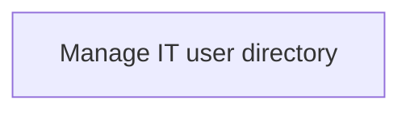
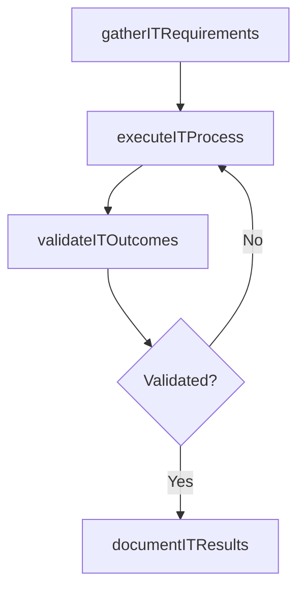

# Manage IT user directory

> Business-as-Code definition for manage it user directory. Models the process of managing directory of user profiles and access requirements across different levels in the organization's it network.

## Overview

Managing directory of user profiles and access requirements across different levels in the organization's IT network.

## Process Hierarchy



## GraphDL

```yaml
manage:
  object: IT User Directory
  actor: ITRiskAnalyst
  result: ManageItUserDirectory
```

## Actions

| Action | Description |
|--------|-------------|
| gatherITRequirements | Collect requirements and inputs for manage it user directory |
| executeITProcess | Perform the core activities of manage it user directory |
| validateITOutcomes | Verify that outcomes meet defined criteria and standards |
| documentITResults | Record findings and results for stakeholder review |

## Events

| Event | Description |
|-------|-------------|
| itRequirementsGathered | Requirements for manage it user directory collected |
| itProcessExecuted | Core activities of manage it user directory completed |
| itOutcomesValidated | Outcomes verified against defined criteria |
| itResultsDocumented | Results recorded and distributed to stakeholders |

## Searches

| Search | Description |
|--------|-------------|
| getITStatus | Retrieve current status of manage it user directory |
| findITRecords | List records related to manage it user directory by date or status |
| getITReport | Retrieve summary report for manage it user directory |

## Process Flow



## RACI Matrix

| Activity | Responsible | Accountable | Consulted | Informed |
|----------|-------------|-------------|-----------|----------|
| gatherITRequirements | ITRiskAnalyst | ITComplianceAnalyst | BusinessUnitLeaders | CIO |
| executeITProcess | ITRiskAnalyst | ITComplianceAnalyst | ITOperations | ITServiceManager |
| validateITOutcomes | ITRiskAnalyst | ITComplianceAnalyst | QualityAssurance | ITServiceManager |

## Related Processes

| Process | Relationship |
|---------|-------------|
| 8.3.8 Parent process | Parent - provides context and governance |
| 8.3.8.3 Sibling activity | Parallel - complementary activity in the same process |

## Related Departments

| Department | Role |
|-----------|------|
| IT Risk and Compliance | Manages risk assessment and compliance |
| IT Security | Implements security controls and monitoring |
| Legal | Advises on regulatory requirements |

## Related Occupations

| Occupation | Involvement |
|-----------|-------------|
| IT Risk Analyst | Assesses and monitors IT risks |
| IT Compliance Analyst | Evaluates regulatory compliance |

## KPIs

| KPI | Description | Unit |
|-----|-------------|------|
| Completion Rate | Percentage of manage it user directory activities completed on schedule | % |
| Quality Score | Quality assessment score for manage it user directory outputs | Score (1-10) |
| Cycle Time | Average time to complete manage it user directory | Days |

## Usage

```typescript
import { manageItUserDirectory } from '@headlessly/manage-it-user-directory'

const process = manageItUserDirectory()

// Execute the core process
const result = await process.executeITProcess({
  scope: 'department',
  priority: 'high'
})

// Validate outcomes
const validation = await process.validateITOutcomes({
  criteria: 'standard',
  period: 'Q4-2025'
})
```
