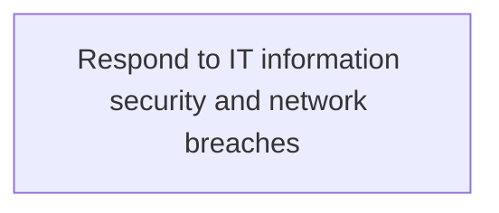
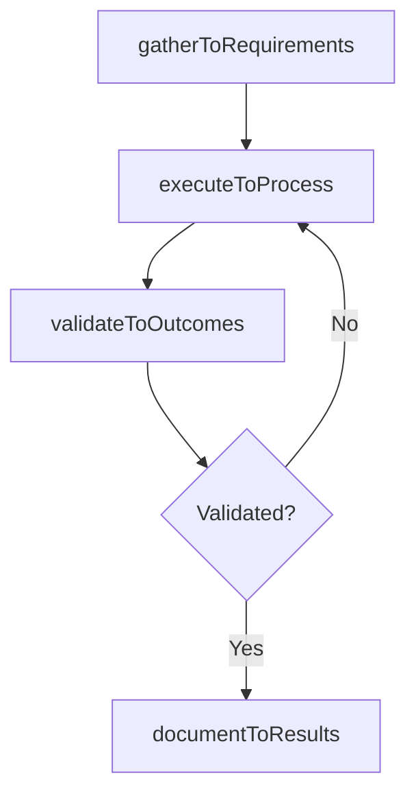

# Respond to IT information security and network breaches

> Business-as-Code definition for respond to it information security and network breaches. Models the process of address any form of unauthorized network breach such as unauthorized access or usage of data, applications, services, ne.

## Overview

Address any form of unauthorized network breach such as unauthorized access or usage of data, applications, services, networks, and/or devices. Identify the root cause and take corrective measures to resolve the breach.

## Process Hierarchy



## GraphDL

```yaml
respond:
  object: To IT Information Security And Network Breaches
  actor: ITRiskAnalyst
  result: RespondToItInformationSecurityAndNetworkBreaches
```

## Actions

| Action | Description |
|--------|-------------|
| gatherToRequirements | Collect requirements and inputs for respond to it information security and network breaches |
| executeToProcess | Perform the core activities of respond to it information security and network breaches |
| validateToOutcomes | Verify that outcomes meet defined criteria and standards |
| documentToResults | Record findings and results for stakeholder review |

## Events

| Event | Description |
|-------|-------------|
| toRequirementsGathered | Requirements for respond to it information security and network breaches collected |
| toProcessExecuted | Core activities of respond to it information security and network breaches completed |
| toOutcomesValidated | Outcomes verified against defined criteria |
| toResultsDocumented | Results recorded and distributed to stakeholders |

## Searches

| Search | Description |
|--------|-------------|
| getToStatus | Retrieve current status of respond to it information security and network breaches |
| findToRecords | List records related to respond to it information security and network breaches by date or status |
| getToReport | Retrieve summary report for respond to it information security and network breaches |

## Process Flow



## RACI Matrix

| Activity | Responsible | Accountable | Consulted | Informed |
|----------|-------------|-------------|-----------|----------|
| gatherToRequirements | ITRiskAnalyst | ITComplianceAnalyst | BusinessUnitLeaders | CIO |
| executeToProcess | ITRiskAnalyst | ITComplianceAnalyst | ITOperations | ITServiceManager |
| validateToOutcomes | ITRiskAnalyst | ITComplianceAnalyst | QualityAssurance | ITServiceManager |

## Related Processes

| Process | Relationship |
|---------|-------------|
| 8.3.8 Parent process | Parent - provides context and governance |
| 8.3.8.7 Sibling activity | Parallel - complementary activity in the same process |

## Related Departments

| Department | Role |
|-----------|------|
| IT Risk and Compliance | Manages risk assessment and compliance |
| IT Security | Implements security controls and monitoring |
| Legal | Advises on regulatory requirements |

## Related Occupations

| Occupation | Involvement |
|-----------|-------------|
| IT Risk Analyst | Assesses and monitors IT risks |
| IT Compliance Analyst | Evaluates regulatory compliance |

## KPIs

| KPI | Description | Unit |
|-----|-------------|------|
| Completion Rate | Percentage of respond to it information security and network breaches activities completed on schedule | % |
| Quality Score | Quality assessment score for respond to it information security and network breaches outputs | Score (1-10) |
| Cycle Time | Average time to complete respond to it information security and network breaches | Days |

## Usage

```typescript
import { respondToItInformationSecurityAndNetworkBreaches } from '@headlessly/respond-to-it-information-security-and-network-breaches'

const process = respondToItInformationSecurityAndNetworkBreaches()

// Execute the core process
const result = await process.executeToProcess({
  scope: 'department',
  priority: 'high'
})

// Validate outcomes
const validation = await process.validateToOutcomes({
  criteria: 'standard',
  period: 'Q4-2025'
})
```
