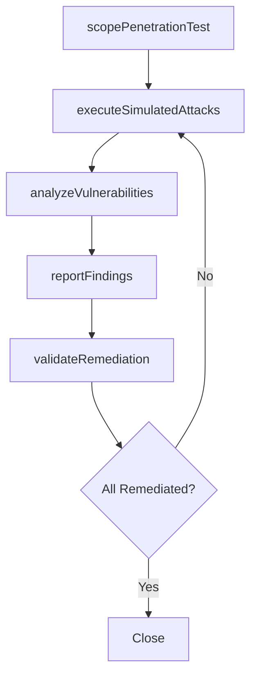

# Conduct penetration testing

> Business-as-Code definition for penetration testing execution. Models the process of scoping authorized security tests, executing simulated attacks, analyzing findings, and reporting vulnerabilities for remediation.

## Overview

Conduct penetration testing (pen test) through an authorized stimulated attack to identify security weakness in an IT environment by evaluating the system or network with various harmful techniques.

## Process Hierarchy


## GraphDL

```yaml
conduct:
  object: Penetration Testing
  actor: PenetrationTester
  result: PenetrationTestReport
```

## Actions

| Action | Description |
|--------|-------------|
| scopePenetrationTest | Define test scope, targets, methodology, and rules of engagement |
| executeSimulatedAttacks | Run authorized attack simulations against target systems |
| analyzeVulnerabilities | Assess discovered vulnerabilities for severity and exploitability |
| reportFindings | Document findings with remediation recommendations and risk ratings |
| validateRemediation | Verify that identified vulnerabilities have been properly addressed |

## Events

| Event | Description |
|-------|-------------|
| penetrationTestScoped | Test scope, rules of engagement, and targets defined |
| simulatedAttacksExecuted | Authorized attack simulations completed against targets |
| vulnerabilitiesAnalyzed | Discovered vulnerabilities assessed and risk-rated |
| findingsReported | Penetration test report delivered to stakeholders |
| remediationValidated | Vulnerability remediation verified through re-testing |

## Searches

| Search | Description |
|--------|-------------|
| findPenTestResults | List penetration test results by target, severity, or date |
| getVulnerabilityFindings | Retrieve vulnerability findings with risk ratings |
| getPenTestSchedule | Get upcoming and completed penetration test schedule |

## Process Flow



## RACI Matrix

| Activity | Responsible | Accountable | Consulted | Informed |
|----------|-------------|-------------|-----------|----------|
| scopePenetrationTest | PenetrationTester | CISO | ITSecurityManager | Legal |
| executeSimulatedAttacks | PenetrationTester | ITSecurityManager | ITOperations | CISO |
| reportFindings | PenetrationTester | ITSecurityManager | ApplicationOwners | CIO |

## Related Processes

| Process | Relationship |
|---------|-------------|
| 8.3.8 Parent process | Parent - provides context and governance |
| 8.3.8.8 Sibling activity | Parallel - complementary activity in the same process |

## Related Departments

| Department | Role |
|-----------|------|
| IT Risk and Compliance | Manages risk assessment and compliance |
| IT Security | Implements security controls and monitoring |
| Legal | Advises on regulatory requirements |

## Related Occupations

| Occupation | Involvement |
|-----------|-------------|
| Penetration Tester | Executes authorized security simulations |
| Security Operations Analyst | Reviews findings and monitors remediation |
| IT Security Manager | Scopes tests and approves reports |

## KPIs

| KPI | Description | Unit |
|-----|-------------|------|
| Critical Finding Count | Number of critical vulnerabilities discovered per test | Count/Test |
| Remediation Closure Rate | Percentage of findings remediated within SLA | % |
| Test Coverage | Percentage of in-scope systems successfully tested | % |

## Usage

```typescript
import { conductPenetrationTesting } from '@headlessly/conduct-penetration-testing'

const process = conductPenetrationTesting()

// Execute the core process
const result = await process.executePenetrationProcess({
  scope: 'department',
  priority: 'high'
})

// Validate outcomes
const validation = await process.validatePenetrationOutcomes({
  criteria: 'standard',
  period: 'Q4-2025'
})
```
