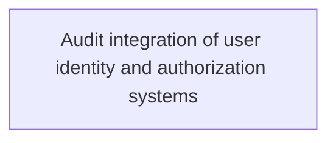
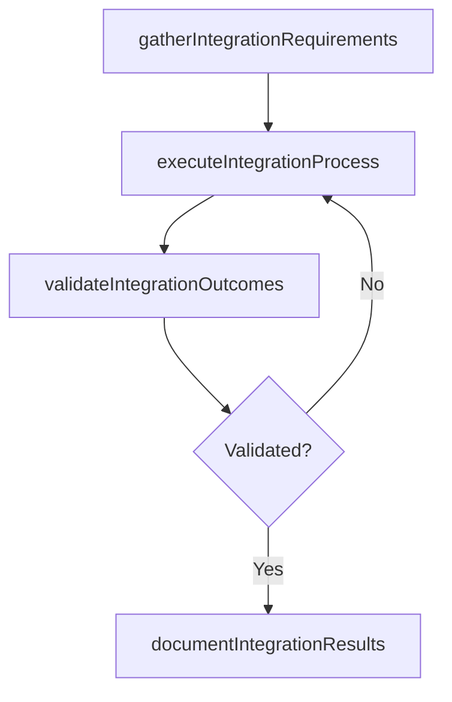

# Audit integration of user identity and authorization systems

> Business-as-Code definition for audit integration of user identity and authorization systems. Models the process of reviewing the processes responsible for integration of user identity and access authorization in order to confirm that a.

## Overview

Reviewing the processes responsible for integration of user identity and access authorization in order to confirm that all the required regulations are followed.

## Process Hierarchy



## GraphDL

```yaml
audit:
  object: Integration Of User Identity And Authorization Systems
  actor: ITRiskAnalyst
  result: AuditIntegrationOfUserIdentityAndAuthorizationSystems
```

## Actions

| Action | Description |
|--------|-------------|
| gatherIntegrationRequirements | Collect requirements and inputs for audit integration of user identity and authorization systems |
| executeIntegrationProcess | Perform the core activities of audit integration of user identity and authorization systems |
| validateIntegrationOutcomes | Verify that outcomes meet defined criteria and standards |
| documentIntegrationResults | Record findings and results for stakeholder review |

## Events

| Event | Description |
|-------|-------------|
| integrationRequirementsGathered | Requirements for audit integration of user identity and authorization systems collected |
| integrationProcessExecuted | Core activities of audit integration of user identity and authorization systems completed |
| integrationOutcomesValidated | Outcomes verified against defined criteria |
| integrationResultsDocumented | Results recorded and distributed to stakeholders |

## Searches

| Search | Description |
|--------|-------------|
| getIntegrationStatus | Retrieve current status of audit integration of user identity and authorization systems |
| findIntegrationRecords | List records related to audit integration of user identity and authorization systems by date or status |
| getIntegrationReport | Retrieve summary report for audit integration of user identity and authorization systems |

## Process Flow



## RACI Matrix

| Activity | Responsible | Accountable | Consulted | Informed |
|----------|-------------|-------------|-----------|----------|
| gatherIntegrationRequirements | ITRiskAnalyst | ITComplianceAnalyst | BusinessUnitLeaders | CIO |
| executeIntegrationProcess | ITRiskAnalyst | ITComplianceAnalyst | ITOperations | ITServiceManager |
| validateIntegrationOutcomes | ITRiskAnalyst | ITComplianceAnalyst | QualityAssurance | ITServiceManager |

## Related Processes

| Process | Relationship |
|---------|-------------|
| 8.3.8 Parent process | Parent - provides context and governance |
| 8.3.8.9 Sibling activity | Parallel - complementary activity in the same process |

## Related Departments

| Department | Role |
|-----------|------|
| IT Risk and Compliance | Manages risk assessment and compliance |
| IT Security | Implements security controls and monitoring |
| Legal | Advises on regulatory requirements |

## Related Occupations

| Occupation | Involvement |
|-----------|-------------|
| IT Risk Analyst | Assesses and monitors IT risks |
| IT Compliance Analyst | Evaluates regulatory compliance |

## KPIs

| KPI | Description | Unit |
|-----|-------------|------|
| Completion Rate | Percentage of audit integration of user identity and authorization systems activities completed on schedule | % |
| Quality Score | Quality assessment score for audit integration of user identity and authorization systems outputs | Score (1-10) |
| Cycle Time | Average time to complete audit integration of user identity and authorization systems | Days |

## Usage

```typescript
import { auditIntegrationOfUserIdentityAndAuthorizationSystems } from '@headlessly/audit-integration-of-user-identity-and-authorization-systems'

const process = auditIntegrationOfUserIdentityAndAuthorizationSystems()

// Execute the core process
const result = await process.executeIntegrationProcess({
  scope: 'department',
  priority: 'high'
})

// Validate outcomes
const validation = await process.validateIntegrationOutcomes({
  criteria: 'standard',
  period: 'Q4-2025'
})
```
