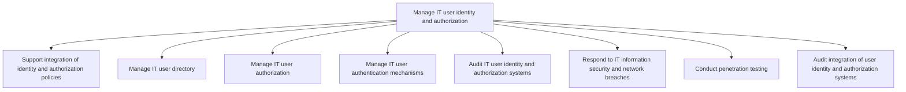
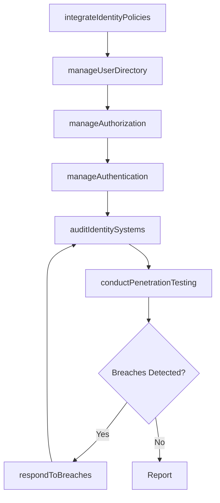

# Manage IT user identity and authorization

> Business-as-Code definition for IT user identity and authorization management. Models the process of integrating identity policies, managing user directories, administering authentication and authorization, conducting security audits, and responding to breaches.

## Overview

The process of identifying, authenticating, and authorizing IT users to have access to applications, systems, IT components, or networks by associating user rights and restrictions with established identities.

## Process Hierarchy



## GraphDL

```yaml
manage:
  object: IT User Identity And Authorization
  actor: IdentityAccessManager
  result: IdentityGovernanceReport
```

## Actions

| Action | Description |
|--------|-------------|
| integrateIdentityPolicies | Align and integrate identity and authorization policies across systems |
| manageUserDirectory | Administer the IT user directory with roles and access profiles |
| manageAuthorization | Provision and revoke user access rights based on policies |
| manageAuthentication | Configure and maintain user authentication mechanisms |
| auditIdentitySystems | Audit IT user identity and authorization system effectiveness |
| respondToBreaches | Coordinate incident response for security and network breaches |
| conductPenetrationTesting | Execute authorized penetration tests to identify vulnerabilities |

## Events

| Event | Description |
|-------|-------------|
| identityPoliciesIntegrated | Identity and authorization policies aligned across systems |
| userDirectoryManaged | User directory updated with current roles and profiles |
| authorizationManaged | User access rights provisioned or revoked |
| authenticationManaged | Authentication mechanisms configured and validated |
| identitySystemsAudited | Identity and authorization audit completed |
| breachesRespondedTo | Security breach incident response executed |
| penetrationTestingConducted | Penetration test completed with findings documented |

## Searches

| Search | Description |
|--------|-------------|
| findUserAccess | List user access rights by role, system, or department |
| getIdentityAuditLog | Retrieve identity and access audit trail for a period |
| findAccessViolations | List access policy violations by severity or user |
| getPenetrationTestResults | Get penetration test findings by severity or system |

## Process Flow



## RACI Matrix

| Activity | Responsible | Accountable | Consulted | Informed |
|----------|-------------|-------------|-----------|----------|
| manageUserDirectory | IdentityAdministrator | IdentityAccessManager | HumanResources | ITOperations |
| manageAuthorization | IdentityAdministrator | IdentityAccessManager | ApplicationOwners | ITSecurityManager |
| auditIdentitySystems | ITSecurityAuditor | IdentityAccessManager | InternalAudit | CISO |
| respondToBreaches | IncidentResponseTeam | CISO | Legal | CIO |
| conductPenetrationTesting | PenetrationTester | IdentityAccessManager | ITSecurityManager | CISO |

## Sub-Processes

| ID | Name | Description |
|----|------|-------------|
| 8.3.8.1 | Support integration of identity and authorization policies | Create and implement policies that integrate authorization policies with authorized profiles of user |
| 8.3.8.2 | Manage IT user directory | Managing directory of user profiles and access requirements across different levels in the organizat |
| 8.3.8.3 | Manage IT user authorization | Managing the process of authorizing IT users to access applications, systems, IT components, or netw |
| 8.3.8.4 | Manage IT user authentication mechanisms | Create and manage the process to authenticate IT users from user directory based on the internal pol |
| 8.3.8.5 | Audit IT user identity and authorization systems | Examine the processes responsible for reviewing IT user identity and authorization. |
| 8.3.8.6 | Respond to IT information security and network breaches | Address any form of unauthorized network breach such as unauthorized access or usage of data, applic |
| 8.3.8.7 | Conduct penetration testing | Conduct penetration testing (pen test) through an authorized stimulated attack to identify security  |
| 8.3.8.8 | Audit integration of user identity and authorization systems | Reviewing the processes responsible for integration of user identity and access authorization in ord |

## Related Processes

| Process | Relationship |
|---------|-------------|
| 8.3.5 Develop and manage IT security, privacy, and data protection | Parallel - identity management supports data protection |
| 8.3.3 Control IT risk, compliance, and security | Upstream - security policies define identity requirements |
| 7.3 Manage employee lifecycle | Parallel - employee onboarding/offboarding triggers access changes |

## Related Departments

| Department | Role |
|-----------|------|
| Identity and Access Management | Primary owner of user identity lifecycle |
| IT Security | Monitors access violations and responds to breaches |
| Human Resources | Triggers access provisioning for employee lifecycle events |
| Internal Audit | Validates identity governance controls |
| Application Development | Integrates authentication and authorization into applications |

## Related Occupations

| Occupation | Involvement |
|-----------|-------------|
| Identity Access Manager | Leads identity governance and access administration |
| Security Operations Analyst | Monitors access violations and security incidents |
| Penetration Tester | Conducts authorized security testing |

## KPIs

| KPI | Description | Unit |
|-----|-------------|------|
| Access Review Completion | Percentage of scheduled access reviews completed on time | % |
| Orphaned Account Rate | Percentage of user accounts without active owners | % |
| Mean Time to Provision | Average time to provision new user access | Hours |
| Penetration Test Finding Rate | Number of critical findings per penetration test | Count/Test |

## Usage

```typescript
import { manageITUserIdentityAndAuthorization } from '@headlessly/manage-it-user-identity-and-authorization'

const iam = manageITUserIdentityAndAuthorization()

// Manage user authorization
const access = await iam.manageAuthorization({
  userId: 'emp-12345',
  action: 'grant',
  resources: ['erp-finance', 'reporting-dashboard'],
  role: 'financial-analyst'
})

// Conduct penetration testing
const penTest = await iam.conductPenetrationTesting({
  scope: 'external-facing-applications',
  methodology: 'OWASP-Top-10',
  duration: '2-weeks'
})
```
