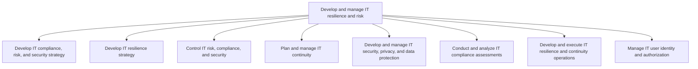
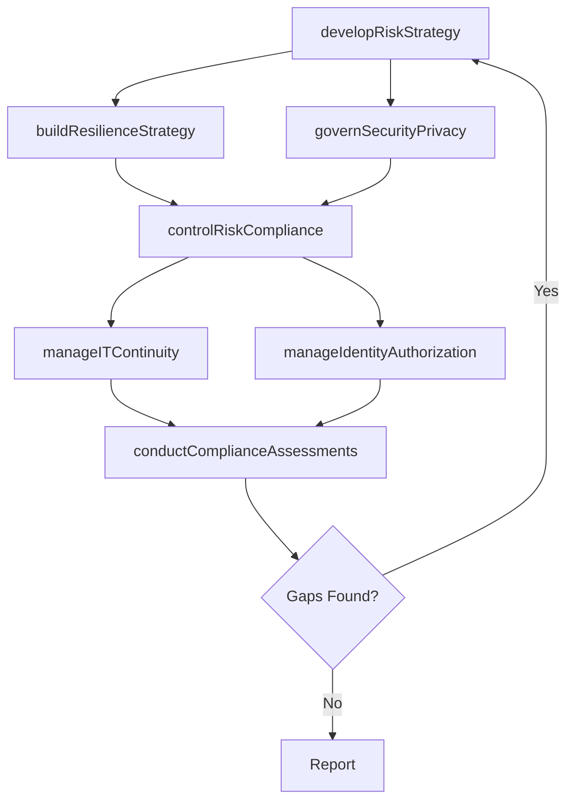

# Develop and manage IT resilience and risk

> Business-as-Code definition for IT resilience and risk management. Models the complete lifecycle of IT risk identification, compliance governance, security management, business continuity, and identity authorization.

## Overview

Develop and include the processes required to rapidly adapt and respond to any internal or external opportunity, demand, disruption, or threat to IT. Develop a more dynamic, strategic, and integrated approach to managing risk and compliance obligations.

## Process Hierarchy



## GraphDL

```yaml
develop:
  object: And Manage IT Resilience And Risk
  actor: ChiefInformationSecurityOfficer
  result: ITRiskAndResilienceFramework
```

## Actions

| Action | Description |
|--------|-------------|
| developRiskStrategy | Formulate IT compliance, risk, and security strategy |
| buildResilienceStrategy | Design IT resilience approaches for critical systems |
| controlRiskCompliance | Enforce IT risk controls and compliance standards |
| manageITContinuity | Plan and maintain IT business continuity capabilities |
| governSecurityPrivacy | Establish and manage IT security, privacy, and data protection |
| conductComplianceAssessments | Evaluate IT environment against regulatory requirements |
| manageIdentityAuthorization | Administer user identity, authentication, and access controls |

## Events

| Event | Description |
|-------|-------------|
| riskStrategyDeveloped | IT risk and security strategy approved |
| resilienceStrategyBuilt | IT resilience strategy established with mitigation approaches |
| riskComplianceControlled | IT risk controls enforced and compliance verified |
| itContinuityManaged | Business continuity plans tested and validated |
| securityPrivacyGoverned | Security and data protection policies deployed |
| complianceAssessmentsCompleted | IT compliance audit findings reported |
| identityAuthorizationManaged | User access controls provisioned and audited |

## Searches

| Search | Description |
|--------|-------------|
| getITRiskRegister | Retrieve IT risk register with severity and mitigation status |
| findComplianceGaps | List compliance gaps by regulation, severity, or business unit |
| getSecurityPosture | Get current security posture including open vulnerabilities |
| findContinuityPlans | List IT business continuity plans by system or criticality |
| getIdentityAuditLog | Retrieve user access audit trail for a specified period |

## Process Flow



## RACI Matrix

| Activity | Responsible | Accountable | Consulted | Informed |
|----------|-------------|-------------|-----------|----------|
| developRiskStrategy | ITRiskManager | CISO | Legal | CIO |
| buildResilienceStrategy | ITResilienceArchitect | CISO | ITOperations | BusinessUnitLeaders |
| controlRiskCompliance | ITComplianceManager | CISO | InternalAudit | CIO |
| governSecurityPrivacy | ITSecurityManager | CISO | DataProtectionOfficer | Legal |
| manageIdentityAuthorization | IdentityManager | CISO | HumanResources | ITOperations |

## Sub-Processes

| ID | Name | Description |
|----|------|-------------|
| 8.3.1 | Develop IT compliance, risk, and security strategy | Ensuring that the organization effectively manages risk. Develop rules and standards for robust IT o |
| 8.3.2 | Develop IT resilience strategy | Developing resilience strategies of IT across the organization so that prospective risks can be avoi |
| 8.3.3 | Control IT risk, compliance, and security | Ensure effective control in overall IT risk management, formulate and execute guidelines in-line wit |
| 8.3.4 | Plan and manage IT continuity | Planning and managing IT's ability to recover from exposure to internal and external threats. |
| 8.3.5 | Develop and manage IT security, privacy, and data protection | Creating and deploying an architecture for securing and ensuring the privacy of data flows throughou |
| 8.3.6 | Conduct and analyze IT compliance assessments | Evaluate and analyze the IT environment for the compliance of industry regulations and government le |
| 8.3.7 | Develop and execute IT resilience and continuity operations | Create and execute a process to rapidly adapt and respond to any internal or external opportunity, d |
| 8.3.8 | Manage IT user identity and authorization | The process of identifying, authenticating, and authorizing IT users to have access to applications, |

## Related Processes

| Process | Relationship |
|---------|-------------|
| 8.2 Develop and manage IT business strategy | Upstream - strategy defines risk appetite and governance model |
| 8.5 Develop and manage services/solutions | Parallel - security controls embedded in service design |
| 11.0 Manage Business Risk | Parallel - IT risk integrates with enterprise risk management |

## Related Departments

| Department | Role |
|-----------|------|
| IT Security | Primary owner of cybersecurity and access management |
| IT Risk and Compliance | Manages risk assessments and regulatory compliance |
| Legal | Advises on regulatory obligations and data protection law |
| Internal Audit | Conducts independent assurance of IT controls |
| IT Operations | Implements resilience and continuity measures |

## Related Occupations

| Occupation | Involvement |
|-----------|-------------|
| Chief Information Security Officer | Executive accountable for IT risk and security posture |
| IT Risk Manager | Identifies, assesses, and tracks IT risks |
| IT Compliance Analyst | Monitors regulatory compliance and audit readiness |
| Security Operations Analyst | Monitors threats and manages incident response |

## KPIs

| KPI | Description | Unit |
|-----|-------------|------|
| Risk Mitigation Rate | Percentage of identified IT risks with active mitigation plans | % |
| Compliance Audit Pass Rate | Percentage of compliance audit controls passing | % |
| Mean Time to Recover | Average time to restore services after an incident | Hours |
| Security Incident Rate | Number of confirmed security incidents per quarter | Count/Quarter |
| Business Continuity Test Success | Percentage of continuity tests meeting recovery objectives | % |

## Usage

```typescript
import { developAndManageITResilienceAndRisk } from '@headlessly/develop-and-manage-it-resilience-and-risk'

const resilience = developAndManageITResilienceAndRisk()

// Assess current IT risk posture
const riskRegister = await resilience.developRiskStrategy({
  scope: 'enterprise',
  frameworks: ['NIST-CSF', 'ISO-27001'],
  riskTolerance: 'moderate'
})

// Run compliance assessment
const audit = await resilience.conductComplianceAssessments({
  regulation: 'SOC2-Type-II',
  period: 'Q4-2025'
})
```
