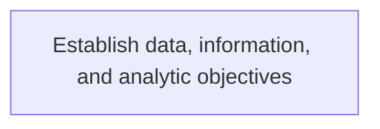
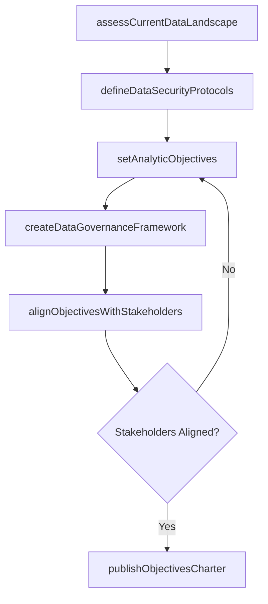

# Establish data, information, and analytic objectives

> Business-as-Code definition for establish data, information, and analytic objectives. Models the process of implementing strategies for securing and ensuring the privacy of data flows throughout the organization. create protocol.

## Overview

Implementing strategies for securing and ensuring the privacy of data flows throughout the organization. Create protocols and guidelines for individual IT components. Outline analytic objectives in order to avoid misuse of information.

## Process Hierarchy



## GraphDL

```yaml
establish:
  object: Data, Information, And Analytic Objectives
  actor: DataArchitect
  result: EstablishDataInformationAndAnalyticObjectives
```

## Actions

| Action | Description |
|--------|-------------|
| assessCurrentDataLandscape | Survey existing data assets, flows, and analytics capabilities across the organization |
| defineDataSecurityProtocols | Establish security and privacy guidelines for data handling and transmission |
| setAnalyticObjectives | Define specific, measurable analytic goals aligned with business strategy |
| createDataGovernanceFramework | Develop policies for data ownership, classification, and acceptable use |
| alignObjectivesWithStakeholders | Validate data and analytic objectives with business unit leaders |
| publishObjectivesCharter | Formalize and distribute approved data and analytic objectives |

## Events

| Event | Description |
|-------|-------------|
| currentDataLandscapeAssessed | Organizational data asset survey completed |
| dataSecurityProtocolsDefined | Security and privacy guidelines for data flows established |
| analyticObjectivesSet | Measurable analytic goals defined and documented |
| dataGovernanceFrameworkCreated | Data governance policies formalized |
| objectivesAlignedWithStakeholders | Stakeholder validation of objectives completed |
| objectivesCharterPublished | Approved data and analytic objectives distributed to the organization |

## Searches

| Search | Description |
|--------|-------------|
| getDataObjectives | Retrieve current data and analytic objectives by domain or priority |
| findDataAssets | List data assets filtered by classification, owner, or security tier |
| getSecurityProtocols | Query active data security protocols by data type or flow |
| getObjectivesProgress | Track progress against defined data and analytic objectives |

## Process Flow



## RACI Matrix

| Activity | Responsible | Accountable | Consulted | Informed |
|----------|-------------|-------------|-----------|----------|
| assessCurrentDataLandscape | DataArchitect | ChiefDataOfficer | ITOperations | BusinessUnitLeaders |
| defineDataSecurityProtocols | InformationSecurityAnalyst | ChiefInformationSecurityOfficer | LegalCounsel | DataArchitect |
| setAnalyticObjectives | BusinessIntelligenceManager | ChiefDataOfficer | DataScientists | ExecutiveLeadership |
| createDataGovernanceFramework | DataGovernanceLead | ChiefDataOfficer | ComplianceOfficer | AllDataStewards |
| alignObjectivesWithStakeholders | DataArchitect | ChiefDataOfficer | BusinessUnitLeaders | ITManagement |

## Related Processes

| Process | Relationship |
|---------|-------------|
| 8.4.1 Parent process | Parent - provides context and governance |
| 8.4.1.2 Sibling activity | Parallel - complementary activity in the same process |

## Related Departments

| Department | Role |
|-----------|------|
| Data Management | Owns data governance and architecture |
| Business Intelligence | Develops analytics capabilities |
| IT Operations | Maintains data infrastructure |

## Related Occupations

| Occupation | Involvement |
|-----------|-------------|
| Data Architect | Designs data models and integration patterns |
| Data Governance Analyst | Enforces data quality and stewardship |

## KPIs

| KPI | Description | Unit |
|-----|-------------|------|
| Completion Rate | Percentage of establish data, information, and analytic objectives activities completed on schedule | % |
| Quality Score | Quality assessment score for establish data, information, and analytic objectives outputs | Score (1-10) |
| Cycle Time | Average time to complete establish data, information, and analytic objectives | Days |

## Usage

```typescript
import { establishDataInformationAndAnalyticObjectives } from '@headlessly/establish-data-information-and-analytic-objectives'

const process = establishDataInformationAndAnalyticObjectives()

// Execute the core process
const result = await process.executeDataProcess({
  scope: 'department',
  priority: 'high'
})

// Validate outcomes
const validation = await process.validateDataOutcomes({
  criteria: 'standard',
  period: 'Q4-2025'
})
```
