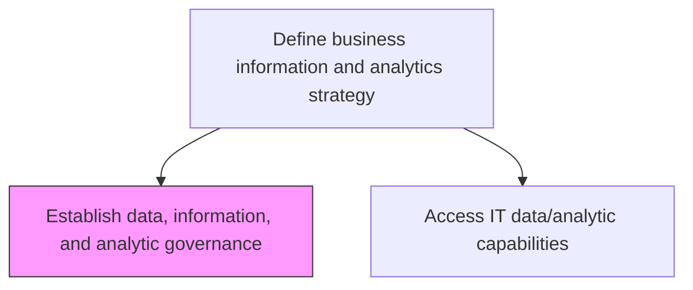
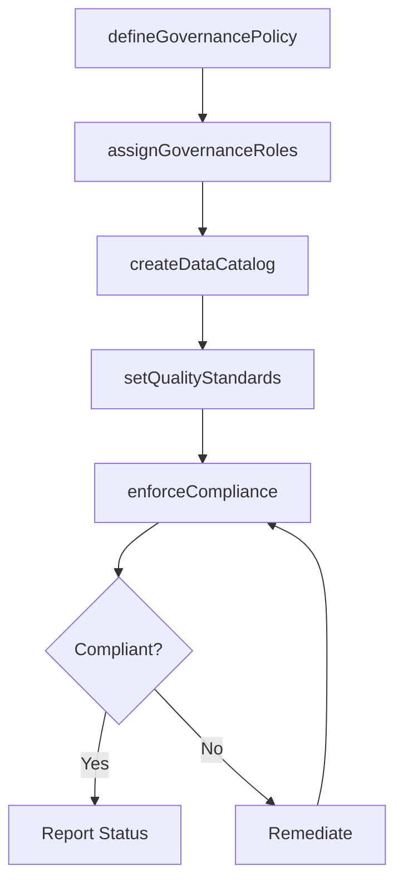

# Establish data, information, and analytic governance

> Business-as-Code definition for creating governance frameworks that ensure effective and compliant use of enterprise data, information assets, and analytical capabilities.

## Overview

Creating a set of guidelines that ensure effective and efficient use of IT. Define data, information, and analytic governance to reach the organization's goal.

## Process Hierarchy



## GraphDL

```yaml
establish:
  object: Data, Information, And Analytic Governance
  actor: DataGovernanceOfficer
  result: GovernanceFramework
```

## Actions

| Action | Description |
|--------|-------------|
| defineGovernancePolicy | Establish policies for data ownership, quality, and usage |
| assignGovernanceRoles | Designate data stewards, custodians, and governance council members |
| createDataCatalog | Build a governed catalog of enterprise data assets |
| setQualityStandards | Define data quality thresholds and measurement criteria |
| enforceCompliance | Monitor adherence to governance policies and flag violations |

## Events

| Event | Description |
|-------|-------------|
| governancePolicyDefined | Data governance policies published and communicated |
| governanceRolesAssigned | Governance roles and responsibilities designated |
| dataCatalogCreated | Enterprise data catalog published with asset classifications |
| qualityStandardsSet | Data quality thresholds and measurement criteria established |
| complianceEnforced | Governance compliance audit completed |

## Searches

| Search | Description |
|--------|-------------|
| getGovernancePolicies | Retrieve governance policies by domain or effective date |
| findGovernanceRoles | List governance role assignments by domain or person |
| getComplianceReport | Get governance compliance audit results |

## Process Flow



## RACI Matrix

| Activity | Responsible | Accountable | Consulted | Informed |
|----------|-------------|-------------|-----------|----------|
| defineGovernancePolicy | DataGovernanceOfficer | ChiefDataOfficer | LegalCounsel | ITManagement |
| assignGovernanceRoles | ChiefDataOfficer | CIO | DepartmentHeads | DataStewards |
| enforceCompliance | ComplianceAnalyst | DataGovernanceOfficer | InternalAudit | ExecutiveTeam |

## Related Processes

| Process | Relationship |
|---------|-------------|
| 8.4.1.3 Access IT data/analytic capabilities | Sibling - governance controls data access |
| 8.4.2 Define and maintain business information architecture | Downstream - governance informs architecture standards |

## Related Departments

| Department | Role |
|-----------|------|
| Data Governance | Primary owner of governance framework |
| Legal and Compliance | Advises on regulatory governance requirements |
| Internal Audit | Validates governance compliance |

## Related Occupations

| Occupation | Involvement |
|-----------|-------------|
| Data Governance Officer | Designs and enforces governance framework |
| Data Steward | Executes governance within assigned domains |

## KPIs

| KPI | Description | Unit |
|-----|-------------|------|
| Governance Policy Coverage | Percentage of data domains covered by governance policies | % |
| Data Quality Score | Average quality score across governed data assets | Score (0-100) |
| Governance Violation Rate | Number of policy violations per reporting period | Count |

## Usage

```typescript
import { establishDataInformationAndAnalyticGovernance } from '@headlessly/establish-data-information-and-analytic-governance'

const governance = establishDataInformationAndAnalyticGovernance()

// Define a governance policy
const policy = await governance.defineGovernancePolicy({
  domain: 'Customer Data',
  dataClassification: 'Confidential',
  retentionYears: 7,
  accessApproval: 'data-owner'
})

// Assign governance roles
await governance.assignGovernanceRoles({
  domain: 'Customer Data',
  steward: 'jane.smith@company.com',
  custodian: 'dba-team@company.com'
})
```
