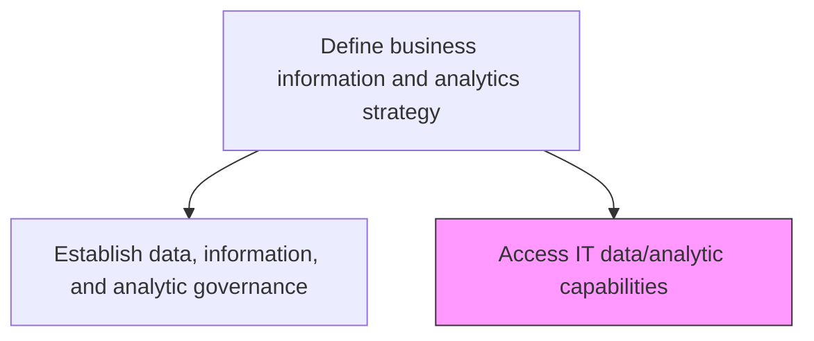
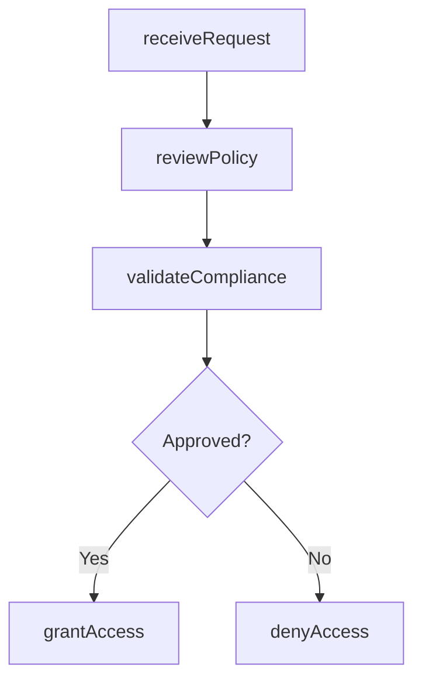

# Access IT data/analytic capabilities

> Business-as-Code definition for evaluating and provisioning access to IT data and analytic capabilities, ensuring compliance with security policies and data access governance.

## Overview

Determining the request for data accessibility and analysis. Review the details based on internal data security policies and permit data access only if internal policies and data access parameters are met.

## Process Hierarchy



## GraphDL

```yaml
access:
  object: IT Data/analytic Capabilities
  actor: DataAccessAdministrator
  result: AccessGrant
```

## Actions

| Action | Description |
|--------|-------------|
| receiveRequest | Accept and log a data or analytics access request |
| reviewPolicy | Evaluate the request against internal security and data access policies |
| validateCompliance | Confirm the request meets regulatory and governance requirements |
| grantAccess | Provision access to the requested data or analytics capability |
| denyAccess | Reject the request with documented rationale |

## Events

| Event | Description |
|-------|-------------|
| requestReceived | Data access request logged and acknowledged |
| policyReviewed | Request evaluated against data security policies |
| complianceValidated | Regulatory and governance compliance confirmed |
| accessGranted | Access provisioned to the requested data or capability |
| accessDenied | Request rejected with documented reasons |

## Searches

| Search | Description |
|--------|-------------|
| findAccessRequests | List pending or completed access requests by status or requester |
| getAccessPermissions | Retrieve current access permissions for a user or dataset |
| getCapabilityCatalog | List available data and analytics capabilities |

## Process Flow



## RACI Matrix

| Activity | Responsible | Accountable | Consulted | Informed |
|----------|-------------|-------------|-----------|----------|
| receiveRequest | DataAccessAdministrator | DataGovernanceOfficer | Requester | ServiceDesk |
| reviewPolicy | DataAccessAdministrator | DataGovernanceOfficer | SecurityTeam | DataOwner |
| grantAccess | DataAccessAdministrator | DataGovernanceOfficer | ITSecurity | EndUser |

## Related Processes

| Process | Relationship |
|---------|-------------|
| 8.4.1.2 Establish data, information, and analytic governance | Sibling - governance policies govern access decisions |
| 8.4.4.4 Implement and administer business information access | Downstream - access grants are administered |

## Related Departments

| Department | Role |
|-----------|------|
| Data Governance | Sets access policies and reviews requests |
| IT Security | Validates security compliance of access requests |
| Business Intelligence | Primary requestor of analytics capabilities |

## Related Occupations

| Occupation | Involvement |
|-----------|-------------|
| Data Access Administrator | Processes and provisions access requests |
| Information Security Analyst | Reviews requests for security compliance |

## KPIs

| KPI | Description | Unit |
|-----|-------------|------|
| Access Request Fulfillment Time | Average time from request to access provisioning | Hours |
| Access Denial Rate | Percentage of access requests denied | % |
| Policy Compliance Rate | Percentage of granted access adhering to governance policies | % |

## Usage

```typescript
import { accessItDataAnalyticCapabilities } from '@headlessly/access-it-data-analytic-capabilities'

const access = accessItDataAnalyticCapabilities()

// Submit an access request
const request = await access.receiveRequest({
  requestedBy: 'analyst@company.com',
  capability: 'sales-data-warehouse',
  accessLevel: 'read',
  justification: 'Quarterly revenue analysis'
})

// Review and grant access
await access.grantAccess({
  requestId: request.id,
  expiresAt: '2025-12-31',
  conditions: ['no-export', 'audit-logging']
})
```
