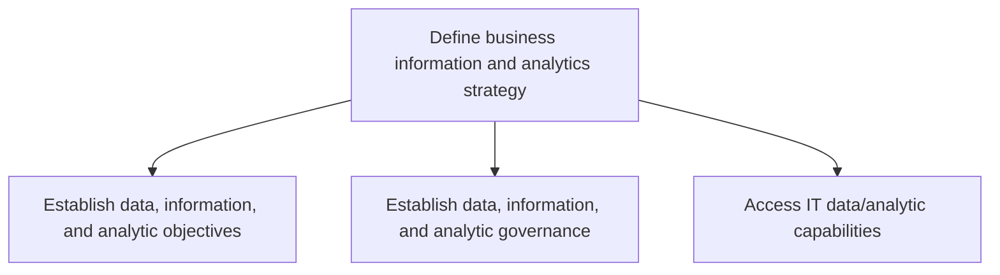
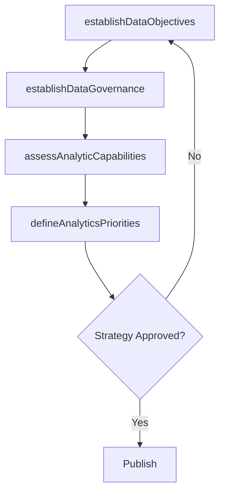

# Define business information and analytics strategy

> Business-as-Code definition for business information and analytics strategy. Models the process of establishing data objectives, defining governance frameworks, and assessing analytical capabilities to support organizational decision-making.

## Overview

Create an organization-wide strategy for the IT function by combining skills, technologies, applications, and processes in order to attain organizations objectives.

## Process Hierarchy



## GraphDL

```yaml
define:
  object: Business Information And Analytics Strategy
  actor: DataStrategyManager
  result: InformationAnalyticsStrategy
```

## Actions

| Action | Description |
|--------|-------------|
| establishDataObjectives | Define data, information, and analytics objectives |
| establishDataGovernance | Create governance framework for data and analytics |
| assessAnalyticCapabilities | Evaluate current IT data and analytical capabilities |
| defineAnalyticsPriorities | Prioritize analytics use cases aligned to business needs |

## Events

| Event | Description |
|-------|-------------|
| dataObjectivesEstablished | Data and analytics objectives defined and approved |
| dataGovernanceEstablished | Data governance framework published |
| analyticCapabilitiesAssessed | Data and analytics capability assessment completed |
| analyticsPrioritiesDefined | Analytics priorities ranked and communicated |

## Searches

| Search | Description |
|--------|-------------|
| getDataStrategy | Retrieve the current data and analytics strategy |
| findAnalyticCapabilities | List analytics capabilities by maturity or domain |
| getGovernanceFramework | Get data governance framework and policies |

## Process Flow



## RACI Matrix

| Activity | Responsible | Accountable | Consulted | Informed |
|----------|-------------|-------------|-----------|----------|
| establishDataObjectives | DataStrategyManager | CDO | CIO | BusinessUnitLeaders |
| establishDataGovernance | DataGovernanceManager | CDO | Legal | DataStewards |
| assessAnalyticCapabilities | DataAnalyticsLead | DataStrategyManager | ITOperations | BusinessIntelligence |
| defineAnalyticsPriorities | DataStrategyManager | CDO | BusinessUnitLeaders | Finance |

## Sub-Processes

| ID | Name | Description |
|----|------|-------------|
| 8.4.1.1 | Establish data, information, and analytic objectives | Implementing strategies for securing and ensuring the privacy of data flows throughout the organizat |
| 8.4.1.2 | Establish data, information, and analytic governance | Creating a set of guidelines that ensure effective and efficient use of IT. Define data, information |
| 8.4.1.3 | Access IT data/analytic capabilities | Determining the request for data accessibility and analysis. Review the details based on internal da |

## Related Processes

| Process | Relationship |
|---------|-------------|
| 8.4.2 Define and maintain business information architecture | Downstream - strategy drives architecture decisions |
| 8.2.1 Define business technology and governance strategy | Upstream - technology strategy informs data priorities |

## Related Departments

| Department | Role |
|-----------|------|
| Data Management | Primary owner of information and analytics strategy |
| Business Intelligence | Implements analytics capabilities |
| IT Operations | Maintains data infrastructure |
| Business Units | Primary consumers of analytics outputs |

## Related Occupations

| Occupation | Involvement |
|-----------|-------------|
| Data Strategy Manager | Leads strategy definition and governance |
| Data Governance Analyst | Establishes governance policies and standards |
| Data Analytics Lead | Assesses and develops analytics capabilities |

## KPIs

| KPI | Description | Unit |
|-----|-------------|------|
| Analytics Maturity Level | Organizational analytics maturity assessment | Level (1-5) |
| Data Governance Coverage | Percentage of data domains with governance policies | % |
| Analytics Use Case Delivery | Number of analytics use cases delivered per quarter | Count/Quarter |

## Usage

```typescript
import { defineBusinessInformationAndAnalyticsStrategy } from '@headlessly/define-business-information-and-analytics-strategy'

const strategy = defineBusinessInformationAndAnalyticsStrategy()

// Establish data objectives
const objectives = await strategy.establishDataObjectives({
  focusAreas: ['customer-360', 'predictive-analytics', 'real-time-dashboards'],
  alignedTo: 'corporate-strategy-2025'
})

// Assess analytic capabilities
const capabilities = await strategy.assessAnalyticCapabilities({
  domains: ['sales', 'operations', 'finance'],
  benchmarkAgainst: 'industry-peers'
})
```
