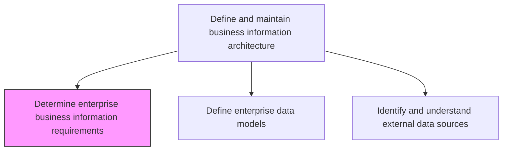
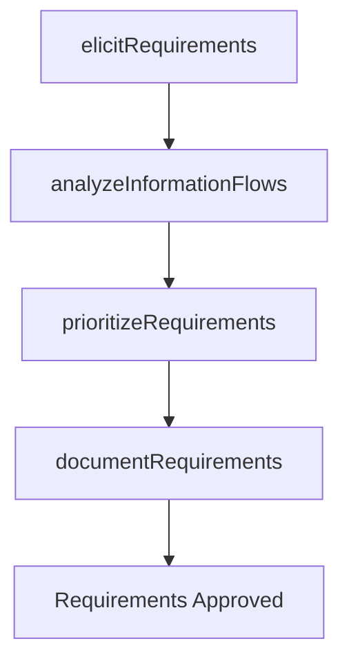

# Determine enterprise business information requirements

> Business-as-Code definition for gathering and analyzing enterprise-wide business information requirements to guide the design of data architectures and information flows.

## Overview

Determining strategies to manage the enterprise wide flow of business information and content. Outline the required architecture for information resources.

## Process Hierarchy



## GraphDL

```yaml
determine:
  object: Enterprise Business Information Requirements
  actor: BusinessAnalyst
  result: InformationRequirementsDocument
```

## Actions

| Action | Description |
|--------|-------------|
| elicitRequirements | Conduct stakeholder interviews and workshops to capture information needs |
| analyzeInformationFlows | Map current data flows and identify gaps or redundancies |
| prioritizeRequirements | Rank requirements by business impact and feasibility |
| documentRequirements | Produce a formal requirements specification document |

## Events

| Event | Description |
|-------|-------------|
| requirementsElicited | Stakeholder information needs captured and recorded |
| informationFlowsAnalyzed | Current data flows mapped and gaps identified |
| requirementsPrioritized | Requirements ranked by business impact |
| requirementsDocumented | Formal requirements specification published |

## Searches

| Search | Description |
|--------|-------------|
| findRequirements | List information requirements filtered by domain or priority |
| getInformationFlowMap | Retrieve the current enterprise information flow diagram |
| getStakeholderNeeds | Get documented information needs by business unit |

## Process Flow



## RACI Matrix

| Activity | Responsible | Accountable | Consulted | Informed |
|----------|-------------|-------------|-----------|----------|
| elicitRequirements | BusinessAnalyst | DataArchitect | DomainExperts | ITManagement |
| prioritizeRequirements | DataArchitect | ChiefDataOfficer | BusinessUnitLeads | Finance |

## Related Processes

| Process | Relationship |
|---------|-------------|
| 8.4.2.2 Define enterprise data models | Downstream - requirements drive data model design |
| 8.4.2.3 Identify and understand external data sources | Parallel - requirements may include external data needs |

## Related Departments

| Department | Role |
|-----------|------|
| Business Analysis | Elicits and documents information requirements |
| Data Management | Translates requirements into architecture specifications |
| Business Units | Provides domain-specific information needs |

## Related Occupations

| Occupation | Involvement |
|-----------|-------------|
| Business Analyst | Captures and documents requirements |
| Data Architect | Translates requirements into architecture |

## KPIs

| KPI | Description | Unit |
|-----|-------------|------|
| Requirements Coverage | Percentage of business domains with documented requirements | % |
| Stakeholder Satisfaction | Rating of requirements quality by stakeholders | Score (1-5) |
| Requirements Cycle Time | Time from elicitation to approved specification | Days |

## Usage

```typescript
import { determineEnterpriseBusinessInformationRequirements } from '@headlessly/determine-enterprise-business-information-requirements'

const requirements = determineEnterpriseBusinessInformationRequirements()

// Elicit requirements from stakeholders
const needs = await requirements.elicitRequirements({
  domain: 'Supply Chain',
  stakeholders: ['logistics-manager', 'procurement-director'],
  method: 'workshop'
})

// Prioritize requirements
const prioritized = await requirements.prioritizeRequirements({
  requirements: needs.items,
  criteria: ['business-impact', 'feasibility', 'urgency']
})
```
