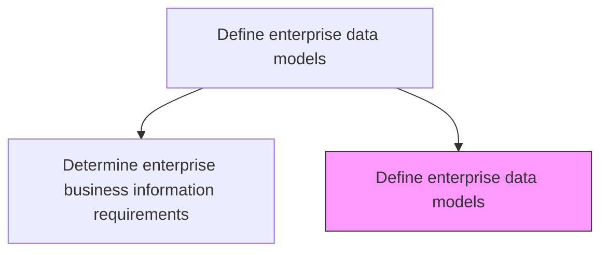
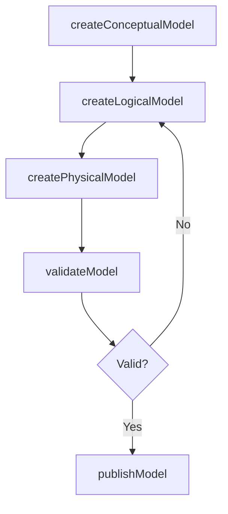

# Define enterprise data models

> Business-as-Code definition for creating conceptual, logical, and physical data models that standardize how enterprise data is represented, used, and identified across the organization.

## Overview

Define different ways of representation, usage, and identification of data with independent or interdependent sources across the organization.

## Process Hierarchy



## GraphDL

```yaml
define:
  object: Enterprise Data Models
  actor: DataModeler
  result: EnterpriseDataModel
```

## Actions

| Action | Description |
|--------|-------------|
| createConceptualModel | Design high-level conceptual data models with entity relationships |
| createLogicalModel | Build detailed logical data models with attributes and constraints |
| createPhysicalModel | Define physical database schemas optimized for target platforms |
| validateModel | Verify data model accuracy against business requirements |
| publishModel | Release approved data models to the enterprise model repository |

## Events

| Event | Description |
|-------|-------------|
| conceptualModelCreated | High-level conceptual data model designed |
| logicalModelCreated | Detailed logical data model built with attributes |
| physicalModelCreated | Physical database schema defined |
| modelValidated | Data model verified against requirements |
| modelPublished | Approved data model released to repository |

## Searches

| Search | Description |
|--------|-------------|
| findDataModels | List enterprise data models by domain, type, or version |
| getModelDetails | Retrieve a specific data model with entities and relationships |
| getModelHistory | Get version history for a data model |

## Process Flow



## RACI Matrix

| Activity | Responsible | Accountable | Consulted | Informed |
|----------|-------------|-------------|-----------|----------|
| createConceptualModel | DataModeler | DataArchitect | DomainExperts | BusinessAnalysts |
| createLogicalModel | DataModeler | DataArchitect | DatabaseAdministrator | DevelopmentTeams |
| publishModel | DataArchitect | ChiefDataOfficer | DataGovernance | ITManagement |

## Related Processes

| Process | Relationship |
|---------|-------------|
| 8.4.2.1 Determine enterprise business information requirements | Upstream - requirements drive data model design |
| 8.4.2.5 Maintain and evolve enterprise data and information architecture | Downstream - models are maintained as architecture evolves |

## Related Departments

| Department | Role |
|-----------|------|
| Data Management | Creates and maintains data models |
| Database Administration | Implements physical data models |
| Enterprise Architecture | Ensures model alignment with architecture standards |

## Related Occupations

| Occupation | Involvement |
|-----------|-------------|
| Data Modeler | Creates conceptual, logical, and physical models |
| Data Architect | Governs model standards and approves publications |

## KPIs

| KPI | Description | Unit |
|-----|-------------|------|
| Model Coverage | Percentage of business domains with enterprise data models | % |
| Model Currency | Average age of the most recent data model revision | Months |
| Model Validation Rate | Percentage of models validated against requirements | % |

## Usage

```typescript
import { defineEnterpriseDataModels } from '@headlessly/define-enterprise-data-models'

const models = defineEnterpriseDataModels()

// Create a logical data model
const model = await models.createLogicalModel({
  domain: 'Order Management',
  entities: ['Order', 'OrderLine', 'Product', 'Customer'],
  relationships: [
    { from: 'Order', to: 'Customer', type: 'many-to-one' },
    { from: 'OrderLine', to: 'Order', type: 'many-to-one' }
  ]
})

// Validate against requirements
await models.validateModel({ modelId: model.id, requirementsId: 'req-order-mgmt-v2' })
```
