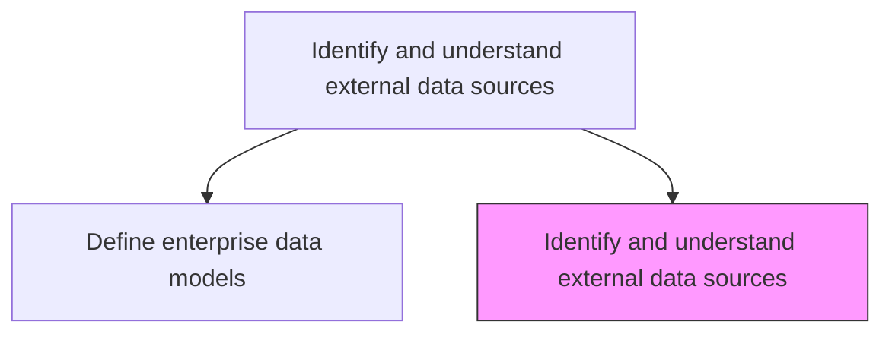
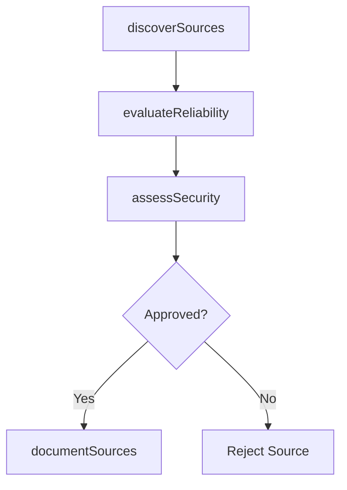

# Identify and understand external data sources

> Business-as-Code definition for discovering, evaluating, and documenting external data sources with respect to reliability, security, authenticity, and integration potential.

## Overview

Identifying and understanding external sources of data in relevance of reliability, security, and authenticity.

## Process Hierarchy



## GraphDL

```yaml
identify:
  object: External Data Sources
  actor: DataEngineer
  result: ExternalDataSourceCatalog
```

## Actions

| Action | Description |
|--------|-------------|
| discoverSources | Scan the market for relevant external data providers and feeds |
| evaluateReliability | Assess the reliability, uptime, and data freshness of each source |
| assessSecurity | Evaluate security posture and data protection practices of the provider |
| documentSources | Catalog external data sources with metadata and integration details |

## Events

| Event | Description |
|-------|-------------|
| sourcesDiscovered | External data sources identified and cataloged |
| reliabilityEvaluated | Source reliability and data freshness assessed |
| securityAssessed | Provider security posture and data protection evaluated |
| sourcesDocumented | External data source catalog updated |

## Searches

| Search | Description |
|--------|-------------|
| findExternalSources | List external data sources by category, provider, or reliability score |
| getSourceDetails | Retrieve detailed evaluation for a specific external source |
| getSecurityAssessments | Get security assessments for external data providers |

## Process Flow



## RACI Matrix

| Activity | Responsible | Accountable | Consulted | Informed |
|----------|-------------|-------------|-----------|----------|
| discoverSources | DataEngineer | DataArchitect | BusinessAnalysts | ITManagement |
| assessSecurity | SecurityAnalyst | DataArchitect | ComplianceOfficer | VendorManagement |

## Related Processes

| Process | Relationship |
|---------|-------------|
| 8.4.2.2 Define enterprise data models | Parallel - external sources may extend data models |
| 8.4.2.4 Establish data ownership and stewardship responsibilities | Downstream - external data requires ownership assignment |

## Related Departments

| Department | Role |
|-----------|------|
| Data Engineering | Discovers and evaluates external data sources |
| IT Security | Assesses security of external providers |
| Procurement | Manages contracts with external data providers |

## Related Occupations

| Occupation | Involvement |
|-----------|-------------|
| Data Engineer | Discovers and evaluates external data sources |
| Security Analyst | Assesses external provider security |

## KPIs

| KPI | Description | Unit |
|-----|-------------|------|
| Source Catalog Completeness | Percentage of known external sources documented | % |
| Source Reliability Score | Average reliability rating of cataloged sources | Score (1-5) |
| Security Assessment Coverage | Percentage of external sources with completed security assessments | % |

## Usage

```typescript
import { identifyAndUnderstandExternalDataSources } from '@headlessly/identify-and-understand-external-data-sources'

const sources = identifyAndUnderstandExternalDataSources()

// Discover external data sources
const discovered = await sources.discoverSources({
  category: 'Market Data',
  industry: 'Financial Services'
})

// Evaluate reliability
const evaluation = await sources.evaluateReliability({
  sourceId: discovered[0].id,
  criteria: ['uptime', 'freshness', 'accuracy']
})
```
