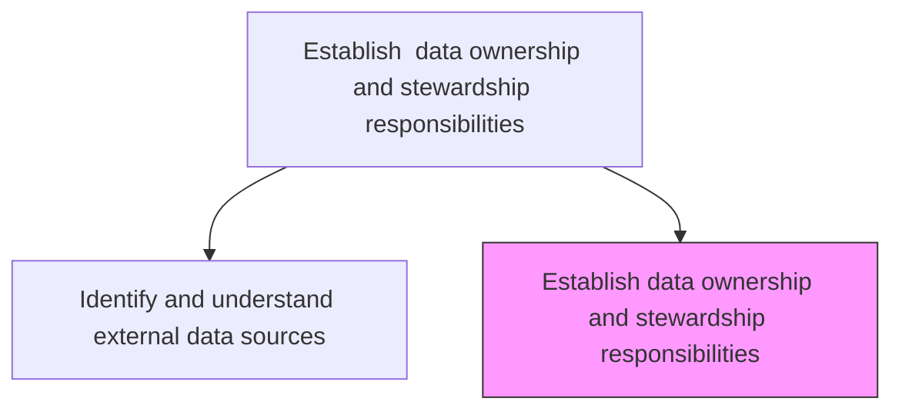
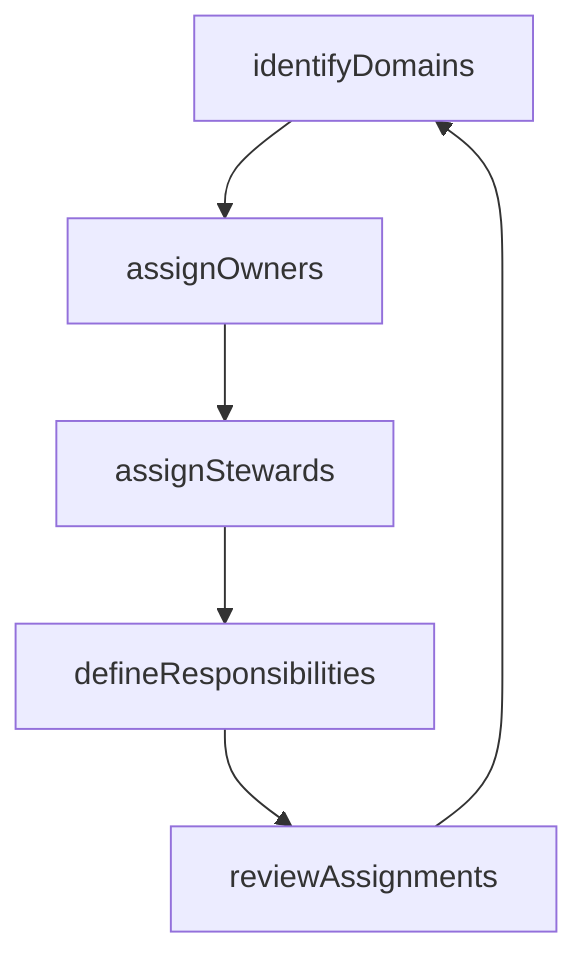

# Establish  data ownership and stewardship responsibilities

> Business-as-Code definition for designating data owners and stewards responsible for data accuracy, integrity, and timeliness across enterprise data domains.

## Overview

Establishing entities responsible for data accuracy, integrity, and timeliness that can authorize or deny access to certain data. Develop data utilizing governance processes to ensure fitness of data elements.

## Process Hierarchy



## GraphDL

```yaml
establish:
  object: Data Ownership And Stewardship Responsibilities
  actor: ChiefDataOfficer
  result: OwnershipAssignmentMatrix
```

## Actions

| Action | Description |
|--------|-------------|
| identifyDomains | Define the data domains requiring ownership and stewardship |
| assignOwners | Designate data owners with authority over data access and quality |
| assignStewards | Appoint data stewards responsible for daily data quality management |
| defineResponsibilities | Document the roles, responsibilities, and accountability for each assignment |
| reviewAssignments | Periodically review and update ownership and stewardship assignments |

## Events

| Event | Description |
|-------|-------------|
| domainsIdentified | Data domains requiring governance identified |
| ownersAssigned | Data owners designated for each domain |
| stewardsAssigned | Data stewards appointed for daily quality management |
| responsibilitiesDefined | Roles and responsibilities documented |
| assignmentsReviewed | Ownership assignments reviewed and updated |

## Searches

| Search | Description |
|--------|-------------|
| getOwnershipMatrix | Retrieve the full data ownership and stewardship matrix |
| findOwnerByDomain | Look up the data owner for a specific domain |
| getStewardAssignments | List steward assignments filtered by domain or person |

## Process Flow



## RACI Matrix

| Activity | Responsible | Accountable | Consulted | Informed |
|----------|-------------|-------------|-----------|----------|
| assignOwners | ChiefDataOfficer | CIO | DepartmentHeads | DataStewards |
| assignStewards | DataGovernanceOfficer | ChiefDataOfficer | DataOwners | ITManagement |

## Related Processes

| Process | Relationship |
|---------|-------------|
| 8.4.2.2 Define enterprise data models | Upstream - data models define domains requiring ownership |
| 8.4.1.2 Establish data, information, and analytic governance | Parallel - governance framework defines ownership requirements |

## Related Departments

| Department | Role |
|-----------|------|
| Data Governance | Manages the ownership assignment process |
| Business Units | Provide domain expertise and accept ownership |
| IT Management | Supports stewardship with technical capabilities |

## Related Occupations

| Occupation | Involvement |
|-----------|-------------|
| Chief Data Officer | Designates data owners at the executive level |
| Data Steward | Executes daily data quality management |

## KPIs

| KPI | Description | Unit |
|-----|-------------|------|
| Ownership Assignment Rate | Percentage of data domains with designated owners | % |
| Stewardship Coverage | Percentage of critical data elements with assigned stewards | % |
| Assignment Review Frequency | How often ownership assignments are reviewed | Per Year |

## Usage

```typescript
import { establishDataOwnershipAndStewardshipResponsibilities } from '@headlessly/establish-data-ownership-and-stewardship-responsibilities'

const ownership = establishDataOwnershipAndStewardshipResponsibilities()

// Assign a data owner
await ownership.assignOwners({
  domain: 'Product Catalog',
  owner: 'VP Product Management',
  effectiveDate: '2025-07-01'
})

// Assign data stewards
await ownership.assignStewards({
  domain: 'Product Catalog',
  stewards: ['product-data-admin@company.com'],
  responsibilities: ['quality-monitoring', 'access-approval']
})
```
