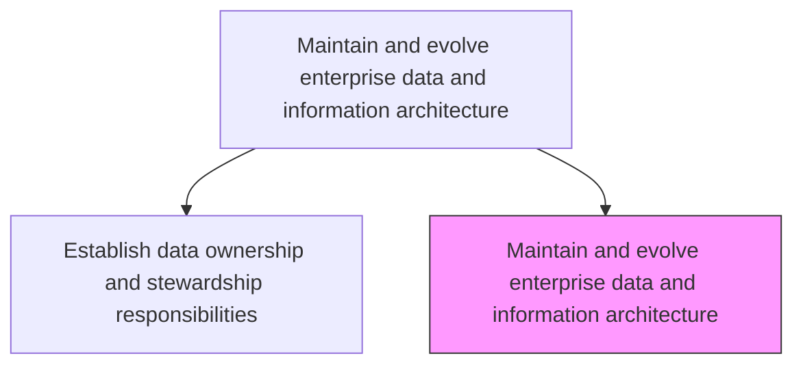
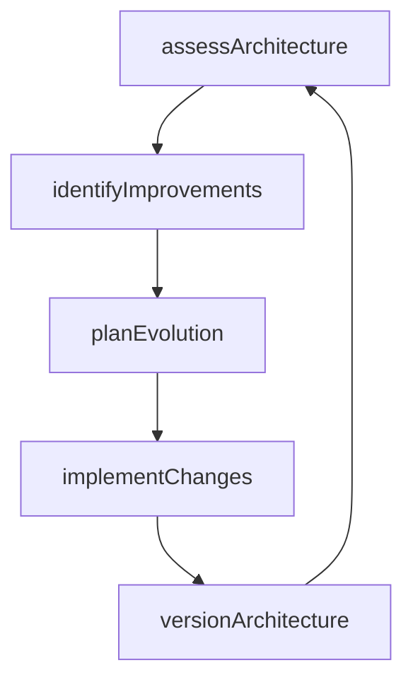

# Maintain and evolve enterprise data and information architecture

> Business-as-Code definition for continuously updating and improving the enterprise data and information architecture to reflect evolving business needs, technology changes, and regulatory requirements.

## Overview

Creating and maintaining the process of designing, creating, deploying, and managing strategies to maintain enterprise data and information architecture.

## Process Hierarchy



## GraphDL

```yaml
maintain:
  object: Enterprise Data And Information Architecture
  actor: DataArchitect
  result: ArchitectureRevision
```

## Actions

| Action | Description |
|--------|-------------|
| assessArchitecture | Evaluate the current architecture against business needs and technology trends |
| identifyImprovements | Document opportunities to improve the information architecture |
| planEvolution | Create a roadmap for architecture evolution and migration |
| implementChanges | Execute approved architecture changes and updates |
| versionArchitecture | Publish a new version of the enterprise information architecture |

## Events

| Event | Description |
|-------|-------------|
| architectureAssessed | Current architecture evaluated for gaps and opportunities |
| improvementsIdentified | Architecture improvement opportunities documented |
| evolutionPlanned | Architecture evolution roadmap created |
| changesImplemented | Architecture changes executed and validated |
| architectureVersioned | New architecture version published |

## Searches

| Search | Description |
|--------|-------------|
| getArchitectureVersions | List architecture versions with change summaries |
| getEvolutionRoadmap | Retrieve the planned architecture evolution roadmap |
| findImprovements | List identified improvement opportunities by priority |

## Process Flow



## RACI Matrix

| Activity | Responsible | Accountable | Consulted | Informed |
|----------|-------------|-------------|-----------|----------|
| assessArchitecture | DataArchitect | ChiefDataOfficer | EnterpriseArchitect | ITGovernance |
| implementChanges | DataArchitect | ChiefDataOfficer | DevelopmentTeams | DataStewards |

## Related Processes

| Process | Relationship |
|---------|-------------|
| 8.4.2.1 Determine enterprise business information requirements | Upstream - new requirements trigger architecture evolution |
| 8.4.2.2 Define enterprise data models | Parallel - model changes drive architecture updates |

## Related Departments

| Department | Role |
|-----------|------|
| Data Management | Maintains and evolves the information architecture |
| Enterprise Architecture | Ensures alignment with overall technology strategy |

## Related Occupations

| Occupation | Involvement |
|-----------|-------------|
| Data Architect | Designs and evolves the information architecture |
| Enterprise Architect | Provides strategic architecture guidance |

## KPIs

| KPI | Description | Unit |
|-----|-------------|------|
| Architecture Currency | Age of the latest architecture revision | Months |
| Improvement Implementation Rate | Percentage of identified improvements implemented | % |
| Architecture Compliance | Percentage of systems conforming to the architecture | % |

## Usage

```typescript
import { maintainAndEvolveEnterpriseDataAndInformationArchitecture } from '@headlessly/maintain-and-evolve-enterprise-data-and-information-architecture'

const architecture = maintainAndEvolveEnterpriseDataAndInformationArchitecture()

// Assess current architecture
const assessment = await architecture.assessArchitecture({
  scope: 'enterprise',
  evaluationCriteria: ['scalability', 'compliance', 'integration']
})

// Plan evolution
const roadmap = await architecture.planEvolution({
  improvements: assessment.improvements,
  budget: 250000,
  timeline: '2025-H2'
})
```
