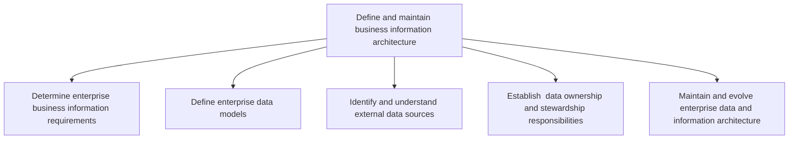
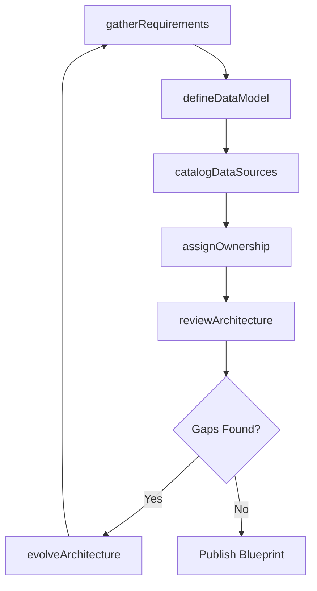

# Define and maintain business information architecture

> Business-as-Code definition for designing, documenting, and evolving the enterprise information architecture, including data models, ownership structures, and external data source integration.

## Overview

Creating strategies to manage the organization's information and content. Outline the architecture for information collection and communication. Administer information resources, data management and content.

## Process Hierarchy



## GraphDL

```yaml
define:
  object: Business Information Architecture
  actor: DataArchitect
  result: InformationArchitectureBlueprint
```

## Actions

| Action | Description |
|--------|-------------|
| gatherRequirements | Collect enterprise-wide business information requirements from stakeholders |
| defineDataModel | Create conceptual, logical, and physical data models for the enterprise |
| catalogDataSources | Identify and document internal and external data sources |
| assignOwnership | Designate data owners and stewards for each data domain |
| reviewArchitecture | Evaluate the current information architecture for gaps and improvements |
| evolveArchitecture | Update the information architecture to reflect new business needs |

## Events

| Event | Description |
|-------|-------------|
| requirementsGathered | Enterprise information requirements documented and validated |
| dataModelDefined | Enterprise data model created or updated |
| dataSourcesCataloged | Internal and external data sources identified and documented |
| ownershipAssigned | Data owners and stewards designated for data domains |
| architectureReviewed | Information architecture gap analysis completed |
| architectureEvolved | Information architecture updated to reflect new requirements |

## Searches

| Search | Description |
|--------|-------------|
| findDataModels | List enterprise data models filtered by domain or version |
| getDataSources | Retrieve cataloged data sources by type, owner, or classification |
| getOwnershipMap | Get data ownership and stewardship assignments by domain |
| findArchitectureGaps | List identified gaps in the current information architecture |

## Process Flow



## RACI Matrix

| Activity | Responsible | Accountable | Consulted | Informed |
|----------|-------------|-------------|-----------|----------|
| gatherRequirements | DataArchitect | ChiefDataOfficer | BusinessAnalysts | ITManagement |
| defineDataModel | DataModeler | DataArchitect | DomainExperts | DevelopmentTeams |
| catalogDataSources | DataEngineer | DataArchitect | VendorManagement | ComplianceTeam |
| assignOwnership | ChiefDataOfficer | CIO | DepartmentHeads | DataStewards |
| reviewArchitecture | DataArchitect | ChiefDataOfficer | EnterpriseArchitect | ITGovernance |

## Sub-Processes

| ID | Name | Description |
|----|------|-------------|
| 8.4.2.1 | Determine enterprise business information requirements | Determining strategies to manage the enterprise wide flow of business information and content. Outli |
| 8.4.2.2 | Define enterprise data models | Define different ways of representation, usage, and identification of data with independent or inter |
| 8.4.2.3 | Identify and understand external data sources | Identifying and understanding external sources of data in relevance of reliability, security, and au |
| 8.4.2.4 | Establish  data ownership and stewardship responsibilities | Establishing entities responsible for data accuracy, integrity, and timeliness that can authorize or |
| 8.4.2.5 | Maintain and evolve enterprise data and information architecture | Creating and maintaining the process of designing, creating, deploying, and managing strategies to m |

## Related Processes

| Process | Relationship |
|---------|-------------|
| 8.4.1 Define business information and analytics strategy | Upstream - provides strategic direction for architecture |
| 8.4.3 Define and execute business information lifecycle planning and control | Downstream - uses architecture to govern data lifecycle |
| 8.4.4 Manage business information content | Downstream - manages content within the defined architecture |

## Related Departments

| Department | Role |
|-----------|------|
| Data Management | Designs and maintains data models and architecture |
| Enterprise Architecture | Ensures alignment with overall technology architecture |
| IT Governance | Oversees data ownership and stewardship policies |
| Business Intelligence | Consumes architecture for analytics and reporting |

## Related Occupations

| Occupation | Involvement |
|-----------|-------------|
| Data Architect | Designs and evolves the information architecture |
| Data Modeler | Creates and maintains enterprise data models |
| Data Steward | Ensures data quality within assigned domains |

## KPIs

| KPI | Description | Unit |
|-----|-------------|------|
| Data Model Coverage | Percentage of business domains with defined data models | % |
| Data Source Catalog Completeness | Percentage of known data sources documented in catalog | % |
| Ownership Assignment Rate | Percentage of data domains with assigned owners and stewards | % |
| Architecture Currency | Age of the latest information architecture revision | Months |

## Usage

```typescript
import { defineAndMaintainBusinessInformationArchitecture } from '@headlessly/define-and-maintain-business-information-architecture'

const infoArch = defineAndMaintainBusinessInformationArchitecture()

// Define an enterprise data model
const model = await infoArch.defineDataModel({
  domain: 'Customer',
  type: 'logical',
  entities: ['Customer', 'Account', 'Contact', 'Address'],
  version: '2.1'
})

// Assign data ownership
await infoArch.assignOwnership({
  domain: 'Customer',
  owner: 'VP Sales Operations',
  steward: 'CRM Data Steward'
})

// Review current architecture
const gaps = await infoArch.findArchitectureGaps({
  scope: 'enterprise',
  includeRecommendations: true
})
```
