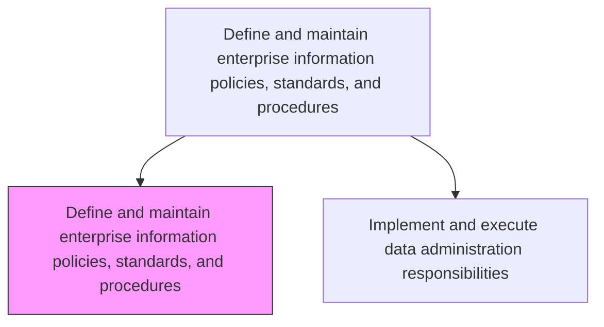
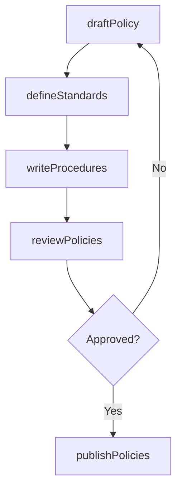

# Define and maintain enterprise information policies, standards, and procedures

> Business-as-Code definition for establishing and maintaining enterprise-wide policies, standards, and standard operating procedures that govern the creation, storage, access, and dissemination of information.

## Overview

Outlining and establishing policies for information and setting information standards and procedures. Establish policies to regulate the creation, use, storage, access, communication, and dissemination of information.

## Process Hierarchy



## GraphDL

```yaml
define:
  object: Enterprise Information Policies, Standards, And Procedures
  actor: InformationPolicyManager
  result: PolicyDocument
```

## Actions

| Action | Description |
|--------|-------------|
| draftPolicy | Create or update enterprise information policies |
| defineStandards | Establish naming conventions, data quality thresholds, and classification standards |
| writeProcedures | Document standard operating procedures for data handling |
| reviewPolicies | Conduct periodic reviews of existing policies for currency and relevance |
| publishPolicies | Distribute approved policies and standards to stakeholders |

## Events

| Event | Description |
|-------|-------------|
| policyDrafted | Information policy draft created or updated |
| standardsDefined | Information standards established and documented |
| proceduresWritten | Standard operating procedures documented |
| policiesReviewed | Periodic policy review completed |
| policiesPublished | Approved policies distributed to stakeholders |

## Searches

| Search | Description |
|--------|-------------|
| findPolicies | List information policies by domain, status, or effective date |
| getStandards | Retrieve current information standards by category |
| getProcedures | Get SOPs filtered by process area or data type |

## Process Flow



## RACI Matrix

| Activity | Responsible | Accountable | Consulted | Informed |
|----------|-------------|-------------|-----------|----------|
| draftPolicy | InformationPolicyManager | ChiefDataOfficer | LegalCounsel | ITManagement |
| defineStandards | DataGovernanceLead | ChiefDataOfficer | EnterpriseArchitect | DataStewards |
| writeProcedures | InformationPolicyManager | ChiefDataOfficer | ITOperationsManager | DataEngineers |
| reviewPolicies | ComplianceAnalyst | ChiefDataOfficer | InternalAudit | DataGovernanceCouncil |
| publishPolicies | InformationPolicyManager | ChiefDataOfficer | ComplianceOfficer | AllStaff |

## Related Processes

| Process | Relationship |
|---------|-------------|
| 8.4.3.2 Implement and execute data administration responsibilities | Downstream - policies govern administration |
| 8.4.2 Define and maintain business information architecture | Upstream - architecture informs policy scope |

## Related Departments

| Department | Role |
|-----------|------|
| Data Governance | Creates and maintains information policies |
| Legal and Compliance | Reviews policies for regulatory alignment |
| IT Security | Ensures policies address security requirements |

## Related Occupations

| Occupation | Involvement |
|-----------|-------------|
| Information Policy Manager | Drafts and maintains policies and standards |
| Compliance Analyst | Reviews policies for regulatory adherence |

## KPIs

| KPI | Description | Unit |
|-----|-------------|------|
| Policy Currency | Percentage of policies reviewed within the last 12 months | % |
| Standards Adoption | Percentage of data domains following defined standards | % |
| Procedure Documentation Rate | Percentage of data processes with documented SOPs | % |

## Usage

```typescript
import { defineAndMaintainEnterpriseInformationPoliciesStandardsAndProcedures } from '@headlessly/define-and-maintain-enterprise-information-policies-standards-and-procedures'

const policies = defineAndMaintainEnterpriseInformationPoliciesStandardsAndProcedures()

// Draft a new information policy
const policy = await policies.draftPolicy({
  domain: 'Customer PII',
  scope: 'enterprise',
  retentionPeriod: '5 years',
  classification: 'Restricted'
})

// Publish approved policies
await policies.publishPolicies({
  policyIds: [policy.id],
  effectiveDate: '2025-08-01',
  notifyStakeholders: true
})
```
