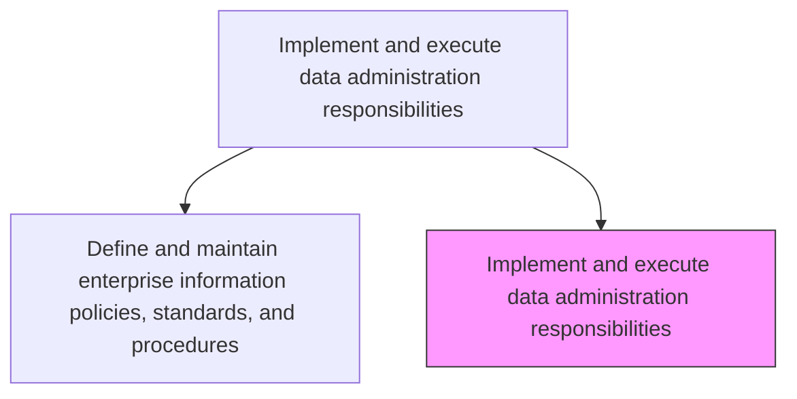
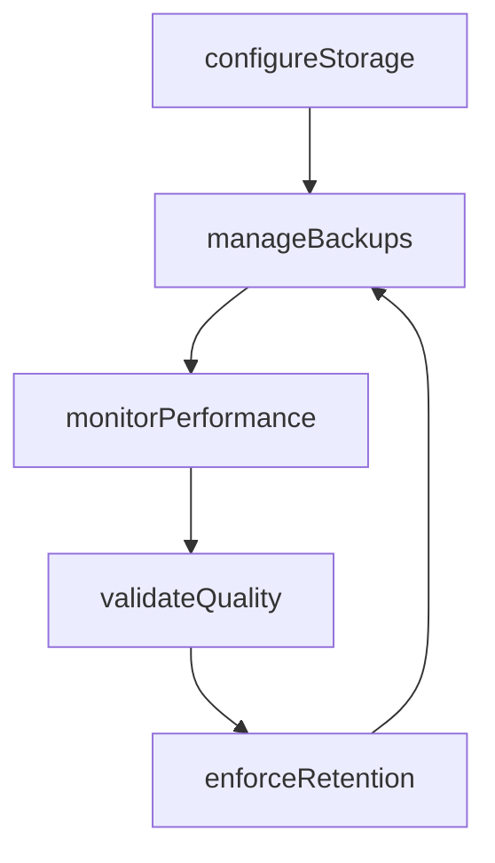

# Implement and execute data administration responsibilities

> Business-as-Code definition for implementing and executing data administration processes and technologies that support the collection, management, storage, and quality assurance of enterprise data.

## Overview

Implementing and executing strategies for processes and technologies that support the collection, managing, and storing of data.

## Process Hierarchy



## GraphDL

```yaml
implement:
  object: Data Administration Responsibilities
  actor: DatabaseAdministrator
  result: AdministrationReport
```

## Actions

| Action | Description |
|--------|-------------|
| configureStorage | Set up and optimize data storage infrastructure |
| manageBackups | Schedule and execute data backup and recovery procedures |
| monitorPerformance | Track database performance and optimize queries |
| enforceRetention | Apply data retention and archival rules per policy |
| validateQuality | Run data quality checks and remediate issues |

## Events

| Event | Description |
|-------|-------------|
| storageConfigured | Data storage infrastructure set up or optimized |
| backupsManaged | Backup procedures executed successfully |
| performanceMonitored | Database performance metrics collected |
| retentionEnforced | Data retention rules applied to datasets |
| qualityValidated | Data quality checks completed |

## Searches

| Search | Description |
|--------|-------------|
| getStorageMetrics | Retrieve storage utilization and growth metrics |
| getBackupStatus | Get the status of recent backup operations |
| getQualityReport | Retrieve data quality validation results |

## Process Flow



## RACI Matrix

| Activity | Responsible | Accountable | Consulted | Informed |
|----------|-------------|-------------|-----------|----------|
| configureStorage | DatabaseAdministrator | DataGovernanceManager | InfrastructureTeam | DataEngineers |
| validateQuality | DataQualityAnalyst | DataGovernanceManager | DataStewards | DataOwners |

## Related Processes

| Process | Relationship |
|---------|-------------|
| 8.4.3.1 Define and maintain enterprise information policies, standards, and procedures | Upstream - policies govern administration |
| 8.4.4 Manage business information content | Downstream - administration supports content management |

## Related Departments

| Department | Role |
|-----------|------|
| Database Administration | Manages data storage and performance |
| Data Quality | Validates and remediates data quality issues |
| IT Operations | Supports infrastructure for data administration |

## Related Occupations

| Occupation | Involvement |
|-----------|-------------|
| Database Administrator | Manages storage, backups, and performance |
| Data Quality Analyst | Validates data against quality standards |

## KPIs

| KPI | Description | Unit |
|-----|-------------|------|
| Backup Success Rate | Percentage of backups completing without errors | % |
| Database Uptime | Percentage of time databases are available | % |
| Data Quality Score | Composite quality score across administered datasets | Score (0-100) |

## Usage

```typescript
import { implementAndExecuteDataAdministrationResponsibilities } from '@headlessly/implement-and-execute-data-administration-responsibilities'

const admin = implementAndExecuteDataAdministrationResponsibilities()

// Monitor database performance
const performance = await admin.monitorPerformance({
  database: 'enterprise-warehouse',
  metrics: ['query-latency', 'throughput', 'storage-utilization']
})

// Validate data quality
const quality = await admin.validateQuality({
  dataset: 'customer-master',
  rules: ['completeness', 'uniqueness', 'referential-integrity']
})
```
