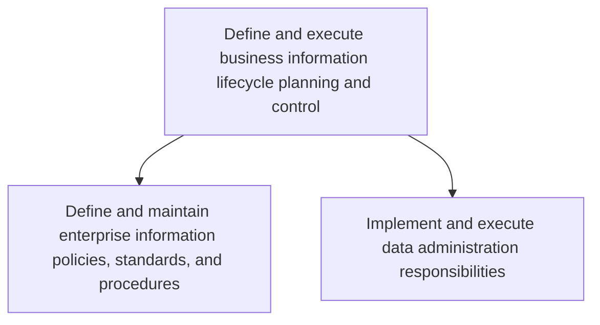
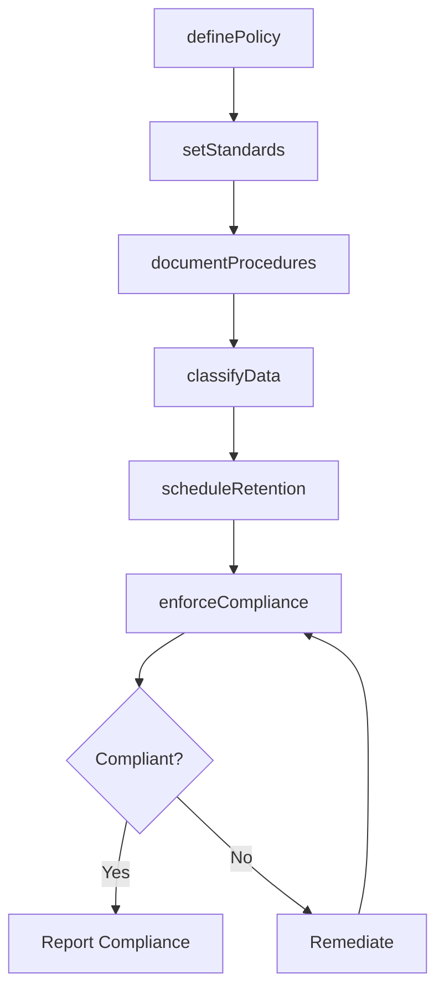

# Define and execute business information lifecycle planning and control

> Business-as-Code definition for governing the full lifecycle of enterprise data, from creation and storage through archival and disposal, using defined policies, standards, and administration procedures.

## Overview

Develop and implement strategies to plan and manage the flow of an information system's data from creation and initial storage to the time when it becomes obsolete and deleted.

## Process Hierarchy



## GraphDL

```yaml
define:
  object: Business Information Lifecycle Planning And Control
  actor: DataGovernanceManager
  result: InformationLifecyclePolicy
```

## Actions

| Action | Description |
|--------|-------------|
| definePolicy | Establish enterprise information policies for data handling and retention |
| setStandards | Define data quality, classification, and naming standards |
| documentProcedures | Create standard operating procedures for data administration |
| enforceCompliance | Monitor and enforce adherence to information policies |
| classifyData | Apply data classification labels based on sensitivity and regulatory requirements |
| scheduleRetention | Set retention schedules for data archival and disposal |

## Events

| Event | Description |
|-------|-------------|
| policyDefined | Enterprise information policy established and published |
| standardsSet | Data quality and classification standards documented |
| proceduresDocumented | Data administration SOPs created and distributed |
| complianceEnforced | Policy compliance audit completed with findings |
| dataClassified | Data classification labels applied to information assets |
| retentionScheduled | Data retention and disposal schedules established |

## Searches

| Search | Description |
|--------|-------------|
| findPolicies | List information policies filtered by domain, status, or effective date |
| getRetentionSchedule | Retrieve retention and disposal schedules for a data classification |
| getComplianceStatus | Get compliance audit results for a specific policy or domain |

## Process Flow



## RACI Matrix

| Activity | Responsible | Accountable | Consulted | Informed |
|----------|-------------|-------------|-----------|----------|
| definePolicy | DataGovernanceManager | ChiefDataOfficer | LegalCounsel | ITManagement |
| setStandards | DataQualityAnalyst | DataGovernanceManager | BusinessAnalysts | DevelopmentTeams |
| classifyData | DataSteward | DataGovernanceManager | ComplianceOfficer | DataOwners |
| enforceCompliance | ComplianceAnalyst | DataGovernanceManager | InternalAudit | ExecutiveTeam |

## Sub-Processes

| ID | Name | Description |
|----|------|-------------|
| 8.4.3.1 | Define and maintain enterprise information policies, standards, and procedures | Outlining and establishing policies for information and setting information standards and procedures |
| 8.4.3.2 | Implement and execute data administration responsibilities | Implementing and executing strategies for processes and technologies that support the collection, ma |

## Related Processes

| Process | Relationship |
|---------|-------------|
| 8.4.2 Define and maintain business information architecture | Upstream - provides architecture that policies govern |
| 8.4.4 Manage business information content | Downstream - applies lifecycle policies to content management |

## Related Departments

| Department | Role |
|-----------|------|
| Data Governance | Defines and enforces information lifecycle policies |
| Legal and Compliance | Advises on regulatory data retention requirements |
| Records Management | Manages physical and digital records retention |
| IT Security | Ensures data classification aligns with security controls |

## Related Occupations

| Occupation | Involvement |
|-----------|-------------|
| Data Governance Manager | Defines and oversees information lifecycle policies |
| Records Manager | Manages retention schedules and data disposal |
| Compliance Analyst | Audits adherence to data policies and regulations |

## KPIs

| KPI | Description | Unit |
|-----|-------------|------|
| Policy Coverage | Percentage of data domains covered by lifecycle policies | % |
| Retention Compliance Rate | Percentage of data assets adhering to retention schedules | % |
| Data Classification Completeness | Percentage of information assets with classification labels | % |
| Policy Violation Count | Number of data policy violations detected per period | Count |

## Usage

```typescript
import { defineAndExecuteBusinessInformationLifecyclePlanningAndControl } from '@headlessly/define-and-execute-business-information-lifecycle-planning-and-control'

const lifecycle = defineAndExecuteBusinessInformationLifecyclePlanningAndControl()

// Define a retention policy
const policy = await lifecycle.definePolicy({
  domain: 'Financial Records',
  retentionPeriod: '7 years',
  classification: 'Confidential',
  regulatoryBasis: 'SOX'
})

// Classify data assets
await lifecycle.classifyData({
  assetId: 'ds-transaction-logs',
  classification: 'Confidential',
  policyId: policy.id
})

// Check compliance status
const compliance = await lifecycle.getComplianceStatus({
  domain: 'Financial Records',
  period: '2025-Q2'
})
```
