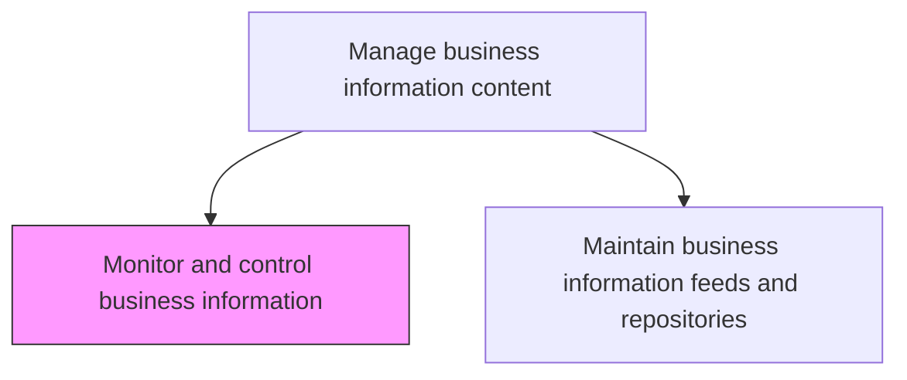
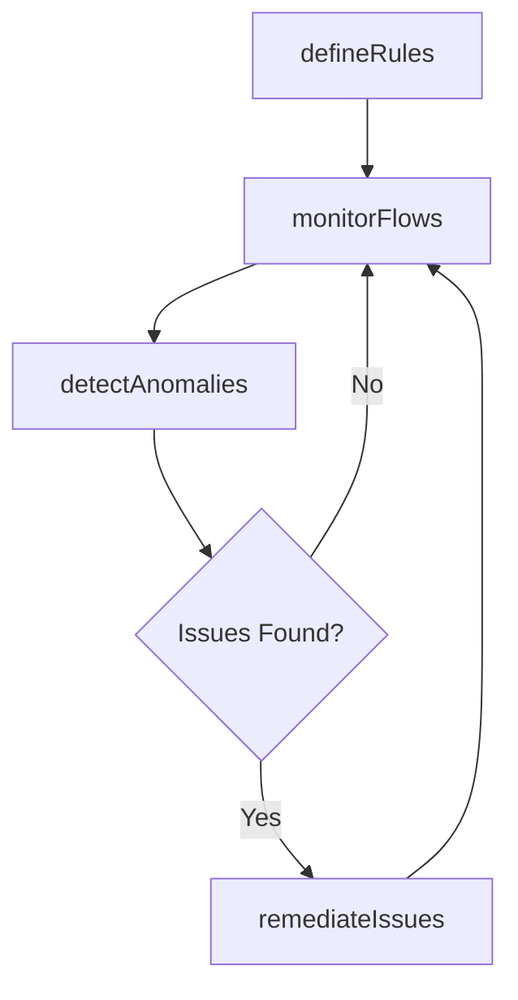

# Monitor and control business information

> Business-as-Code definition for continuously monitoring and controlling business information attributes, ensuring data flows conform to organizational rules, standards, and quality thresholds.

## Overview

Defining the rules, diction, and logic that make up the framework of the organization's information architecture. Monitoring and controlling information attributes that flow through the IT framework.

## Process Hierarchy



## GraphDL

```yaml
monitor:
  object: Business Information
  actor: DataQualityAnalyst
  result: InformationControlReport
```

## Actions

| Action | Description |
|--------|-------------|
| defineRules | Establish business rules and validation logic for information flows |
| monitorFlows | Track information attributes as they flow through IT systems |
| detectAnomalies | Identify data quality anomalies and policy violations |
| remediateIssues | Correct detected data quality issues and policy violations |

## Events

| Event | Description |
|-------|-------------|
| rulesDefined | Business rules for information control established |
| flowsMonitored | Information flow monitoring cycle completed |
| anomaliesDetected | Data quality anomalies or policy violations identified |
| issuesRemediated | Data quality issues corrected |

## Searches

| Search | Description |
|--------|-------------|
| getControlDashboard | Retrieve real-time information quality and flow metrics |
| findAnomalies | List detected anomalies by severity or data domain |
| getRemediationStatus | Get the status of ongoing remediation efforts |

## Process Flow



## RACI Matrix

| Activity | Responsible | Accountable | Consulted | Informed |
|----------|-------------|-------------|-----------|----------|
| defineRules | DataQualityAnalyst | InformationManager | DataStewards | DevelopmentTeams |
| monitorFlows | DataQualityAnalyst | InformationManager | DataEngineers | ITOperations |
| detectAnomalies | DataQualityAnalyst | InformationManager | DataOwners | ITManagement |
| remediateIssues | DataEngineer | InformationManager | DataStewards | BusinessProcessOwners |

## Related Processes

| Process | Relationship |
|---------|-------------|
| 8.4.4.2 Maintain business information feeds and repositories | Downstream - monitoring ensures feed quality |
| 8.4.3.1 Define and maintain enterprise information policies | Upstream - policies define monitoring rules |

## Related Departments

| Department | Role |
|-----------|------|
| Data Quality | Monitors information and detects anomalies |
| Data Management | Remediates quality issues |
| IT Operations | Supports monitoring infrastructure |

## Related Occupations

| Occupation | Involvement |
|-----------|-------------|
| Data Quality Analyst | Monitors information flows and detects anomalies |
| Data Engineer | Implements monitoring pipelines and remediation |

## KPIs

| KPI | Description | Unit |
|-----|-------------|------|
| Anomaly Detection Rate | Percentage of data quality issues detected proactively | % |
| Remediation Cycle Time | Average time from anomaly detection to resolution | Hours |
| Rule Coverage | Percentage of information flows covered by validation rules | % |

## Usage

```typescript
import { monitorAndControlBusinessInformation } from '@headlessly/monitor-and-control-business-information'

const monitor = monitorAndControlBusinessInformation()

// Define validation rules
await monitor.defineRules({
  domain: 'Order Processing',
  rules: [
    { field: 'orderTotal', type: 'range', min: 0, max: 1000000 },
    { field: 'customerId', type: 'referential-integrity', reference: 'customer-master' }
  ]
})

// Check for anomalies
const anomalies = await monitor.findAnomalies({
  domain: 'Order Processing',
  severity: 'high',
  since: '2025-07-01'
})
```
