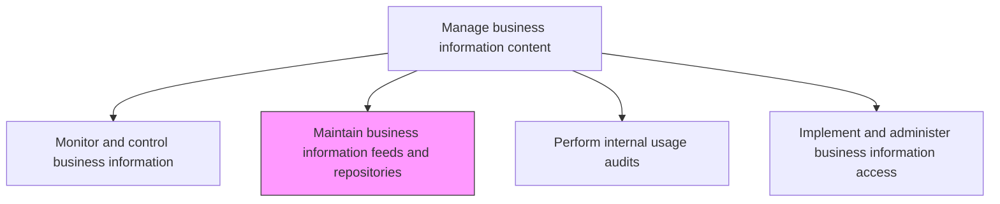
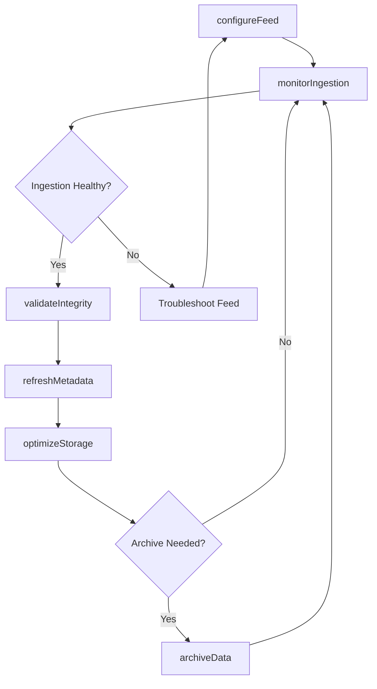

# Maintain business information feeds and repositories

> Business-as-Code definition for managing and maintaining the data feeds, pipelines, and repositories that store, process, and deliver business information across the enterprise.

## Overview

Maintain information feedstock along with IT hardware and software needed for storage, access, and retrieval of business information.

## Process Hierarchy



## GraphDL

```yaml
maintain:
  object: Business Information Feeds And Repositories
  actor: DataEngineer
  result: RepositoryHealthReport
```

## Actions

| Action | Description |
|--------|-------------|
| configureFeed | Set up or update data feed connections, schedules, and transformation rules |
| monitorIngestion | Track the status and health of data ingestion pipelines |
| optimizeStorage | Tune repository storage settings for performance and cost efficiency |
| archiveData | Move aged or infrequently accessed data to long-term storage tiers |
| validateIntegrity | Run integrity checks on repositories to detect corruption or data loss |
| refreshMetadata | Update repository metadata catalogs with current schema and lineage information |

## Events

| Event | Description |
|-------|-------------|
| feedConfigured | Data feed connection or schedule configured or updated |
| ingestionMonitored | Data ingestion pipeline health check completed |
| storageOptimized | Repository storage settings tuned for performance |
| dataArchived | Aged data moved to long-term archive storage |
| integrityValidated | Repository integrity check completed |
| metadataRefreshed | Repository metadata catalog updated |

## Searches

| Search | Description |
|--------|-------------|
| getFeedStatus | Retrieve the current status and health of data feeds |
| getRepositoryInventory | List all managed repositories with storage utilization metrics |
| getIngestionHistory | Retrieve historical ingestion run logs filtered by feed or date range |
| findStaleFeeds | Identify feeds that have not delivered data within expected intervals |

## Process Flow



## RACI Matrix

| Activity | Responsible | Accountable | Consulted | Informed |
|----------|-------------|-------------|-----------|----------|
| configureFeed | DataEngineer | InformationManager | DataArchitect | DataStewards |
| monitorIngestion | DataEngineer | InformationManager | ITOperations | DataOwners |
| optimizeStorage | DatabaseAdministrator | InformationManager | InfrastructureTeam | FinanceTeam |
| archiveData | DataEngineer | InformationManager | ComplianceOfficer | DataOwners |

## Related Processes

| Process | Relationship |
|---------|-------------|
| 8.4.4.1 Monitor and control business information | Upstream - monitoring identifies feed and repository issues |
| 8.4.4.3 Perform internal usage audits | Downstream - repository access logs support usage audits |
| 8.4.3.2 Implement and execute data administration responsibilities | Parallel - administration policies govern repository management |

## Related Departments

| Department | Role |
|-----------|------|
| Data Engineering | Builds and maintains data feeds and pipelines |
| Database Administration | Manages repository infrastructure and performance |
| IT Operations | Supports underlying storage and compute infrastructure |

## Related Occupations

| Occupation | Involvement |
|-----------|-------------|
| Data Engineer | Configures and maintains data feeds and pipelines |
| Database Administrator | Manages repository storage and performance |
| Data Architect | Designs repository and feed architecture |

## KPIs

| KPI | Description | Unit |
|-----|-------------|------|
| Feed Uptime | Percentage of time data feeds are operational and delivering data | % |
| Ingestion Latency | Average time from data availability to repository load completion | Minutes |
| Storage Utilization Efficiency | Ratio of active data to total storage provisioned | % |

## Usage

```typescript
import { maintainBusinessInformationFeedsAndRepositories } from '@headlessly/maintain-business-information-feeds-and-repositories'

const repos = maintainBusinessInformationFeedsAndRepositories()

// Check feed health
const feedStatus = await repos.getFeedStatus({
  feedGroup: 'customer-data',
  includeMetrics: true
})

// Archive aged data
await repos.archiveData({
  repository: 'transaction-history',
  olderThan: '2024-01-01',
  targetTier: 'cold-storage'
})
```
