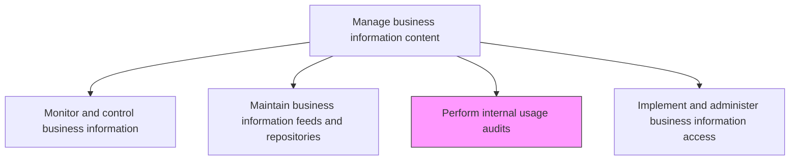
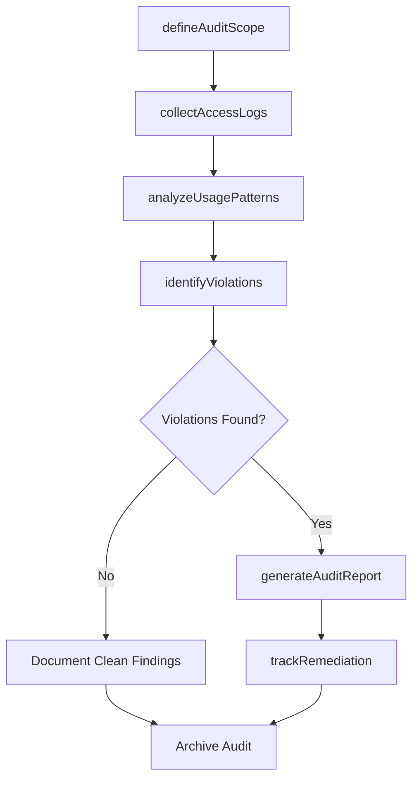

# Perform internal usage audits

> Business-as-Code definition for conducting systematic audits of internal information access and usage patterns, verifying compliance with data governance policies and identifying unauthorized or anomalous activity.

## Overview

Verification of information access and usage through regular reports on organizational performance.

## Process Hierarchy



## GraphDL

```yaml
perform:
  object: Internal Usage Audits
  actor: InformationAuditor
  result: UsageAuditReport
```

## Actions

| Action | Description |
|--------|-------------|
| defineAuditScope | Establish the scope, criteria, and schedule for usage audits |
| collectAccessLogs | Gather access and usage logs from information systems and repositories |
| analyzeUsagePatterns | Examine access frequency, user behavior, and data consumption trends |
| identifyViolations | Detect policy violations, unauthorized access, or suspicious usage patterns |
| generateAuditReport | Compile findings into a structured audit report with recommendations |
| trackRemediation | Monitor the resolution of audit findings and corrective actions |

## Events

| Event | Description |
|-------|-------------|
| auditScopeDefined | Audit scope and criteria established |
| accessLogsCollected | Usage and access logs gathered for analysis |
| usagePatternsAnalyzed | Access and usage pattern analysis completed |
| violationsIdentified | Policy violations or unauthorized access detected |
| auditReportGenerated | Audit report compiled and distributed to stakeholders |
| remediationTracked | Corrective action progress tracked and updated |

## Searches

| Search | Description |
|--------|-------------|
| getAuditSchedule | Retrieve the planned audit schedule and upcoming audit dates |
| findViolations | List policy violations filtered by severity, user, or data domain |
| getUsageTrends | Retrieve usage trend data by department, system, or time period |
| getAuditHistory | List completed audits with findings summaries and remediation status |

## Process Flow



## RACI Matrix

| Activity | Responsible | Accountable | Consulted | Informed |
|----------|-------------|-------------|-----------|----------|
| defineAuditScope | InformationAuditor | InformationManager | ComplianceOfficer | DataOwners |
| analyzeUsagePatterns | InformationAuditor | InformationManager | DataStewards | ITSecurity |
| identifyViolations | InformationAuditor | InformationManager | LegalCounsel | HumanResources |
| generateAuditReport | InformationAuditor | InformationManager | DataGovernanceOfficer | ExecutiveManagement |

## Related Processes

| Process | Relationship |
|---------|-------------|
| 8.4.4.4 Implement and administer business information access | Parallel - access controls are validated by audits |
| 8.4.4.1 Monitor and control business information | Upstream - monitoring data feeds into audit analysis |
| 8.4.3.1 Define and maintain enterprise information policies | Upstream - policies define audit criteria and compliance standards |

## Related Departments

| Department | Role |
|-----------|------|
| Internal Audit | Conducts information usage audits and reports findings |
| Data Governance | Defines audit criteria based on governance policies |
| IT Security | Provides access logs and investigates security violations |
| Compliance | Ensures audits address regulatory requirements |

## Related Occupations

| Occupation | Involvement |
|-----------|-------------|
| Information Auditor | Plans and executes usage audits |
| Compliance Analyst | Reviews audit findings against regulatory requirements |
| Data Governance Officer | Defines audit policies and standards |

## KPIs

| KPI | Description | Unit |
|-----|-------------|------|
| Audit Coverage | Percentage of information systems audited within the audit cycle | % |
| Violation Detection Rate | Number of policy violations detected per audit cycle | Count |
| Remediation Closure Rate | Percentage of audit findings resolved within the target timeframe | % |

## Usage

```typescript
import { performInternalUsageAudits } from '@headlessly/perform-internal-usage-audits'

const audits = performInternalUsageAudits()

// Analyze usage patterns for a specific system
const trends = await audits.getUsageTrends({
  system: 'customer-data-warehouse',
  period: 'Q4-2025',
  groupBy: 'department'
})

// Identify violations
const violations = await audits.findViolations({
  severity: 'high',
  since: '2025-10-01',
  includeRemediation: true
})
```
