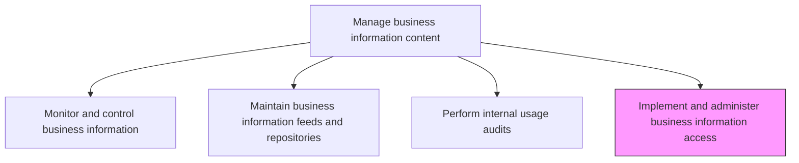
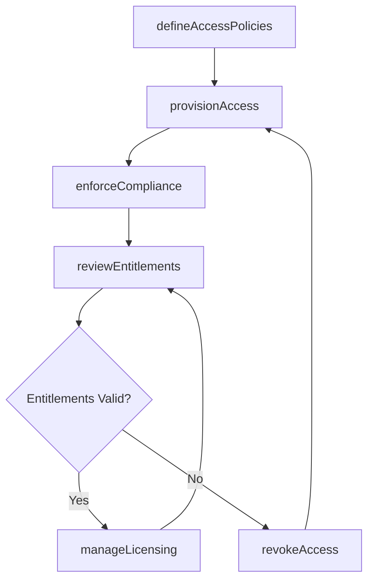

# Implement and administer business information access

> Business-as-Code definition for implementing and administering access controls, permissions, and entitlements that govern how users and systems interact with business information assets.

## Overview

Implement and manage the process for accessing information including issues related to copyright, open source, privacy, and security.

## Process Hierarchy



## GraphDL

```yaml
implement:
  object: And Administer Business Information Access
  actor: InformationAccessAdministrator
  result: AccessControlRecord
```

## Actions

| Action | Description |
|--------|-------------|
| defineAccessPolicies | Establish role-based and attribute-based access control policies for information assets |
| provisionAccess | Grant or modify user and system access to information resources |
| revokeAccess | Remove access entitlements when no longer authorized or needed |
| reviewEntitlements | Conduct periodic reviews of access entitlements for appropriateness |
| enforceCompliance | Verify access controls comply with copyright, privacy, and security regulations |
| manageLicensing | Track and administer licensing for third-party and open-source data assets |

## Events

| Event | Description |
|-------|-------------|
| accessPoliciesDefined | Access control policies established or updated |
| accessProvisioned | User or system access granted to information resources |
| accessRevoked | Access entitlements removed from a user or system |
| entitlementsReviewed | Periodic access entitlement review completed |
| complianceEnforced | Access control compliance verification completed |
| licensingManaged | Data asset licensing records updated |

## Searches

| Search | Description |
|--------|-------------|
| getAccessPolicies | Retrieve access control policies filtered by data domain or classification |
| findUserEntitlements | List all information access entitlements for a specific user or role |
| getAccessRequestLog | Retrieve the history of access requests and approvals |
| findExpiredEntitlements | Identify access entitlements that have passed their review or expiration date |

## Process Flow



## RACI Matrix

| Activity | Responsible | Accountable | Consulted | Informed |
|----------|-------------|-------------|-----------|----------|
| defineAccessPolicies | InformationAccessAdministrator | InformationManager | ITSecurity | DataOwners |
| provisionAccess | InformationAccessAdministrator | InformationManager | DataStewards | EndUsers |
| reviewEntitlements | InformationAccessAdministrator | InformationManager | ComplianceOfficer | HumanResources |
| enforceCompliance | InformationAccessAdministrator | InformationManager | LegalCounsel | DataGovernanceOfficer |

## Related Processes

| Process | Relationship |
|---------|-------------|
| 8.4.4.3 Perform internal usage audits | Downstream - access controls are validated through usage audits |
| 8.4.4.1 Monitor and control business information | Parallel - access monitoring supports information control |
| 8.4.3.1 Define and maintain enterprise information policies | Upstream - policies define access requirements and standards |

## Related Departments

| Department | Role |
|-----------|------|
| Information Security | Implements and enforces access controls |
| Data Governance | Defines access policies aligned with governance framework |
| Legal and Compliance | Advises on copyright, privacy, and licensing requirements |
| Human Resources | Provides role changes triggering access updates |

## Related Occupations

| Occupation | Involvement |
|-----------|-------------|
| Information Access Administrator | Provisions and manages access entitlements |
| IT Security Analyst | Implements technical access controls |
| Compliance Officer | Ensures access practices meet regulatory requirements |

## KPIs

| KPI | Description | Unit |
|-----|-------------|------|
| Access Provisioning Time | Average time from access request to fulfillment | Hours |
| Entitlement Review Completion | Percentage of entitlements reviewed within the scheduled cycle | % |
| Unauthorized Access Incidents | Number of unauthorized access attempts detected per period | Count |

## Usage

```typescript
import { implementAndAdministerBusinessInformationAccess } from '@headlessly/implement-and-administer-business-information-access'

const access = implementAndAdministerBusinessInformationAccess()

// Provision access for a user
await access.provisionAccess({
  userId: 'analyst-042',
  resource: 'financial-reporting-warehouse',
  role: 'read-only',
  justification: 'Q4 financial analysis project',
  expiresAt: '2026-03-31'
})

// Review entitlements for a data domain
const review = await access.findUserEntitlements({
  domain: 'customer-pii',
  includeExpired: true
})
```
