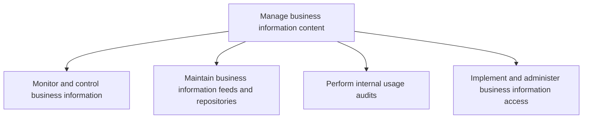
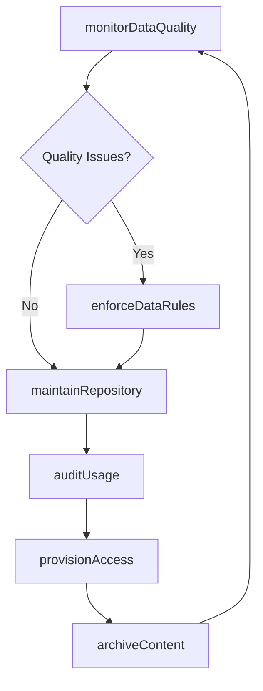

# Manage business information content

> Business-as-Code definition for governing, monitoring, and administering business information content, including data quality control, repository management, usage auditing, and access provisioning.

## Overview

Creating strategies to administer information and content. Understand the needs of the organization for information and content management. Realize the role of IT services for implementing the overall business strategy. Assess the implications of new technologies for managing information and content. Identify and prioritize the most effective and efficient actions for managing information and content.

## Process Hierarchy



## GraphDL

```yaml
manage:
  object: Business Information Content
  actor: InformationManager
  result: ContentGovernanceReport
```

## Actions

| Action | Description |
|--------|-------------|
| monitorDataQuality | Track data accuracy, completeness, and consistency metrics |
| maintainRepository | Administer data feeds, storage, and repository infrastructure |
| auditUsage | Perform internal audits of information access and usage patterns |
| provisionAccess | Grant, modify, or revoke user access to business information |
| enforceDataRules | Apply business rules and validation logic to information content |
| archiveContent | Move aged or inactive content to archival storage |

## Events

| Event | Description |
|-------|-------------|
| dataQualityMonitored | Data quality metrics collected and anomalies flagged |
| repositoryMaintained | Data feeds and repository infrastructure updated |
| usageAudited | Internal usage audit completed with findings documented |
| accessProvisioned | User access to business information granted or revoked |
| dataRulesEnforced | Business rules applied and validation exceptions logged |
| contentArchived | Aged content moved to archival storage |

## Searches

| Search | Description |
|--------|-------------|
| getDataQualityMetrics | Retrieve data quality scores for a domain or dataset |
| findAccessPermissions | List user access permissions by role, dataset, or user |
| getAuditFindings | Retrieve usage audit results for a given period |
| findRepositories | List data repositories filtered by type, status, or capacity |

## Process Flow



## RACI Matrix

| Activity | Responsible | Accountable | Consulted | Informed |
|----------|-------------|-------------|-----------|----------|
| monitorDataQuality | DataQualityAnalyst | InformationManager | DataStewards | BusinessUsers |
| maintainRepository | DatabaseAdministrator | InformationManager | InfrastructureTeam | DataEngineers |
| auditUsage | InternalAuditor | ComplianceOfficer | InformationManager | DataOwners |
| provisionAccess | AccessAdministrator | InformationManager | SecurityTeam | EndUsers |

## Sub-Processes

| ID | Name | Description |
|----|------|-------------|
| 8.4.4.1 | Monitor and control business information | Defining the rules, diction, and logic that make up the framework of the organization's information  |
| 8.4.4.2 | Maintain business information feeds and repositories | Maintain information feedstock along with IT hardware and software needed for storage, access, and r |
| 8.4.4.3 | Perform internal usage audits | Verification of information access and usage through regular reports on organizational performance. |
| 8.4.4.4 | Implement and administer business information access | Implement and manage the process for accessing information including issues related to copyright, op |

## Related Processes

| Process | Relationship |
|---------|-------------|
| 8.4.2 Define and maintain business information architecture | Upstream - provides data models and architecture used for content management |
| 8.4.3 Define and execute business information lifecycle planning and control | Upstream - provides policies governing content lifecycle |
| 8.4.1 Define business information and analytics strategy | Upstream - provides strategic direction for content priorities |

## Related Departments

| Department | Role |
|-----------|------|
| Data Management | Monitors data quality and maintains repositories |
| Internal Audit | Conducts usage audits and compliance reviews |
| IT Security | Manages access controls and information protection |
| Business Intelligence | Consumes managed content for analytics and reporting |

## Related Occupations

| Occupation | Involvement |
|-----------|-------------|
| Database Administrator | Maintains data repositories and feed infrastructure |
| Data Quality Analyst | Monitors and reports on data quality metrics |
| Information Security Analyst | Administers access controls and audits usage |

## KPIs

| KPI | Description | Unit |
|-----|-------------|------|
| Data Quality Score | Composite score of accuracy, completeness, and consistency | Score (0-100) |
| Access Request Fulfillment Time | Average time to provision user access requests | Hours |
| Audit Finding Resolution Rate | Percentage of audit findings resolved within SLA | % |
| Repository Availability | Uptime percentage of data repositories | % |

## Usage

```typescript
import { manageBusinessInformationContent } from '@headlessly/manage-business-information-content'

const content = manageBusinessInformationContent()

// Monitor data quality for a domain
const quality = await content.monitorDataQuality({
  domain: 'Customer Master',
  metrics: ['accuracy', 'completeness', 'timeliness']
})

// Provision access to a dataset
await content.provisionAccess({
  userId: 'analyst@company.com',
  dataset: 'sales-transactions',
  accessLevel: 'read',
  expiresAt: '2025-12-31'
})

// Retrieve audit findings
const findings = await content.getAuditFindings({
  period: '2025-Q2',
  severity: 'high'
})
```
