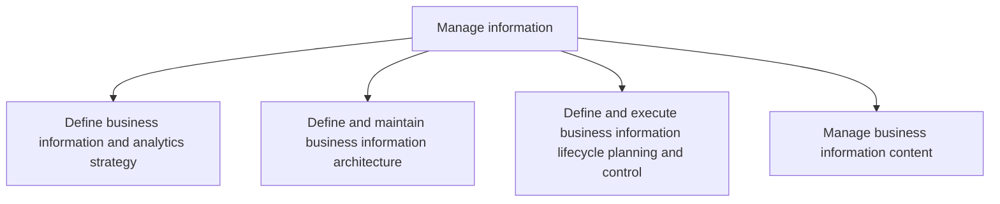
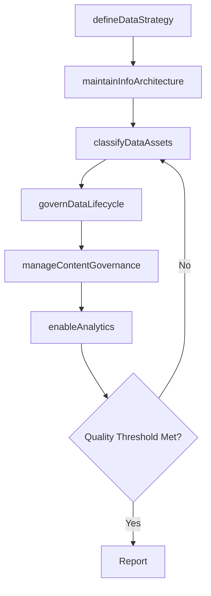

# Manage information

> Business-as-Code definition for enterprise information management. Models the processes of defining data strategy, maintaining information architecture, governing the data lifecycle, and managing business content.

## Overview

Creating strategies to manage the organization's information and content. Outline the architecture for information. Administer information resources. Administer the management of data and content.

## Process Hierarchy



## GraphDL

```yaml
manage:
  object: Information
  actor: ChiefDataOfficer
  result: InformationGovernanceFramework
```

## Actions

| Action | Description |
|--------|-------------|
| defineDataStrategy | Establish business information and analytics strategy |
| maintainInfoArchitecture | Design and evolve the enterprise information architecture |
| governDataLifecycle | Manage information lifecycle from creation to disposition |
| manageContentGovernance | Administer business information content policies and quality |
| classifyDataAssets | Categorize and tag data assets by sensitivity and business value |
| enableAnalytics | Deploy analytics capabilities and self-service data access |

## Events

| Event | Description |
|-------|-------------|
| dataStrategyDefined | Business information and analytics strategy approved |
| infoArchitectureMaintained | Information architecture standards updated |
| dataLifecycleGoverned | Data lifecycle policies enforced across the enterprise |
| contentGovernanceManaged | Content governance policies reviewed and published |
| dataAssetsClassified | Data assets categorized and tagged in the data catalog |
| analyticsEnabled | Analytics platform or capability deployed |

## Searches

| Search | Description |
|--------|-------------|
| findDataAssets | List data assets filtered by domain, classification, or owner |
| getDataQualityReport | Retrieve data quality metrics for a given domain or system |
| getInfoArchitecture | Get current information architecture model and standards |
| findContentPolicies | List content governance policies by type or business unit |

## Process Flow



## RACI Matrix

| Activity | Responsible | Accountable | Consulted | Informed |
|----------|-------------|-------------|-----------|----------|
| defineDataStrategy | DataStrategyManager | CDO | CIO | BusinessUnitLeaders |
| maintainInfoArchitecture | DataArchitect | CDO | EnterpriseArchitect | ITOperations |
| governDataLifecycle | DataGovernanceManager | CDO | Legal | DataStewards |
| manageContentGovernance | ContentManager | CDO | Compliance | BusinessUnitLeaders |

## Sub-Processes

| ID | Name | Description |
|----|------|-------------|
| 8.4.1 | Define business information and analytics strategy | Create an organization-wide strategy for the IT function by combining skills, technologies, applicat |
| 8.4.2 | Define and maintain business information architecture | Creating strategies to manage the organization's information and content. Outline the architecture f |
| 8.4.3 | Define and execute business information lifecycle planning and control | Develop and implement strategies to plan and manage the flow of an information system's data from cr |
| 8.4.4 | Manage business information content | Creating strategies to administer information and content. Understand the needs of the organization  |

## Related Processes

| Process | Relationship |
|---------|-------------|
| 8.2 Develop and manage IT business strategy | Upstream - IT strategy defines data and analytics priorities |
| 8.3 Develop and manage IT resilience and risk | Parallel - data protection requirements inform governance |
| 8.5 Develop and manage services/solutions | Downstream - data architecture underpins solution design |

## Related Departments

| Department | Role |
|-----------|------|
| Data Management | Primary owner of data governance and architecture |
| Business Intelligence | Develops analytics and reporting capabilities |
| IT Operations | Maintains data infrastructure and platforms |
| Legal and Compliance | Advises on data privacy and retention requirements |
| Business Units | Data consumers and stewards for domain-specific data |

## Related Occupations

| Occupation | Involvement |
|-----------|-------------|
| Chief Data Officer | Executive accountable for enterprise data strategy |
| Data Architect | Designs information models and integration patterns |
| Data Governance Analyst | Enforces data quality and stewardship policies |
| Business Intelligence Developer | Builds analytics and reporting solutions |

## KPIs

| KPI | Description | Unit |
|-----|-------------|------|
| Data Quality Score | Composite score for accuracy, completeness, and timeliness | Score (1-100) |
| Data Catalog Coverage | Percentage of enterprise data assets documented in the catalog | % |
| Analytics Adoption Rate | Percentage of business users actively using self-service analytics | % |
| Data Retention Compliance | Percentage of data assets meeting retention policy requirements | % |

## Usage

```typescript
import { manageInformation } from '@headlessly/manage-information'

const info = manageInformation()

// Define data strategy for the enterprise
const strategy = await info.defineDataStrategy({
  scope: 'enterprise',
  focusAreas: ['data-quality', 'self-service-analytics', 'master-data'],
  planningHorizon: '2-year'
})

// Classify and catalog data assets
const classification = await info.classifyDataAssets({
  domain: 'customer',
  sensitivityLevels: ['public', 'internal', 'confidential', 'restricted']
})
```
