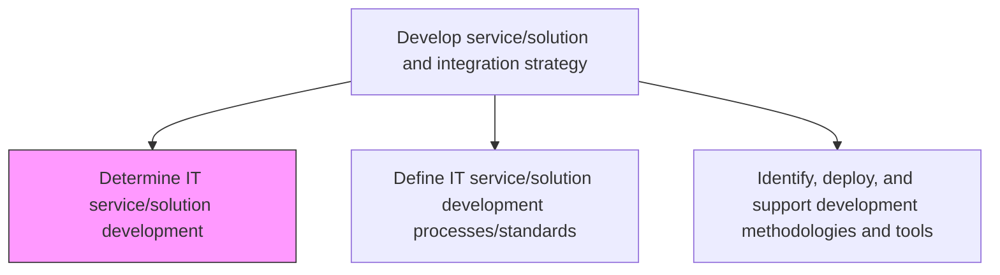
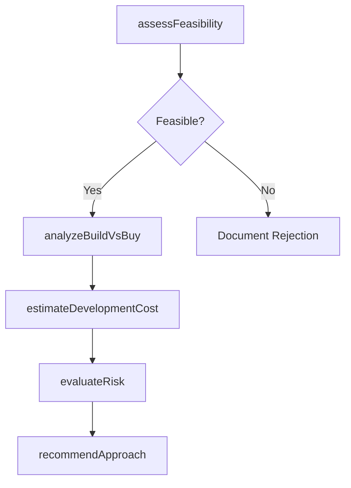

# Determine IT service/solution development

> Business-as-Code definition for evaluating and determining the optimal approach for IT service and solution development, including build-versus-buy analysis and cost-effectiveness assessments.

## Overview

Determining the development of IT service/solution. Analyze the pros and cons of IT service/solution and it's methods on the basis of their cost effectiveness and development value.

## Process Hierarchy



## GraphDL

```yaml
determine:
  object: IT Service/solution Development
  actor: DevelopmentStrategyLead
  result: DevelopmentFeasibilityAssessment
```

## Actions

| Action | Description |
|--------|-------------|
| assessFeasibility | Evaluate the technical and business feasibility of proposed IT service development |
| analyzeBuildVsBuy | Compare costs and benefits of building in-house versus purchasing or licensing solutions |
| estimateDevelopmentCost | Calculate projected costs including labor, infrastructure, and licensing |
| evaluateRisk | Assess development risks including timeline, resource, and technology risks |
| recommendApproach | Provide a recommended development approach based on analysis outcomes |

## Events

| Event | Description |
|-------|-------------|
| feasibilityAssessed | Technical and business feasibility evaluation completed |
| buildVsBuyAnalyzed | Build-versus-buy comparison completed |
| developmentCostEstimated | Development cost projections calculated |
| riskEvaluated | Development risk assessment completed |
| approachRecommended | Recommended development approach documented and presented |

## Searches

| Search | Description |
|--------|-------------|
| getFeasibilityReports | Retrieve feasibility assessments filtered by project or service area |
| getCostEstimates | List development cost estimates by project, technology, or time period |
| getBuildVsBuyAnalysis | Retrieve build-versus-buy analysis results for a specific solution |

## Process Flow



## RACI Matrix

| Activity | Responsible | Accountable | Consulted | Informed |
|----------|-------------|-------------|-----------|----------|
| assessFeasibility | DevelopmentStrategyLead | ITDirector | EnterpriseArchitect | ProjectManagers |
| analyzeBuildVsBuy | DevelopmentStrategyLead | ITDirector | ProcurementTeam | FinanceTeam |
| evaluateRisk | DevelopmentStrategyLead | ITDirector | SecurityArchitect | SteeringCommittee |

## Related Processes

| Process | Relationship |
|---------|-------------|
| 8.5.1.2 Define IT service/solution development processes/standards | Downstream - development determination informs process standards |
| 8.5.2.3 Determine IT service/solution approach | Parallel - approach selection complements development determination |
| 8.5.3.1 Assess IT application and infrastructure architecture constraints | Downstream - architecture constraints inform feasibility |

## Related Departments

| Department | Role |
|-----------|------|
| IT Strategy | Leads development determination and feasibility analysis |
| Enterprise Architecture | Provides architectural guidance on development options |
| Finance | Reviews cost estimates and budget implications |
| Procurement | Supports buy-side analysis for vendor solutions |

## Related Occupations

| Occupation | Involvement |
|-----------|-------------|
| Development Strategy Lead | Drives feasibility and build-versus-buy analysis |
| Enterprise Architect | Evaluates technical feasibility and architecture fit |
| Business Analyst | Gathers requirements for feasibility assessment |

## KPIs

| KPI | Description | Unit |
|-----|-------------|------|
| Feasibility Assessment Accuracy | Percentage of feasibility assessments that correctly predicted project outcomes | % |
| Build vs Buy Decision Cycle Time | Average time from analysis initiation to recommendation | Days |
| Cost Estimate Variance | Deviation between estimated and actual development costs | % |

## Usage

```typescript
import { determineItServiceSolutionDevelopment } from '@headlessly/determine-it-service-solution-development'

const development = determineItServiceSolutionDevelopment()

// Assess feasibility of a new service
const feasibility = await development.assessFeasibility({
  serviceName: 'Customer Analytics Platform',
  capabilities: ['real-time-dashboards', 'predictive-models', 'data-integration'],
  targetTimeline: 'Q3-2026'
})

// Run build-versus-buy analysis
const analysis = await development.analyzeBuildVsBuy({
  serviceName: 'Customer Analytics Platform',
  vendorOptions: ['vendor-a', 'vendor-b'],
  internalCapabilities: feasibility.technicalCapabilities
})
```
