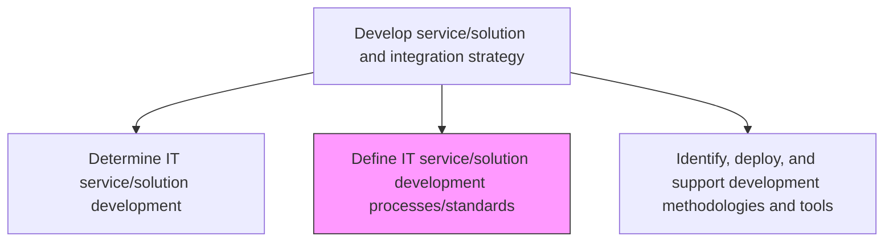
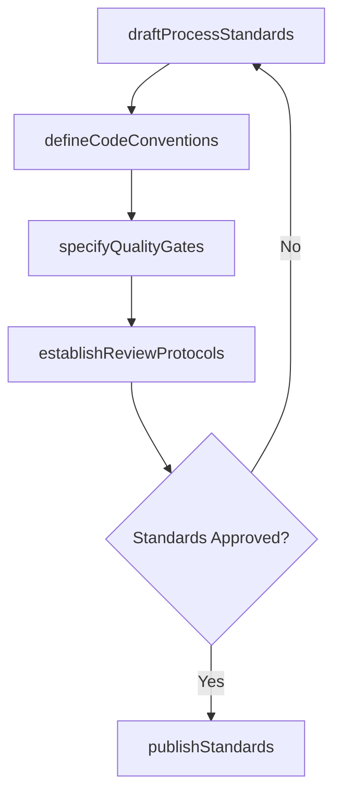

# Define IT service/solution development processes/standards

> Business-as-Code definition for establishing and codifying the processes, standards, and quality gates that govern IT service and solution development across the organization.

## Overview

Establishing the methods and processes as the foundation for developing new IT platforms, components, software, and explore new standards for better IT usage in the organization.

## Process Hierarchy



## GraphDL

```yaml
define:
  object: IT Service/solution Development Processes/standards
  actor: ProcessStandardsManager
  result: DevelopmentStandardsDocument
```

## Actions

| Action | Description |
|--------|-------------|
| draftProcessStandards | Create or update development process standards and quality gates |
| defineCodeConventions | Establish coding standards, naming conventions, and documentation requirements |
| specifyQualityGates | Define quality gate criteria for each development lifecycle phase |
| establishReviewProtocols | Set up peer review, code review, and architecture review protocols |
| publishStandards | Distribute approved standards to development teams and stakeholders |

## Events

| Event | Description |
|-------|-------------|
| processStandardsDrafted | Development process standards created or updated |
| codeConventionsDefined | Coding standards and conventions established |
| qualityGatesSpecified | Quality gate criteria defined for lifecycle phases |
| reviewProtocolsEstablished | Review protocols set up and communicated |
| standardsPublished | Approved standards distributed to development teams |

## Searches

| Search | Description |
|--------|-------------|
| getStandards | Retrieve current development standards filtered by technology or process area |
| getQualityGates | List quality gate definitions and criteria by development phase |
| getStandardsCompliance | Retrieve compliance metrics for development standards adoption |

## Process Flow



## RACI Matrix

| Activity | Responsible | Accountable | Consulted | Informed |
|----------|-------------|-------------|-----------|----------|
| draftProcessStandards | ProcessStandardsManager | ITDirector | DevelopmentLeads | QualityAssurance |
| defineCodeConventions | ProcessStandardsManager | ITDirector | SeniorDevelopers | AllDevelopers |
| specifyQualityGates | ProcessStandardsManager | ITDirector | QualityAssuranceLead | ProjectManagers |

## Related Processes

| Process | Relationship |
|---------|-------------|
| 8.5.1.1 Determine IT service/solution development | Upstream - development determination informs standards scope |
| 8.5.1.3 Identify, deploy, and support development methodologies and tools | Downstream - standards guide methodology and tool selection |
| 8.5.1.7 Establish development standards exception governance | Downstream - exceptions require defined standards baseline |

## Related Departments

| Department | Role |
|-----------|------|
| Software Engineering | Primary consumer and contributor to development standards |
| Quality Assurance | Validates quality gate criteria and compliance |
| IT Governance | Ensures standards align with governance framework |

## Related Occupations

| Occupation | Involvement |
|-----------|-------------|
| Process Standards Manager | Authors and maintains development standards |
| Software Architect | Contributes architectural standards and patterns |
| Quality Assurance Lead | Defines testing standards and quality gates |

## KPIs

| KPI | Description | Unit |
|-----|-------------|------|
| Standards Adoption Rate | Percentage of development teams adhering to defined standards | % |
| Standards Currency | Percentage of standards reviewed and updated within the last 12 months | % |
| Quality Gate Pass Rate | Percentage of deliverables passing quality gates on first attempt | % |

## Usage

```typescript
import { defineItServiceSolutionDevelopmentProcessesStandards } from '@headlessly/define-it-service-solution-development-processes-standards'

const standards = defineItServiceSolutionDevelopmentProcessesStandards()

// Retrieve current development standards
const currentStandards = await standards.getStandards({
  technology: 'cloud-native',
  area: 'microservices'
})

// Publish updated standards
await standards.publishStandards({
  standardIds: ['coding-conventions-v3', 'api-design-v2'],
  effectiveDate: '2026-03-01',
  notifyTeams: true
})
```
