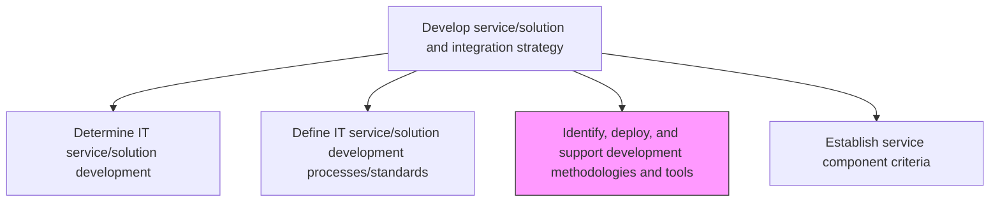
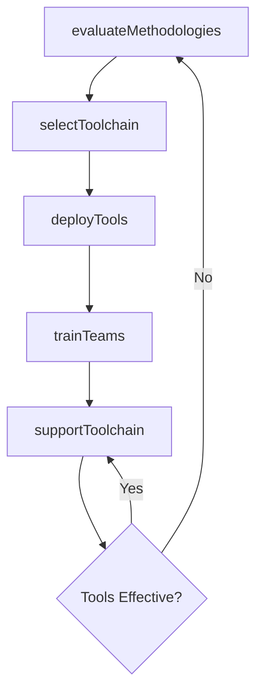

# Identify, deploy, and support development methodologies and tools

> Business-as-Code definition for evaluating, deploying, and providing ongoing support for development methodologies (Agile, DevOps, Waterfall) and toolchains that enable efficient IT service and solution creation.

## Overview

Identifying and implementing techniques and tools for development based on overall value addition to the IT environment.

## Process Hierarchy



## GraphDL

```yaml
identify,:
  object: Deploy, And Support Development Methodologies And Tools
  actor: DevOpsToolingManager
  result: MethodologyToolkitCatalog
```

## Actions

| Action | Description |
|--------|-------------|
| evaluateMethodologies | Assess development methodologies against organizational needs and project types |
| selectToolchain | Choose development tools, CI/CD pipelines, and collaboration platforms |
| deployTools | Install, configure, and integrate development tools across the organization |
| trainTeams | Provide training and enablement on adopted methodologies and tools |
| supportToolchain | Deliver ongoing technical support and maintenance for development tools |

## Events

| Event | Description |
|-------|-------------|
| methodologiesEvaluated | Development methodology assessment completed |
| toolchainSelected | Development toolchain selection finalized |
| toolsDeployed | Development tools installed and configured |
| teamsTrainedOnMethodology | Teams trained on adopted methodologies and tools |
| toolchainSupported | Toolchain support activities completed for the period |

## Searches

| Search | Description |
|--------|-------------|
| getToolCatalog | Retrieve the catalog of approved development tools and versions |
| getMethodologyGuidance | List methodology guidance documents by project type or team |
| getToolUsageMetrics | Retrieve adoption and usage metrics for development tools |

## Process Flow



## RACI Matrix

| Activity | Responsible | Accountable | Consulted | Informed |
|----------|-------------|-------------|-----------|----------|
| evaluateMethodologies | DevOpsToolingManager | ITDirector | DevelopmentLeads | ProjectManagers |
| selectToolchain | DevOpsToolingManager | ITDirector | EnterpriseArchitect | SecurityTeam |
| deployTools | DevOpsToolingManager | ITDirector | InfrastructureTeam | AllDevelopers |
| trainTeams | DevOpsToolingManager | ITDirector | LearningAndDevelopment | TeamLeads |

## Related Processes

| Process | Relationship |
|---------|-------------|
| 8.5.1.2 Define IT service/solution development processes/standards | Upstream - standards guide methodology and tool selection |
| 8.5.4.1 Execute IT service/solution development lifecycle | Downstream - methodologies and tools are used in development execution |
| 8.5.1.4 Establish service component criteria | Parallel - tools support component-based development |

## Related Departments

| Department | Role |
|-----------|------|
| DevOps Engineering | Evaluates and deploys development toolchains |
| Software Engineering | Primary consumer of methodologies and tools |
| IT Training | Delivers methodology and tool training programs |

## Related Occupations

| Occupation | Involvement |
|-----------|-------------|
| DevOps Tooling Manager | Leads methodology evaluation and tool deployment |
| Scrum Master | Champions Agile methodology adoption |
| Release Engineer | Configures and maintains CI/CD pipelines |

## KPIs

| KPI | Description | Unit |
|-----|-------------|------|
| Tool Adoption Rate | Percentage of development teams using the approved toolchain | % |
| Methodology Compliance | Percentage of projects following the prescribed development methodology | % |
| Developer Satisfaction Score | Developer satisfaction with provided tools and methodologies | Score (1-10) |

## Usage

```typescript
import { identifyDeployAndSupportDevelopmentMethodologiesAndTools } from '@headlessly/identify-deploy-and-support-development-methodologies-and-tools'

const devTools = identifyDeployAndSupportDevelopmentMethodologiesAndTools()

// Get approved tool catalog
const catalog = await devTools.getToolCatalog({
  category: 'ci-cd',
  status: 'approved'
})

// Check tool usage metrics
const metrics = await devTools.getToolUsageMetrics({
  tool: 'github-actions',
  period: 'last-quarter',
  groupBy: 'team'
})
```
