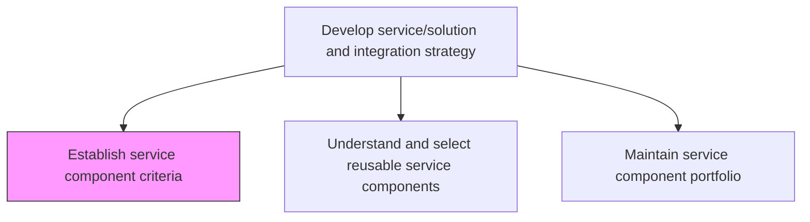
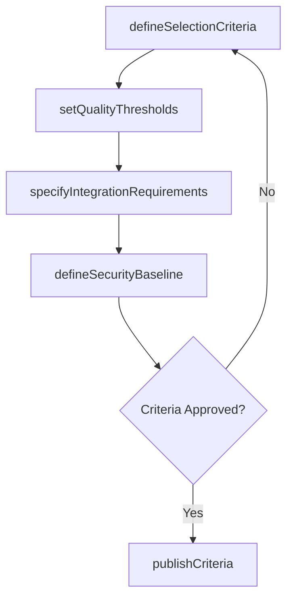

# Establish service component criteria

> Business-as-Code definition for defining the selection, evaluation, and acceptance criteria used to assess IT service components for inclusion in the enterprise service portfolio.

## Overview

Establishing standards for selection of IT service components.

## Process Hierarchy



## GraphDL

```yaml
establish:
  object: Service Component Criteria
  actor: ServiceArchitect
  result: ComponentCriteriaDocument
```

## Actions

| Action | Description |
|--------|-------------|
| defineSelectionCriteria | Establish technical and business criteria for evaluating service components |
| setQualityThresholds | Define minimum quality, performance, and reliability thresholds for components |
| specifyIntegrationRequirements | Document integration standards and interoperability requirements |
| defineSecurityBaseline | Establish security and compliance requirements for service components |
| publishCriteria | Distribute approved component criteria to development and procurement teams |

## Events

| Event | Description |
|-------|-------------|
| selectionCriteriaDefined | Component selection criteria established |
| qualityThresholdsSet | Quality and performance thresholds defined |
| integrationRequirementsSpecified | Integration and interoperability requirements documented |
| securityBaselineDefined | Security and compliance baseline for components established |
| criteriaPublished | Component criteria distributed to stakeholders |

## Searches

| Search | Description |
|--------|-------------|
| getCriteria | Retrieve component criteria filtered by technology domain or component type |
| getQualityThresholds | List quality and performance thresholds by component category |
| getComplianceRequirements | Retrieve security and compliance requirements for component evaluation |

## Process Flow



## RACI Matrix

| Activity | Responsible | Accountable | Consulted | Informed |
|----------|-------------|-------------|-----------|----------|
| defineSelectionCriteria | ServiceArchitect | ITDirector | DevelopmentLeads | ProjectManagers |
| setQualityThresholds | ServiceArchitect | ITDirector | QualityAssuranceLead | OperationsTeam |
| defineSecurityBaseline | ServiceArchitect | ITDirector | SecurityArchitect | ComplianceOfficer |

## Related Processes

| Process | Relationship |
|---------|-------------|
| 8.5.1.5 Understand and select reusable service components | Downstream - criteria guide component selection |
| 8.5.1.6 Maintain service component portfolio | Downstream - criteria define portfolio admission standards |
| 8.5.3.4 Identify opportunities for IT component reuse | Parallel - reuse criteria align with component standards |

## Related Departments

| Department | Role |
|-----------|------|
| Enterprise Architecture | Defines architectural criteria for components |
| Quality Assurance | Establishes quality and testing thresholds |
| IT Security | Defines security requirements for components |

## Related Occupations

| Occupation | Involvement |
|-----------|-------------|
| Service Architect | Leads criteria definition and documentation |
| Security Architect | Contributes security baseline requirements |
| Quality Assurance Lead | Defines quality and performance thresholds |

## KPIs

| KPI | Description | Unit |
|-----|-------------|------|
| Criteria Coverage | Percentage of component categories with defined selection criteria | % |
| Criteria Currency | Age of the most recent criteria revision | Months |
| Component Rejection Rate | Percentage of candidate components not meeting criteria | % |

## Usage

```typescript
import { establishServiceComponentCriteria } from '@headlessly/establish-service-component-criteria'

const criteria = establishServiceComponentCriteria()

// Define selection criteria for a component category
await criteria.defineSelectionCriteria({
  category: 'authentication-services',
  requirements: ['oauth2-support', 'mfa-capable', 'sso-integration'],
  minimumSLA: '99.9%'
})

// Retrieve current criteria
const authCriteria = await criteria.getCriteria({
  domain: 'identity-and-access',
  status: 'active'
})
```
