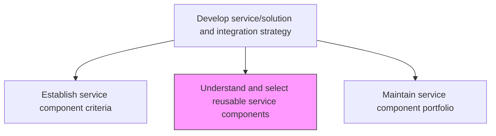
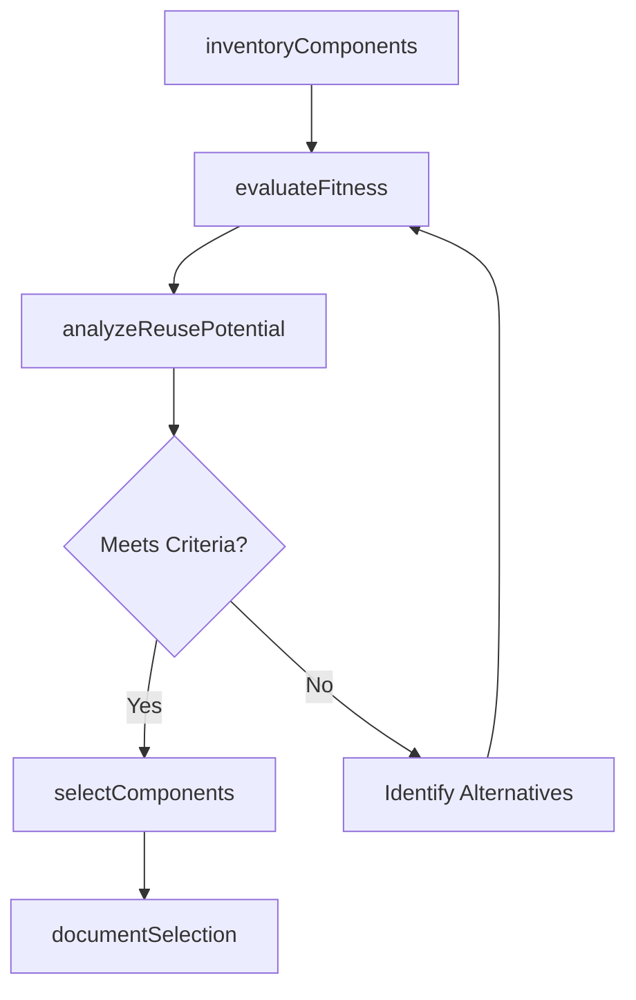

# Understand and select reusable service components

> Business-as-Code definition for identifying, evaluating, and selecting reusable IT service components from internal libraries, open-source repositories, and vendor catalogs to accelerate development and reduce duplication.

## Overview

Understanding and selecting reusable service components so that they can be cost-effective and efficient.

## Process Hierarchy



## GraphDL

```yaml
understand:
  object: And Select Reusable Service Components
  actor: ComponentLibrarian
  result: ComponentSelectionReport
```

## Actions

| Action | Description |
|--------|-------------|
| inventoryComponents | Catalog available reusable components from internal and external sources |
| evaluateFitness | Assess candidate components against established selection criteria |
| analyzeReusePotential | Determine the reuse potential and adaptability of candidate components |
| selectComponents | Choose components that best meet requirements for cost, quality, and fit |
| documentSelection | Record selection rationale, dependencies, and integration notes |

## Events

| Event | Description |
|-------|-------------|
| componentsInventoried | Available reusable components cataloged |
| fitnessEvaluated | Component fitness assessment completed against criteria |
| reusePotentialAnalyzed | Reuse potential and adaptability analysis completed |
| componentsSelected | Reusable components selected for adoption |
| selectionDocumented | Component selection rationale and integration notes recorded |

## Searches

| Search | Description |
|--------|-------------|
| findComponents | Search for reusable components by capability, technology, or domain |
| getComponentDetails | Retrieve detailed information about a specific reusable component |
| getSelectionHistory | List past component selection decisions with rationale |

## Process Flow



## RACI Matrix

| Activity | Responsible | Accountable | Consulted | Informed |
|----------|-------------|-------------|-----------|----------|
| inventoryComponents | ComponentLibrarian | ServiceArchitect | DevelopmentLeads | ProjectManagers |
| evaluateFitness | ComponentLibrarian | ServiceArchitect | QualityAssurance | SecurityTeam |
| selectComponents | ComponentLibrarian | ServiceArchitect | EnterpriseArchitect | ProcurementTeam |

## Related Processes

| Process | Relationship |
|---------|-------------|
| 8.5.1.4 Establish service component criteria | Upstream - criteria guide component selection |
| 8.5.1.6 Maintain service component portfolio | Downstream - selected components are added to the portfolio |
| 8.5.3.4 Identify opportunities for IT component reuse | Parallel - reuse opportunities inform component selection |

## Related Departments

| Department | Role |
|-----------|------|
| Software Engineering | Evaluates component fitness for development projects |
| Enterprise Architecture | Ensures components align with architectural standards |
| Procurement | Supports licensing and vendor evaluation for external components |

## Related Occupations

| Occupation | Involvement |
|-----------|-------------|
| Component Librarian | Catalogs and evaluates reusable components |
| Software Architect | Assesses architectural fitness of candidate components |
| Developer | Provides feedback on component usability and integration |

## KPIs

| KPI | Description | Unit |
|-----|-------------|------|
| Component Reuse Rate | Percentage of new solutions leveraging reusable components | % |
| Component Catalog Size | Total number of approved reusable components in the catalog | Count |
| Selection Cycle Time | Average time from component need identification to selection | Days |

## Usage

```typescript
import { understandAndSelectReusableServiceComponents } from '@headlessly/understand-and-select-reusable-service-components'

const components = understandAndSelectReusableServiceComponents()

// Search for reusable components
const results = await components.findComponents({
  capability: 'payment-processing',
  technology: 'typescript',
  minReliability: 99.5
})

// Evaluate fitness against criteria
const evaluation = await components.evaluateFitness({
  componentId: results[0].id,
  criteriaSet: 'production-readiness',
  projectContext: 'checkout-service'
})
```
