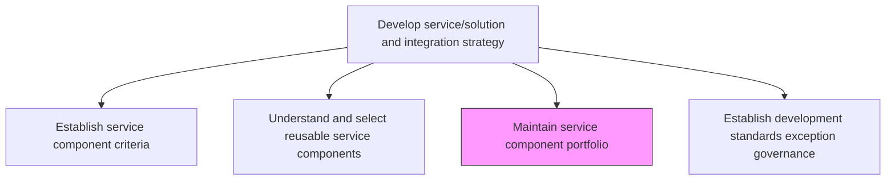
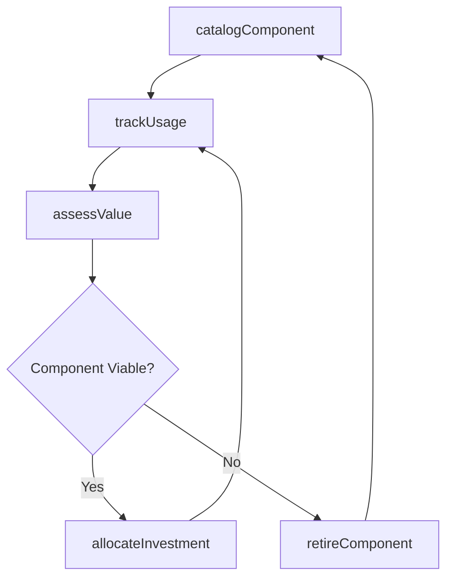

# Maintain service component portfolio

> Business-as-Code definition for managing and maintaining the enterprise portfolio of reusable IT service components, tracking their lifecycle status, usage, and investment value.

## Overview

Creating and establishing service component portfolio by defining investments, and activities. Analyze and examine the value of the service component portfolio, and allocate resources towards it.

## Process Hierarchy



## GraphDL

```yaml
maintain:
  object: Service Component Portfolio
  actor: PortfolioManager
  result: ComponentPortfolioReport
```

## Actions

| Action | Description |
|--------|-------------|
| catalogComponent | Add or update a service component entry in the portfolio catalog |
| trackUsage | Monitor component adoption and usage across projects and teams |
| assessValue | Evaluate the business value and return on investment for portfolio components |
| retireComponent | Deprecate and retire components that are obsolete or no longer supported |
| allocateInvestment | Plan and allocate resources for component development and maintenance |

## Events

| Event | Description |
|-------|-------------|
| componentCataloged | Service component added or updated in the portfolio |
| usageTracked | Component usage data collected and analyzed |
| valueAssessed | Component portfolio value assessment completed |
| componentRetired | Component deprecated and removed from the active portfolio |
| investmentAllocated | Resources allocated for component development or maintenance |

## Searches

| Search | Description |
|--------|-------------|
| getPortfolio | Retrieve the full service component portfolio with lifecycle status |
| getUsageReport | Get component usage metrics by project, team, or time period |
| findDeprecatedComponents | List components approaching or past their end-of-life date |
| getInvestmentSummary | Retrieve investment allocation and ROI data for portfolio components |

## Process Flow



## RACI Matrix

| Activity | Responsible | Accountable | Consulted | Informed |
|----------|-------------|-------------|-----------|----------|
| catalogComponent | PortfolioManager | ITDirector | ServiceArchitect | DevelopmentTeams |
| assessValue | PortfolioManager | ITDirector | FinanceTeam | SteeringCommittee |
| retireComponent | PortfolioManager | ITDirector | DevelopmentLeads | AllDevelopers |

## Related Processes

| Process | Relationship |
|---------|-------------|
| 8.5.1.5 Understand and select reusable service components | Upstream - selected components are added to the portfolio |
| 8.5.1.4 Establish service component criteria | Upstream - criteria define portfolio admission standards |
| 8.5.2.5 Develop IT service/solution sunset plans | Parallel - sunset planning aligns with component retirement |

## Related Departments

| Department | Role |
|-----------|------|
| IT Portfolio Management | Manages the component portfolio lifecycle |
| Software Engineering | Develops and consumes portfolio components |
| Finance | Tracks investment and ROI for portfolio components |

## Related Occupations

| Occupation | Involvement |
|-----------|-------------|
| Portfolio Manager | Maintains and governs the component portfolio |
| Service Architect | Guides architectural decisions for portfolio components |
| Software Engineer | Develops and integrates portfolio components |

## KPIs

| KPI | Description | Unit |
|-----|-------------|------|
| Portfolio Utilization | Percentage of portfolio components actively used in production | % |
| Component ROI | Average return on investment for portfolio components | Ratio |
| Retirement Rate | Number of components retired per year | Count/Year |

## Usage

```typescript
import { maintainServiceComponentPortfolio } from '@headlessly/maintain-service-component-portfolio'

const portfolio = maintainServiceComponentPortfolio()

// Get portfolio overview
const overview = await portfolio.getPortfolio({
  status: 'active',
  includeUsageMetrics: true
})

// Assess component value
const value = await portfolio.assessValue({
  componentId: 'shared-auth-module',
  period: '2025',
  metrics: ['adoption-rate', 'cost-savings', 'defect-reduction']
})
```
