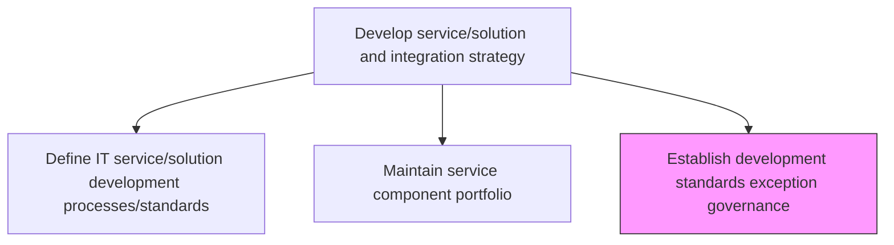
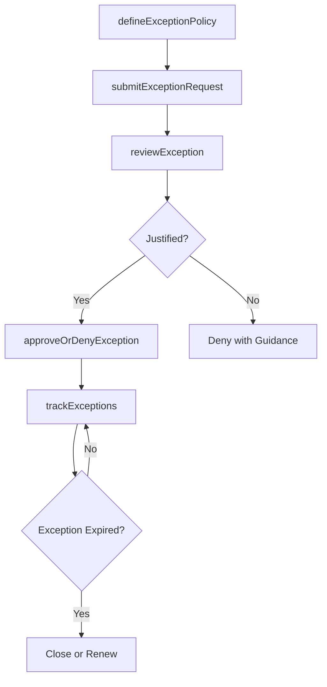

# Establish development standards exception governance

> Business-as-Code definition for creating and managing the governance framework that evaluates, approves, and tracks exceptions to established IT development standards and processes.

## Overview

Creating standards and procedures for developing IT services/solutions outside of defined business parameters.

## Process Hierarchy



## GraphDL

```yaml
establish:
  object: Development Standards Exception Governance
  actor: GovernanceOfficer
  result: ExceptionGovernanceFramework
```

## Actions

| Action | Description |
|--------|-------------|
| defineExceptionPolicy | Create policies defining when and how development standards exceptions may be requested |
| submitExceptionRequest | File a formal request for an exception to an established development standard |
| reviewException | Evaluate exception requests against risk, business justification, and mitigation plans |
| approveOrDenyException | Make a governance decision on exception requests with documented rationale |
| trackExceptions | Monitor active exceptions, their expiration dates, and remediation plans |

## Events

| Event | Description |
|-------|-------------|
| exceptionPolicyDefined | Exception governance policy created or updated |
| exceptionRequested | Formal exception request submitted for governance review |
| exceptionReviewed | Exception request evaluated by the governance board |
| exceptionDecisionMade | Exception request approved or denied with documented rationale |
| exceptionsTracked | Active exception tracking review completed |

## Searches

| Search | Description |
|--------|-------------|
| getExceptionPolicy | Retrieve the current exception governance policy and criteria |
| findActiveExceptions | List all active exceptions filtered by standard, team, or expiration date |
| getExceptionHistory | Retrieve historical exception requests with decisions and outcomes |

## Process Flow



## RACI Matrix

| Activity | Responsible | Accountable | Consulted | Informed |
|----------|-------------|-------------|-----------|----------|
| defineExceptionPolicy | GovernanceOfficer | ITDirector | DevelopmentLeads | AllDevelopers |
| reviewException | GovernanceOfficer | ITDirector | SecurityArchitect | ProjectManagers |
| approveOrDenyException | GovernanceOfficer | ITDirector | RiskManager | RequestingTeam |

## Related Processes

| Process | Relationship |
|---------|-------------|
| 8.5.1.2 Define IT service/solution development processes/standards | Upstream - standards define the baseline against which exceptions are evaluated |
| 8.5.3.8 Manage architectural exceptions | Parallel - architectural exceptions follow similar governance patterns |
| 8.5.3.6 Develop and maintain service/solution architectures | Parallel - architecture exceptions are governed similarly |

## Related Departments

| Department | Role |
|-----------|------|
| IT Governance | Manages the exception governance framework and review board |
| Software Engineering | Submits exception requests and implements mitigations |
| Risk Management | Assesses risk implications of proposed exceptions |

## Related Occupations

| Occupation | Involvement |
|-----------|-------------|
| Governance Officer | Manages exception policy and review process |
| Risk Manager | Evaluates risk of proposed exceptions |
| Development Lead | Submits and justifies exception requests |

## KPIs

| KPI | Description | Unit |
|-----|-------------|------|
| Exception Request Volume | Number of exception requests submitted per quarter | Count |
| Exception Approval Rate | Percentage of exception requests approved | % |
| Exception Remediation Rate | Percentage of expired exceptions remediated within the target timeframe | % |

## Usage

```typescript
import { establishDevelopmentStandardsExceptionGovernance } from '@headlessly/establish-development-standards-exception-governance'

const governance = establishDevelopmentStandardsExceptionGovernance()

// Submit an exception request
const request = await governance.submitExceptionRequest({
  standard: 'coding-conventions-v3',
  justification: 'Legacy system integration requires non-standard protocol',
  mitigationPlan: 'Wrapper layer to isolate non-standard code',
  expirationDate: '2026-06-30'
})

// Track active exceptions
const active = await governance.findActiveExceptions({
  team: 'platform-engineering',
  expiringBefore: '2026-03-31'
})
```
