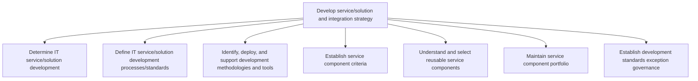
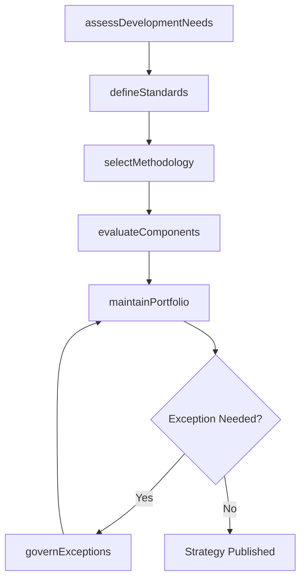

# Develop service/solution and integration strategy

> Business-as-Code definition for establishing the strategic framework for IT service and solution development, including development methodologies, reusable component selection, integration standards, and governance.

## Overview

Developing service/solution along with creating a strategy that provides a base for delivering service/solution aligned with overall business needs. Conduct research within the services/solutions field for development and integration.

## Process Hierarchy



## GraphDL

```yaml
develop:
  object: Service/solution And Integration Strategy
  actor: DevelopmentStrategyLead
  result: IntegrationStrategyPlan
```

## Actions

| Action | Description |
|--------|-------------|
| assessDevelopmentNeeds | Evaluate business requirements to determine IT service development priorities |
| defineStandards | Establish development processes, coding standards, and quality gates |
| selectMethodology | Choose and deploy appropriate development methodologies such as Agile or Waterfall |
| evaluateComponents | Assess reusable service components for fitness and cost-effectiveness |
| maintainPortfolio | Update the service component portfolio with current inventory and roadmap |
| governExceptions | Review and approve requests to deviate from established development standards |

## Events

| Event | Description |
|-------|-------------|
| developmentNeedsAssessed | Business requirements evaluated and development priorities set |
| standardsDefined | Development processes and quality gates established |
| methodologySelected | Development methodology chosen and tooling deployed |
| componentsEvaluated | Reusable service components assessed for selection |
| portfolioMaintained | Service component portfolio updated with current state |
| exceptionGoverned | Standards exception request reviewed and decision recorded |

## Searches

| Search | Description |
|--------|-------------|
| findComponents | List reusable service components filtered by technology, domain, or maturity |
| getStandards | Retrieve current development standards and process definitions |
| getExceptions | List approved or pending standards exception requests |
| getPortfolioStatus | Get the current state of the service component portfolio |

## Process Flow



## RACI Matrix

| Activity | Responsible | Accountable | Consulted | Informed |
|----------|-------------|-------------|-----------|----------|
| assessDevelopmentNeeds | DevelopmentStrategyLead | VP Engineering | BusinessAnalysts | ITManagement |
| defineStandards | TechnicalArchitect | DevelopmentStrategyLead | QATeam | DevelopmentTeams |
| selectMethodology | DevelopmentStrategyLead | VP Engineering | ProjectManagers | DevelopmentTeams |
| evaluateComponents | SolutionArchitect | DevelopmentStrategyLead | Procurement | DevelopmentTeams |

## Sub-Processes

| ID | Name | Description |
|----|------|-------------|
| 8.5.1.1 | Determine IT service/solution development | Determining the development of IT service/solution. Analyze the pros and cons of IT service/solution |
| 8.5.1.2 | Define IT service/solution development processes/standards | Establishing the methods and processes as the foundation for developing new IT platforms, components |
| 8.5.1.3 | Identify, deploy, and support development methodologies and tools | Identifying and implementing techniques and tools for development based on overall value addition to |
| 8.5.1.4 | Establish service component criteria | Establishing standards for selection of IT service components. |
| 8.5.1.5 | Understand and select reusable service components | Understanding and selecting reusable service components so that they can be cost-effective and effic |
| 8.5.1.6 | Maintain service component portfolio | Creating and establishing service component portfolio by defining investments, and activities. Analy |
| 8.5.1.7 | Establish development standards exception governance | Creating standards and procedures for developing IT services/solutions outside of defined business p |

## Related Processes

| Process | Relationship |
|---------|-------------|
| 8.5.2 Manage service/solution lifecycle planning | Downstream - strategy informs lifecycle planning |
| 8.5.3 Develop and manage service/solution architecture | Downstream - strategy guides architecture decisions |
| 8.5.4 Execute IT service/solution creation and testing | Downstream - strategy defines how creation is executed |

## Related Departments

| Department | Role |
|-----------|------|
| IT Development | Implements the development strategy and standards |
| Enterprise Architecture | Aligns integration strategy with enterprise architecture |
| Project Management Office | Adopts methodologies defined by the strategy |
| Procurement | Sources tools and reusable components |

## Related Occupations

| Occupation | Involvement |
|-----------|-------------|
| IT Strategy Analyst | Assesses development needs and formulates strategy |
| Solution Architect | Evaluates and selects reusable service components |
| Development Manager | Implements development standards and methodologies |

## KPIs

| KPI | Description | Unit |
|-----|-------------|------|
| Component Reuse Rate | Percentage of new services built using reusable components | % |
| Standards Compliance | Percentage of projects adhering to development standards | % |
| Exception Request Volume | Number of standards exception requests per quarter | Count |
| Tool Adoption Rate | Percentage of teams using approved development tools | % |

## Usage

```typescript
import { developServiceSolutionAndIntegrationStrategy } from '@headlessly/develop-service-solution-and-integration-strategy'

const strategy = developServiceSolutionAndIntegrationStrategy()

// Assess development needs
const needs = await strategy.assessDevelopmentNeeds({
  businessUnit: 'Digital Commerce',
  horizon: '12 months'
})

// Evaluate reusable components
const components = await strategy.evaluateComponents({
  category: 'Authentication',
  minMaturity: 'production-ready'
})

// Review standards exceptions
const exceptions = await strategy.getExceptions({
  status: 'pending',
  requestedAfter: '2025-01-01'
})
```
