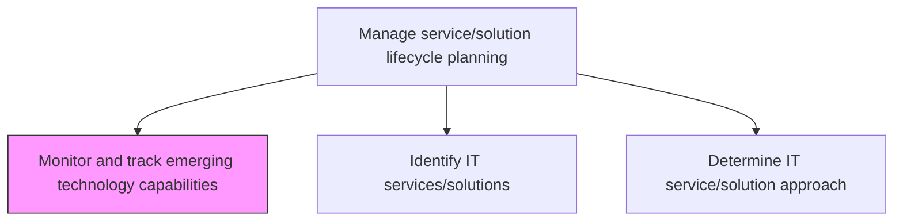
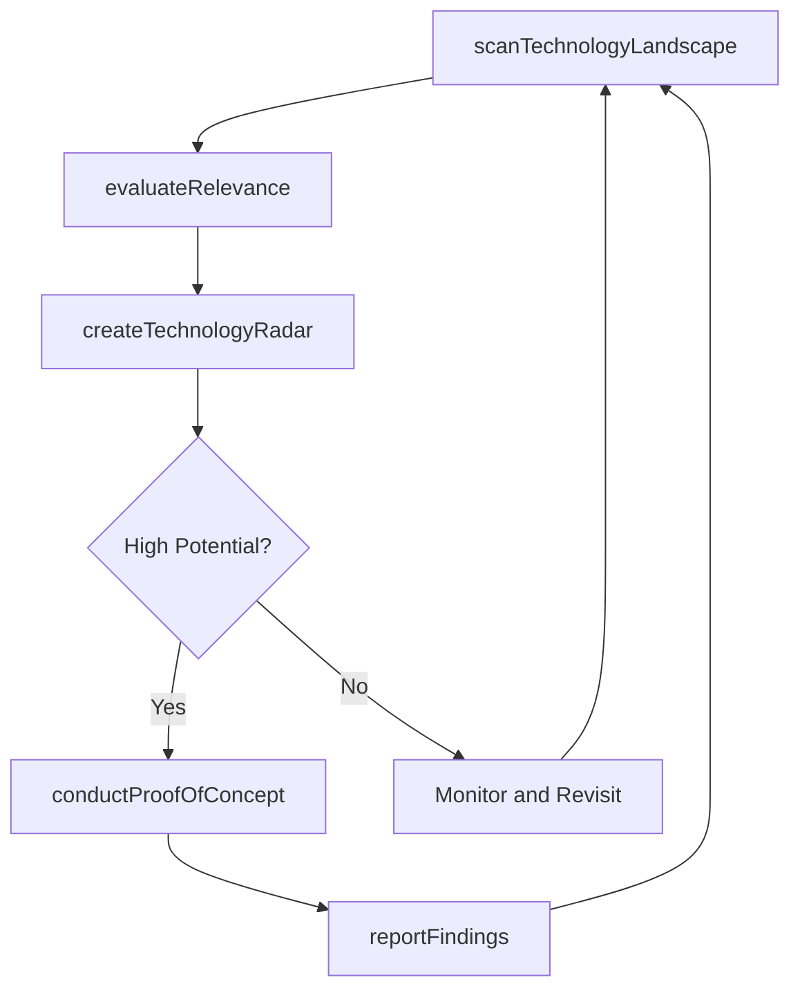

# Monitor and track emerging technology capabilities

> Business-as-Code definition for systematically scanning, evaluating, and tracking emerging technologies and their potential to enhance or transform IT service delivery and business capabilities.

## Overview

Perform a systematic investigation to new and future technology capabilities for future upgrades.

## Process Hierarchy



## GraphDL

```yaml
monitor:
  object: And Track Emerging Technology Capabilities
  actor: TechnologyResearchAnalyst
  result: EmergingTechnologyReport
```

## Actions

| Action | Description |
|--------|-------------|
| scanTechnologyLandscape | Survey the technology market for emerging capabilities, platforms, and frameworks |
| evaluateRelevance | Assess the relevance and potential impact of emerging technologies on business objectives |
| createTechnologyRadar | Build and maintain a technology radar categorizing emerging technologies by maturity and relevance |
| conductProofOfConcept | Run proof-of-concept evaluations for promising emerging technologies |
| reportFindings | Compile and present technology research findings to stakeholders |

## Events

| Event | Description |
|-------|-------------|
| landscapeScanned | Technology landscape survey completed |
| relevanceEvaluated | Emerging technology relevance assessment completed |
| technologyRadarUpdated | Technology radar updated with new entries or status changes |
| proofOfConceptCompleted | Proof-of-concept evaluation for an emerging technology completed |
| findingsReported | Technology research findings compiled and presented |

## Searches

| Search | Description |
|--------|-------------|
| getTechnologyRadar | Retrieve the current technology radar with categorizations |
| findEmergingTechnologies | List emerging technologies filtered by domain, maturity, or relevance score |
| getProofOfConceptResults | Retrieve proof-of-concept evaluation results by technology or date |

## Process Flow



## RACI Matrix

| Activity | Responsible | Accountable | Consulted | Informed |
|----------|-------------|-------------|-----------|----------|
| scanTechnologyLandscape | TechnologyResearchAnalyst | CTO | EnterpriseArchitect | ITLeadership |
| evaluateRelevance | TechnologyResearchAnalyst | CTO | BusinessAnalysts | ProjectManagers |
| conductProofOfConcept | TechnologyResearchAnalyst | CTO | DevelopmentLeads | InnovationTeam |

## Related Processes

| Process | Relationship |
|---------|-------------|
| 8.5.2.2 Identify IT services/solutions | Downstream - emerging technologies inform new service identification |
| 8.5.2.3 Determine IT service/solution approach | Downstream - technology insights shape approach decisions |
| 8.5.1.1 Determine IT service/solution development | Parallel - technology capabilities inform development decisions |

## Related Departments

| Department | Role |
|-----------|------|
| Technology Research | Scans and evaluates emerging technologies |
| Enterprise Architecture | Assesses architecture implications of new technologies |
| Innovation Lab | Conducts proof-of-concept evaluations |

## Related Occupations

| Occupation | Involvement |
|-----------|-------------|
| Technology Research Analyst | Leads technology scanning and evaluation |
| Enterprise Architect | Assesses technology fit within the enterprise architecture |
| Innovation Manager | Champions emerging technology adoption |

## KPIs

| KPI | Description | Unit |
|-----|-------------|------|
| Technology Radar Coverage | Number of emerging technologies tracked on the radar | Count |
| Proof of Concept Success Rate | Percentage of proof-of-concept evaluations with positive outcomes | % |
| Technology Adoption Lead Time | Average time from technology identification to production adoption | Months |

## Usage

```typescript
import { monitorAndTrackEmergingTechnologyCapabilities } from '@headlessly/monitor-and-track-emerging-technology-capabilities'

const techWatch = monitorAndTrackEmergingTechnologyCapabilities()

// Get the current technology radar
const radar = await techWatch.getTechnologyRadar({
  quadrant: 'platforms',
  ring: 'assess'
})

// Find emerging technologies in a specific domain
const aiTech = await techWatch.findEmergingTechnologies({
  domain: 'artificial-intelligence',
  minRelevanceScore: 8,
  maturity: 'early-adoption'
})
```
