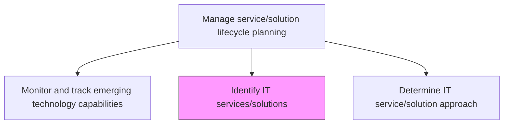
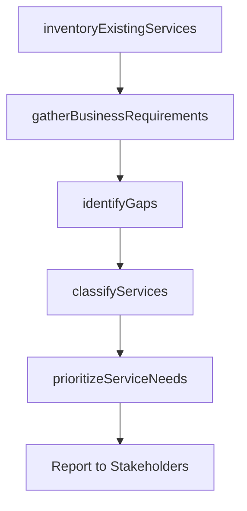

# Identify IT services/solutions

> Business-as-Code definition for discovering, cataloging, and classifying the IT services and solutions needed to support business operations, including both existing capabilities and gaps requiring new development.

## Overview

Identifying processes and supporting procedures that are performed by an organization to design, plan, deliver, operate, and control information technology services/solutions offered to customers.

## Process Hierarchy



## GraphDL

```yaml
identify:
  object: IT Services/solutions
  actor: ServiceCatalogManager
  result: ServiceInventory
```

## Actions

| Action | Description |
|--------|-------------|
| inventoryExistingServices | Catalog all current IT services and solutions with their capabilities |
| gatherBusinessRequirements | Collect business requirements that drive the need for IT services |
| identifyGaps | Compare current service inventory against business requirements to find gaps |
| classifyServices | Categorize identified services by domain, criticality, and business alignment |
| prioritizeServiceNeeds | Rank service development priorities based on business impact and feasibility |

## Events

| Event | Description |
|-------|-------------|
| existingServicesInventoried | Current IT services and solutions cataloged |
| businessRequirementsGathered | Business requirements for IT services collected |
| gapsIdentified | Gaps between current services and business needs identified |
| servicesClassified | IT services categorized by domain and criticality |
| serviceNeedsPrioritized | Service development priorities ranked |

## Searches

| Search | Description |
|--------|-------------|
| getServiceCatalog | Retrieve the IT service catalog filtered by domain, status, or criticality |
| findServiceGaps | List identified gaps between current capabilities and business requirements |
| getServicePriorities | Retrieve prioritized list of service development needs |

## Process Flow



## RACI Matrix

| Activity | Responsible | Accountable | Consulted | Informed |
|----------|-------------|-------------|-----------|----------|
| inventoryExistingServices | ServiceCatalogManager | ITPortfolioManager | ServiceOwners | ITManagement |
| gatherBusinessRequirements | ServiceCatalogManager | ITPortfolioManager | BusinessAnalysts | DepartmentHeads |
| identifyGaps | ServiceCatalogManager | ITPortfolioManager | EnterpriseArchitect | DevelopmentLeads |

## Related Processes

| Process | Relationship |
|---------|-------------|
| 8.5.2.1 Monitor and track emerging technology capabilities | Upstream - emerging technologies inform service identification |
| 8.5.2.3 Determine IT service/solution approach | Downstream - identified services need approach determination |
| 8.5.2.4 Define IT solution lifecycle | Downstream - identified services enter lifecycle planning |

## Related Departments

| Department | Role |
|-----------|------|
| IT Service Management | Maintains the service catalog and identifies service needs |
| Business Analysis | Gathers and translates business requirements |
| Enterprise Architecture | Provides architectural context for service identification |

## Related Occupations

| Occupation | Involvement |
|-----------|-------------|
| Service Catalog Manager | Catalogs and classifies IT services |
| Business Analyst | Translates business needs into service requirements |
| IT Portfolio Manager | Prioritizes service development investments |

## KPIs

| KPI | Description | Unit |
|-----|-------------|------|
| Service Catalog Completeness | Percentage of IT services documented in the catalog | % |
| Gap Resolution Rate | Percentage of identified service gaps addressed within the planning cycle | % |
| Requirements Coverage | Percentage of business requirements mapped to IT services | % |

## Usage

```typescript
import { identifyItServicesSolutions } from '@headlessly/identify-it-services-solutions'

const services = identifyItServicesSolutions()

// Get current service catalog
const catalog = await services.getServiceCatalog({
  domain: 'customer-facing',
  status: 'active'
})

// Identify service gaps
const gaps = await services.findServiceGaps({
  businessUnit: 'sales',
  severity: 'critical'
})
```
