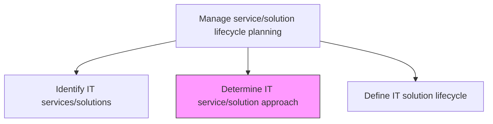
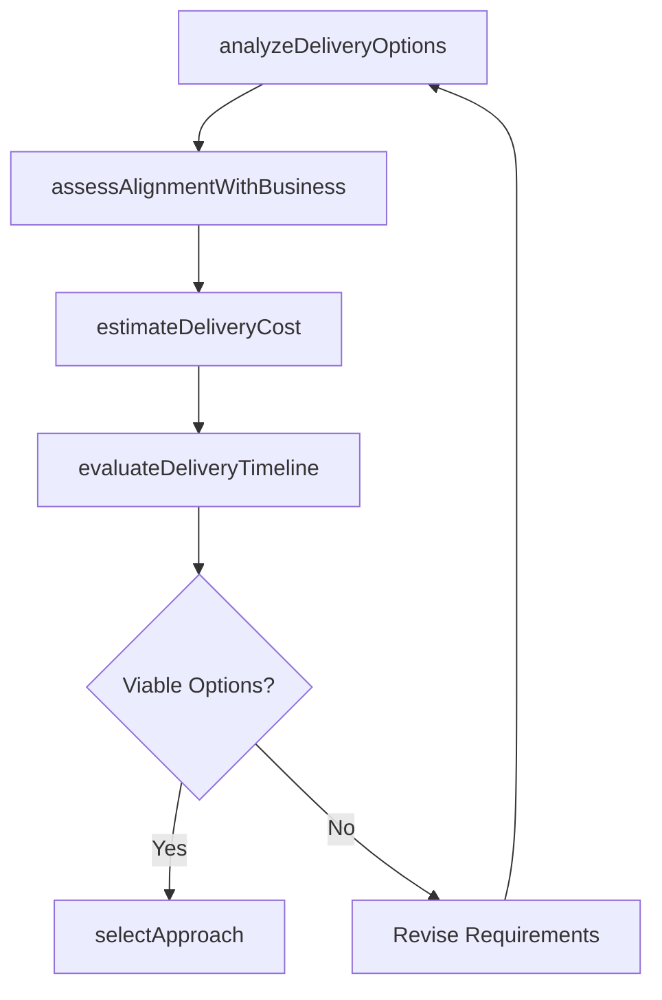

# Determine IT service/solution approach

> Business-as-Code definition for selecting the optimal delivery approach for IT services and solutions, balancing business alignment, cost control, and delivery efficiency across build, buy, and hybrid options.

## Overview

Determining an approach to create a base for delivering IT service/solution aligned with overall business needs while maintaining a tight control on delivery and costs.

## Process Hierarchy



## GraphDL

```yaml
determine:
  object: IT Service/solution Approach
  actor: SolutionArchitect
  result: ApproachRecommendation
```

## Actions

| Action | Description |
|--------|-------------|
| analyzeDeliveryOptions | Evaluate build, buy, partner, and hybrid delivery models for the solution |
| assessAlignmentWithBusiness | Verify that the proposed approach aligns with business strategy and objectives |
| estimateDeliveryCost | Project total cost of ownership for each delivery approach option |
| evaluateDeliveryTimeline | Assess time-to-market for each approach option |
| selectApproach | Choose the optimal delivery approach based on analysis outcomes |

## Events

| Event | Description |
|-------|-------------|
| deliveryOptionsAnalyzed | Delivery model options evaluated |
| businessAlignmentAssessed | Business strategy alignment verified |
| deliveryCostEstimated | Total cost of ownership projections completed |
| deliveryTimelineEvaluated | Time-to-market assessments completed for each option |
| approachSelected | Optimal delivery approach chosen and documented |

## Searches

| Search | Description |
|--------|-------------|
| getApproachRecommendations | Retrieve approach recommendations filtered by service or solution |
| getDeliveryModelComparisons | List delivery model comparisons by cost, timeline, or risk |
| getApproachDecisionHistory | Retrieve historical approach decisions with outcomes |

## Process Flow



## RACI Matrix

| Activity | Responsible | Accountable | Consulted | Informed |
|----------|-------------|-------------|-----------|----------|
| analyzeDeliveryOptions | SolutionArchitect | ITPortfolioManager | EnterpriseArchitect | DevelopmentLeads |
| assessAlignmentWithBusiness | SolutionArchitect | ITPortfolioManager | BusinessAnalysts | SteeringCommittee |
| selectApproach | SolutionArchitect | ITPortfolioManager | FinanceTeam | ProjectManagers |

## Related Processes

| Process | Relationship |
|---------|-------------|
| 8.5.2.2 Identify IT services/solutions | Upstream - identified services require approach determination |
| 8.5.2.4 Define IT solution lifecycle | Downstream - selected approach informs lifecycle definition |
| 8.5.1.1 Determine IT service/solution development | Parallel - development determination complements approach selection |

## Related Departments

| Department | Role |
|-----------|------|
| Solution Architecture | Analyzes delivery options and recommends approaches |
| IT Finance | Provides cost analysis and budget alignment |
| Business Strategy | Ensures approach aligns with business objectives |

## Related Occupations

| Occupation | Involvement |
|-----------|-------------|
| Solution Architect | Leads approach analysis and recommendation |
| IT Portfolio Manager | Makes final approach selection decisions |
| Business Analyst | Validates business alignment of proposed approach |

## KPIs

| KPI | Description | Unit |
|-----|-------------|------|
| Approach Decision Accuracy | Percentage of approach decisions that delivered expected outcomes | % |
| Time to Approach Decision | Average time from service identification to approach selection | Days |
| Cost Estimate Accuracy | Deviation between estimated and actual delivery costs | % |

## Usage

```typescript
import { determineItServiceSolutionApproach } from '@headlessly/determine-it-service-solution-approach'

const approach = determineItServiceSolutionApproach()

// Analyze delivery options
const options = await approach.analyzeDeliveryOptions({
  service: 'customer-portal',
  models: ['build-internal', 'buy-saas', 'hybrid'],
  constraints: { budget: 500000, timeline: '6-months' }
})

// Select the recommended approach
const selected = await approach.selectApproach({
  serviceId: 'customer-portal',
  selectedModel: options.recommended,
  rationale: 'Best balance of cost and time-to-market'
})
```
