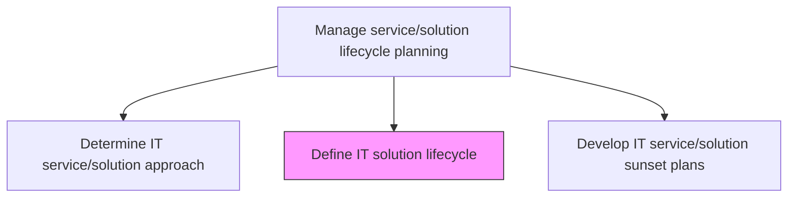
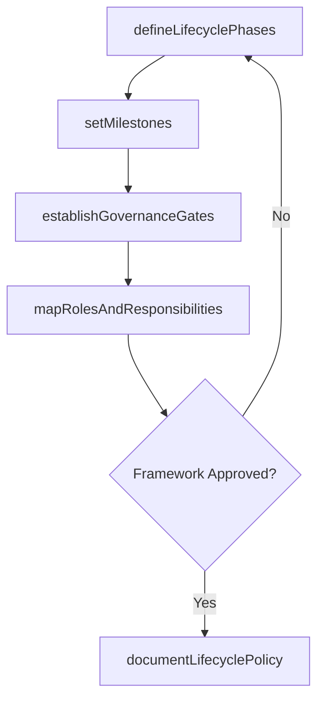

# Define IT solution lifecycle

> Business-as-Code definition for establishing the end-to-end lifecycle phases, milestones, and governance checkpoints for IT solutions from inception through retirement.

## Overview

Defining solutions to satisfy business needs. IT solution lifecycle provides a means to address the full life cycle of an information technology solution and addresses the current and future state of IT services and solutions.

## Process Hierarchy



## GraphDL

```yaml
define:
  object: IT Solution Lifecycle
  actor: LifecycleManager
  result: SolutionLifecycleDefinition
```

## Actions

| Action | Description |
|--------|-------------|
| defineLifecyclePhases | Establish the phases of the solution lifecycle from conception to retirement |
| setMilestones | Define key milestones and deliverables for each lifecycle phase |
| establishGovernanceGates | Create governance checkpoints and approval criteria between phases |
| mapRolesAndResponsibilities | Assign roles and responsibilities for each lifecycle phase |
| documentLifecyclePolicy | Publish the solution lifecycle framework as an organizational standard |

## Events

| Event | Description |
|-------|-------------|
| lifecyclePhasesDefined | Solution lifecycle phases established |
| milestonesSet | Key milestones and deliverables defined for each phase |
| governanceGatesEstablished | Governance checkpoints created between lifecycle phases |
| rolesAndResponsibilitiesMapped | Roles assigned for each lifecycle phase |
| lifecyclePolicyDocumented | Solution lifecycle framework published as standard |

## Searches

| Search | Description |
|--------|-------------|
| getLifecycleDefinition | Retrieve the solution lifecycle definition with phases and milestones |
| getGovernanceGates | List governance gate criteria by lifecycle phase |
| getSolutionLifecycleStatus | Get the current lifecycle phase and status of a specific solution |

## Process Flow



## RACI Matrix

| Activity | Responsible | Accountable | Consulted | Informed |
|----------|-------------|-------------|-----------|----------|
| defineLifecyclePhases | LifecycleManager | ITPortfolioManager | EnterpriseArchitect | ProjectManagers |
| establishGovernanceGates | LifecycleManager | ITPortfolioManager | ITGovernance | SteeringCommittee |
| documentLifecyclePolicy | LifecycleManager | ITPortfolioManager | QualityAssurance | AllITTeams |

## Related Processes

| Process | Relationship |
|---------|-------------|
| 8.5.2.3 Determine IT service/solution approach | Upstream - approach selection informs lifecycle definition |
| 8.5.2.5 Develop IT service/solution sunset plans | Downstream - lifecycle includes end-of-life phase |
| 8.5.4.1 Execute IT service/solution development lifecycle | Downstream - lifecycle definition governs development execution |

## Related Departments

| Department | Role |
|-----------|------|
| IT Portfolio Management | Defines and governs solution lifecycles |
| Project Management Office | Implements lifecycle phases in project planning |
| IT Governance | Establishes governance gates and approval criteria |

## Related Occupations

| Occupation | Involvement |
|-----------|-------------|
| Lifecycle Manager | Defines lifecycle phases and governance framework |
| IT Portfolio Manager | Approves lifecycle definitions and standards |
| Project Manager | Applies lifecycle framework to solution delivery |

## KPIs

| KPI | Description | Unit |
|-----|-------------|------|
| Lifecycle Coverage | Percentage of active solutions with defined lifecycle plans | % |
| Gate Compliance Rate | Percentage of solutions passing governance gates on schedule | % |
| Lifecycle Phase Duration Accuracy | Deviation between planned and actual phase durations | % |

## Usage

```typescript
import { defineItSolutionLifecycle } from '@headlessly/define-it-solution-lifecycle'

const lifecycle = defineItSolutionLifecycle()

// Get lifecycle definition
const definition = await lifecycle.getLifecycleDefinition({
  solutionType: 'cloud-native-application'
})

// Check solution lifecycle status
const status = await lifecycle.getSolutionLifecycleStatus({
  solutionId: 'customer-analytics-platform',
  includeUpcomingMilestones: true
})
```
