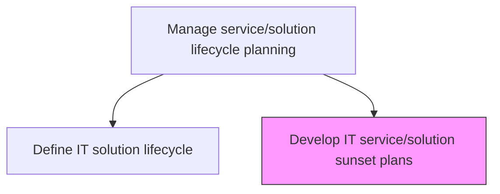
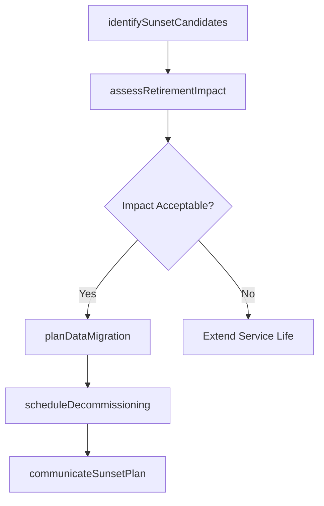

# Develop IT service/solution "sunset" plans

> Business-as-Code definition for planning the orderly decommissioning and retirement of IT services and solutions, including data migration, user transition, and resource reallocation strategies.

## Overview

Developing plans to retire IT service/solution resources when the service/solution is no longer feasible.

## Process Hierarchy



## GraphDL

```yaml
develop:
  object: IT Service/solution "sunset" Plans
  actor: RetirementPlanningManager
  result: SunsetPlan
```

## Actions

| Action | Description |
|--------|-------------|
| identifySunsetCandidates | Evaluate services and solutions approaching end-of-life or no longer viable |
| assessRetirementImpact | Analyze the business and technical impact of decommissioning a service |
| planDataMigration | Develop strategies for migrating data from retiring services to successor systems |
| scheduleDecommissioning | Create a phased decommissioning timeline with milestones and dependencies |
| communicateSunsetPlan | Notify stakeholders and users of the planned retirement timeline and transition steps |

## Events

| Event | Description |
|-------|-------------|
| sunsetCandidatesIdentified | Services approaching end-of-life evaluated and flagged |
| retirementImpactAssessed | Business and technical impact analysis completed |
| dataMigrationPlanned | Data migration strategy developed for retiring service |
| decommissioningScheduled | Phased decommissioning timeline created |
| sunsetPlanCommunicated | Retirement timeline and transition steps communicated to stakeholders |

## Searches

| Search | Description |
|--------|-------------|
| getSunsetCandidates | List services and solutions approaching or past their planned end-of-life |
| getSunsetPlan | Retrieve the detailed sunset plan for a specific service or solution |
| getDecommissioningSchedule | Get the decommissioning timeline with milestones and dependencies |

## Process Flow



## RACI Matrix

| Activity | Responsible | Accountable | Consulted | Informed |
|----------|-------------|-------------|-----------|----------|
| identifySunsetCandidates | RetirementPlanningManager | ITPortfolioManager | ServiceOwners | ITManagement |
| assessRetirementImpact | RetirementPlanningManager | ITPortfolioManager | BusinessAnalysts | AffectedUsers |
| planDataMigration | RetirementPlanningManager | ITPortfolioManager | DataArchitect | DatabaseAdministrators |

## Related Processes

| Process | Relationship |
|---------|-------------|
| 8.5.2.4 Define IT solution lifecycle | Upstream - lifecycle definition includes end-of-life phase |
| 8.5.1.6 Maintain service component portfolio | Parallel - portfolio management tracks component retirement |
| 8.6.4 Implement technology solutions | Downstream - successor solutions are deployed during sunset |

## Related Departments

| Department | Role |
|-----------|------|
| IT Portfolio Management | Identifies sunset candidates and approves retirement plans |
| Data Management | Plans and executes data migration from retiring services |
| Change Management | Manages organizational transition during service retirement |

## Related Occupations

| Occupation | Involvement |
|-----------|-------------|
| Retirement Planning Manager | Develops and coordinates sunset plans |
| Data Migration Specialist | Plans and executes data migration activities |
| Change Manager | Supports user transition to replacement services |

## KPIs

| KPI | Description | Unit |
|-----|-------------|------|
| Sunset Plan Coverage | Percentage of end-of-life services with documented sunset plans | % |
| Data Migration Success Rate | Percentage of data migrations completed without data loss | % |
| Decommissioning On-Time Rate | Percentage of services decommissioned on or before planned date | % |

## Usage

```typescript
import { developItServiceSolutionSunsetPlans } from '@headlessly/develop-it-service-solution-sunset-plans'

const sunset = developItServiceSolutionSunsetPlans()

// Get sunset candidates
const candidates = await sunset.getSunsetCandidates({
  endOfLifeBefore: '2026-12-31',
  includeImpactAssessment: true
})

// Retrieve sunset plan details
const plan = await sunset.getSunsetPlan({
  serviceId: 'legacy-crm-system',
  includeDataMigration: true,
  includeTimeline: true
})
```
