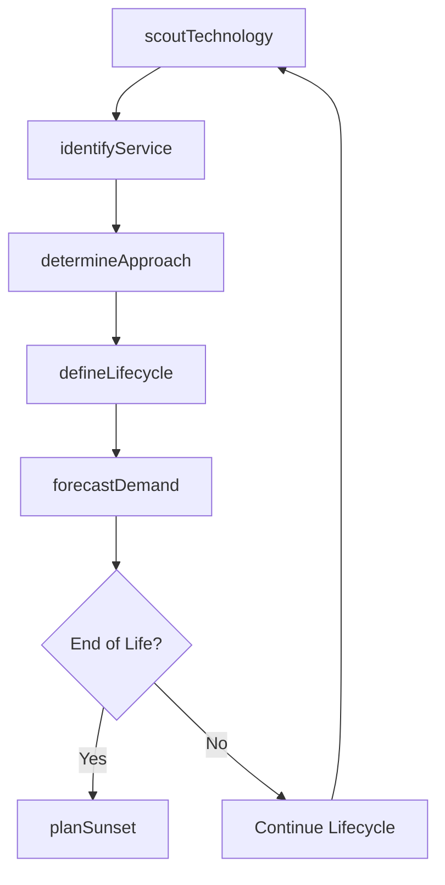

# Manage service/solution lifecycle planning

> Business-as-Code definition for planning and managing the full lifecycle of IT services and solutions, from technology capability scouting through solution identification, approach determination, and sunset planning.

## Overview

Executing life-cycle planning for IT services and solutions. Develop new requirements and feature-function enhancements. Create and design a life cycle plan that addresses the current and future state of IT services and solutions.

## Process Hierarchy

```mermaid
graph TD
    A[Manage service/solution lifecycle planning]
    A --> B[Monitor and track emerging technology capabilities]
    A --> C[Identify IT services/solutions]
    A --> D[Determine IT service/solution approach]
    A --> E[Define IT solution lifecycle]
    A --> F[Develop IT service/solution "sunset" plans]
```

## GraphDL

```yaml
manage:
  object: Service/solution Lifecycle Planning
  actor: ITPortfolioManager
  result: ServiceLifecyclePlan
```

## Actions

| Action | Description |
|--------|-------------|
| scoutTechnology | Monitor emerging technology capabilities and evaluate for adoption |
| identifyService | Catalog IT services and solutions in the portfolio |
| determineApproach | Select the build, buy, or integrate approach for each service |
| defineLifecycle | Establish lifecycle stages, milestones, and transition criteria |
| planSunset | Create retirement plans for end-of-life services and solutions |
| forecastDemand | Project future demand for services based on business growth |

## Events

| Event | Description |
|-------|-------------|
| technologyScouted | Emerging technology assessment completed |
| serviceIdentified | IT service or solution cataloged in the portfolio |
| approachDetermined | Build, buy, or integrate decision finalized |
| lifecycleDefined | Service lifecycle stages and milestones established |
| sunsetPlanned | Service retirement plan created and approved |
| demandForecasted | Future service demand projections completed |

## Searches

| Search | Description |
|--------|-------------|
| findServices | List services filtered by lifecycle stage, domain, or technology |
| getTechnologyRadar | Retrieve emerging technology assessments and adoption recommendations |
| getSunsetSchedule | Get the timeline of planned service retirements |
| getLifecycleRoadmap | Retrieve the lifecycle roadmap for a specific service |

## Process Flow



## RACI Matrix

| Activity | Responsible | Accountable | Consulted | Informed |
|----------|-------------|-------------|-----------|----------|
| scoutTechnology | TechnologyAnalyst | ITPortfolioManager | EnterpriseArchitect | DevelopmentTeams |
| identifyService | ITPortfolioManager | VP Engineering | BusinessAnalysts | ExecutiveTeam |
| determineApproach | SolutionArchitect | ITPortfolioManager | Procurement | Finance |
| planSunset | ITPortfolioManager | CIO | ServiceOwners | EndUsers |

## Sub-Processes

| ID | Name | Description |
|----|------|-------------|
| 8.5.2.1 | Monitor and track emerging technology capabilities | Perform a systematic investigation to new and future technology capabilities for future upgrades. |
| 8.5.2.2 | Identify IT services/solutions | Identifying processes and supporting procedures that are performed by an organization to design, pla |
| 8.5.2.3 | Determine IT service/solution approach | Determining an approach to create a base for delivering IT service/solution aligned with overall bus |
| 8.5.2.4 | Define IT solution lifecycle | Defining solutions to satisfy business needs. IT solution lifecycle provides a means to address the  |
| 8.5.2.5 | Develop IT service/solution "sunset" plans | Developing plans to retire IT service/solution resources when the service/solution is no longer feas |

## Related Processes

| Process | Relationship |
|---------|-------------|
| 8.5.1 Develop service/solution and integration strategy | Upstream - provides strategic direction for lifecycle planning |
| 8.5.3 Develop and manage service/solution architecture | Downstream - lifecycle plans inform architecture decisions |
| 8.5.4 Execute IT service/solution creation and testing | Downstream - lifecycle plans trigger creation activities |

## Related Departments

| Department | Role |
|-----------|------|
| IT Portfolio Management | Owns service lifecycle planning and roadmap |
| Enterprise Architecture | Advises on technology trends and fit |
| Finance | Evaluates cost-benefit of lifecycle decisions |
| Business Units | Provides demand signals and requirements |

## Related Occupations

| Occupation | Involvement |
|-----------|-------------|
| IT Portfolio Manager | Plans and manages the service lifecycle portfolio |
| Technology Analyst | Scouts and evaluates emerging technologies |
| Solution Architect | Determines build, buy, or integrate approaches |

## KPIs

| KPI | Description | Unit |
|-----|-------------|------|
| Portfolio Currency | Percentage of services within their planned lifecycle stage | % |
| Technology Adoption Lead Time | Average time from technology scouting to production adoption | Months |
| Sunset Plan Completion | Percentage of end-of-life services with approved retirement plans | % |
| Service Catalog Accuracy | Percentage of active services documented in the catalog | % |

## Usage

```typescript
import { manageServiceSolutionLifecyclePlanning } from '@headlessly/manage-service-solution-lifecycle-planning'

const lifecycle = manageServiceSolutionLifecyclePlanning()

// Scout emerging technologies
const radar = await lifecycle.scoutTechnology({
  domains: ['AI/ML', 'Edge Computing', 'Serverless'],
  evaluationCriteria: ['maturity', 'cost', 'risk']
})

// Define service lifecycle
const plan = await lifecycle.defineLifecycle({
  serviceId: 'svc-legacy-crm',
  stages: ['Pilot', 'Growth', 'Maturity', 'Decline', 'Sunset'],
  currentStage: 'Decline'
})

// Plan sunset
await lifecycle.planSunset({
  serviceId: 'svc-legacy-crm',
  targetDate: '2026-03-31',
  migrationTarget: 'svc-modern-crm'
})
```
