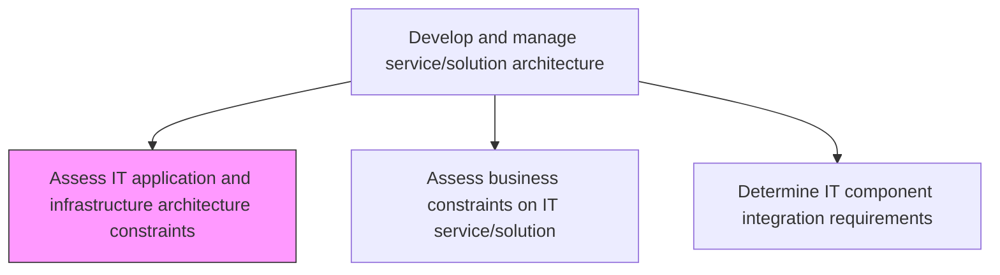
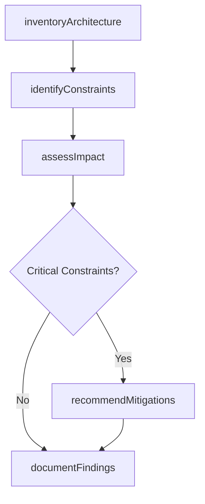

# Assess IT application and infrastructure architecture constraints

> Business-as-Code definition for evaluating technical limitations and constraints in the existing IT application and infrastructure architecture that may impact service or solution development and performance.

## Overview

Assessing limitations in IT application and infrastructure architecture that may hinder expected performance.

## Process Hierarchy



## GraphDL

```yaml
assess:
  object: IT Application And Infrastructure Architecture Constraints
  actor: InfrastructureArchitect
  result: ConstraintAssessmentReport
```

## Actions

| Action | Description |
|--------|-------------|
| inventoryArchitecture | Document current application and infrastructure architecture components and their capabilities |
| identifyConstraints | Discover technical limitations in scalability, performance, security, and compatibility |
| assessImpact | Evaluate how identified constraints affect planned service or solution delivery |
| recommendMitigations | Propose architectural changes or workarounds to address identified constraints |
| documentFindings | Record constraint assessment findings and recommendations for stakeholders |

## Events

| Event | Description |
|-------|-------------|
| architectureInventoried | Current architecture components and capabilities documented |
| constraintsIdentified | Technical limitations discovered and cataloged |
| impactAssessed | Constraint impact on service delivery evaluated |
| mitigationsRecommended | Mitigation strategies proposed for identified constraints |
| findingsDocumented | Assessment findings and recommendations recorded |

## Searches

| Search | Description |
|--------|-------------|
| getConstraints | Retrieve identified constraints filtered by type, severity, or affected system |
| getArchitectureInventory | List current architecture components with capability details |
| getMitigationPlans | Retrieve proposed mitigations for specific constraints |

## Process Flow



## RACI Matrix

| Activity | Responsible | Accountable | Consulted | Informed |
|----------|-------------|-------------|-----------|----------|
| identifyConstraints | InfrastructureArchitect | EnterpriseArchitect | DevelopmentLeads | ProjectManagers |
| assessImpact | InfrastructureArchitect | EnterpriseArchitect | SolutionArchitects | ITManagement |
| recommendMitigations | InfrastructureArchitect | EnterpriseArchitect | InfrastructureTeam | SteeringCommittee |

## Related Processes

| Process | Relationship |
|---------|-------------|
| 8.5.3.2 Assess business constraints on IT service/solution | Parallel - business constraints complement technical constraints |
| 8.5.3.3 Determine IT component integration requirements | Downstream - constraints inform integration requirements |
| 8.5.3.6 Develop and maintain service/solution architectures | Downstream - constraint assessment guides architecture design |

## Related Departments

| Department | Role |
|-----------|------|
| Infrastructure Engineering | Assesses infrastructure constraints and limitations |
| Enterprise Architecture | Provides architectural standards and guidance |
| IT Operations | Identifies operational constraints from production experience |

## Related Occupations

| Occupation | Involvement |
|-----------|-------------|
| Infrastructure Architect | Leads constraint identification and assessment |
| Enterprise Architect | Reviews findings against enterprise architecture standards |
| Performance Engineer | Evaluates performance-related constraints |

## KPIs

| KPI | Description | Unit |
|-----|-------------|------|
| Constraint Discovery Rate | Number of constraints identified per assessment cycle | Count |
| Mitigation Implementation Rate | Percentage of recommended mitigations implemented | % |
| Architecture Assessment Frequency | How often architecture constraint assessments are conducted | Per Year |

## Usage

```typescript
import { assessItApplicationAndInfrastructureArchitectureConstraints } from '@headlessly/assess-it-application-and-infrastructure-architecture-constraints'

const assessment = assessItApplicationAndInfrastructureArchitectureConstraints()

// Identify constraints for a planned service
const constraints = await assessment.getConstraints({
  targetService: 'real-time-analytics-platform',
  severity: 'high',
  type: ['scalability', 'performance']
})

// Get mitigation recommendations
const mitigations = await assessment.getMitigationPlans({
  constraintIds: constraints.map(c => c.id),
  budgetConstraint: 100000
})
```
