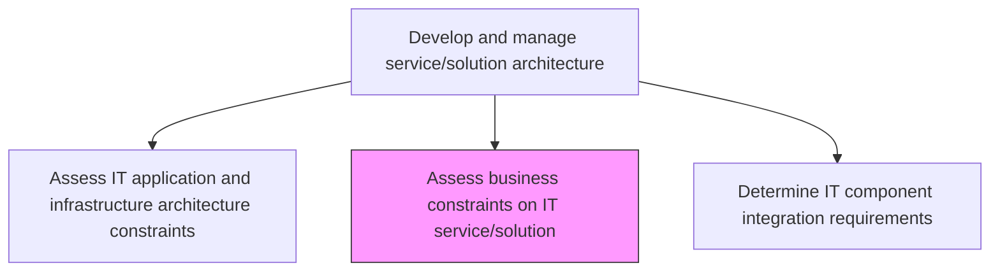
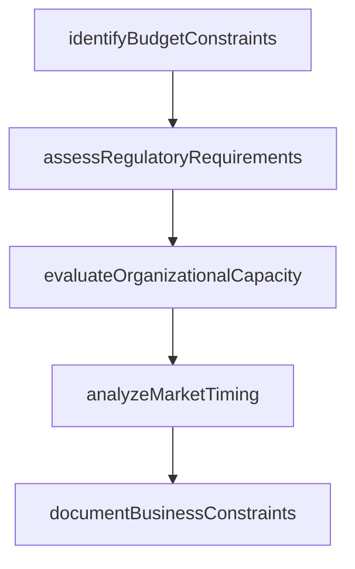

# Assess business constraints on IT service/solution

> Business-as-Code definition for evaluating business limitations such as budget, regulatory requirements, organizational capacity, and market timing that may constrain IT service and solution architecture decisions.

## Overview

Evaluate business limitations that may hinder IT service/solution performance.

## Process Hierarchy



## GraphDL

```yaml
assess:
  object: Business Constraints On IT Service/solution
  actor: BusinessArchitect
  result: BusinessConstraintReport
```

## Actions

| Action | Description |
|--------|-------------|
| identifyBudgetConstraints | Evaluate financial limitations affecting service or solution architecture |
| assessRegulatoryRequirements | Identify regulatory and compliance obligations that constrain design choices |
| evaluateOrganizationalCapacity | Assess the organization's ability to adopt and operate the proposed solution |
| analyzeMarketTiming | Evaluate market and competitive pressures affecting delivery timelines |
| documentBusinessConstraints | Record all identified business constraints with their impact on architecture |

## Events

| Event | Description |
|-------|-------------|
| budgetConstraintsIdentified | Financial limitations affecting architecture documented |
| regulatoryRequirementsAssessed | Regulatory and compliance constraints identified |
| organizationalCapacityEvaluated | Organization's adoption and operational capacity assessed |
| marketTimingAnalyzed | Market and competitive timing pressures evaluated |
| businessConstraintsDocumented | All business constraints recorded with architecture impact |

## Searches

| Search | Description |
|--------|-------------|
| getBusinessConstraints | Retrieve business constraints filtered by type, service, or severity |
| getRegulatoryRequirements | List regulatory requirements affecting a specific service or solution |
| getConstraintImpactAnalysis | Retrieve the impact analysis for identified business constraints |

## Process Flow



## RACI Matrix

| Activity | Responsible | Accountable | Consulted | Informed |
|----------|-------------|-------------|-----------|----------|
| identifyBudgetConstraints | BusinessArchitect | EnterpriseArchitect | FinanceTeam | ITManagement |
| assessRegulatoryRequirements | BusinessArchitect | EnterpriseArchitect | ComplianceOfficer | LegalCounsel |
| evaluateOrganizationalCapacity | BusinessArchitect | EnterpriseArchitect | HumanResources | ChangeManager |

## Related Processes

| Process | Relationship |
|---------|-------------|
| 8.5.3.1 Assess IT application and infrastructure architecture constraints | Parallel - technical constraints complement business constraints |
| 8.5.3.6 Develop and maintain service/solution architectures | Downstream - business constraints shape architecture decisions |
| 8.5.2.3 Determine IT service/solution approach | Upstream - approach decisions inform constraint assessment |

## Related Departments

| Department | Role |
|-----------|------|
| Business Analysis | Identifies business constraints from stakeholder requirements |
| Finance | Provides budget constraint information |
| Legal and Compliance | Identifies regulatory and compliance constraints |

## Related Occupations

| Occupation | Involvement |
|-----------|-------------|
| Business Architect | Leads business constraint assessment |
| Compliance Analyst | Evaluates regulatory constraints |
| Financial Analyst | Assesses budget and cost constraints |

## KPIs

| KPI | Description | Unit |
|-----|-------------|------|
| Constraint Identification Completeness | Percentage of business constraints identified before architecture design | % |
| Regulatory Compliance Coverage | Percentage of applicable regulations addressed in constraint assessment | % |
| Constraint Resolution Rate | Percentage of identified business constraints mitigated through architecture design | % |

## Usage

```typescript
import { assessBusinessConstraintsOnItServiceSolution } from '@headlessly/assess-business-constraints-on-it-service-solution'

const constraints = assessBusinessConstraintsOnItServiceSolution()

// Get business constraints for a service
const results = await constraints.getBusinessConstraints({
  service: 'payment-processing-platform',
  type: ['budget', 'regulatory', 'organizational']
})

// Check regulatory requirements
const regulations = await constraints.getRegulatoryRequirements({
  service: 'payment-processing-platform',
  jurisdiction: ['US', 'EU']
})
```
