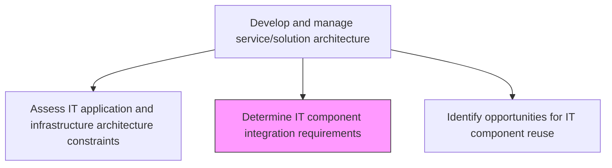
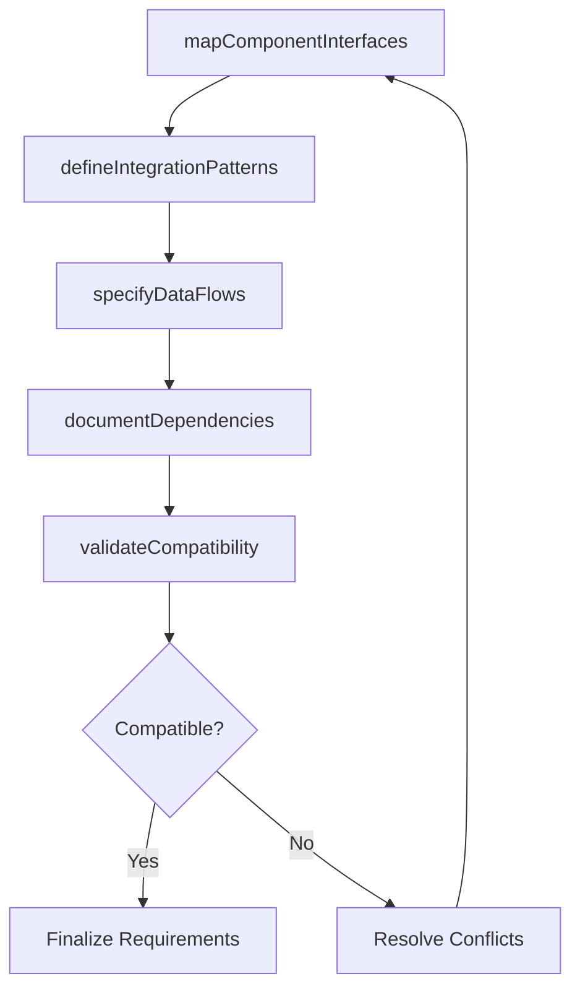

# Determine IT component integration requirements

> Business-as-Code definition for identifying and documenting the technical requirements needed to integrate IT components including hardware, software, databases, and network elements into a cohesive service architecture.

## Overview

Determining the requirements to integrate IT components such as hardware, software, database, telecommunication, and network.

## Process Hierarchy



## GraphDL

```yaml
determine:
  object: IT Component Integration Requirements
  actor: IntegrationArchitect
  result: IntegrationRequirementsDocument
```

## Actions

| Action | Description |
|--------|-------------|
| mapComponentInterfaces | Document the interfaces, protocols, and data formats for each component |
| defineIntegrationPatterns | Specify the integration patterns (API, messaging, event-driven) for component connections |
| specifyDataFlows | Define data flows, transformations, and mapping rules between components |
| documentDependencies | Record component dependencies, sequencing, and orchestration requirements |
| validateCompatibility | Verify that component versions and configurations are compatible for integration |

## Events

| Event | Description |
|-------|-------------|
| componentInterfacesMapped | Component interfaces and protocols documented |
| integrationPatternsDefined | Integration patterns specified for component connections |
| dataFlowsSpecified | Data flows and transformation rules defined |
| dependenciesDocumented | Component dependencies and orchestration requirements recorded |
| compatibilityValidated | Component compatibility verification completed |

## Searches

| Search | Description |
|--------|-------------|
| getIntegrationRequirements | Retrieve integration requirements filtered by component, pattern, or status |
| getComponentInterfaces | List documented interfaces for a specific component |
| getDependencyMap | Retrieve the component dependency graph for a service or solution |

## Process Flow



## RACI Matrix

| Activity | Responsible | Accountable | Consulted | Informed |
|----------|-------------|-------------|-----------|----------|
| mapComponentInterfaces | IntegrationArchitect | EnterpriseArchitect | DevelopmentLeads | ProjectManagers |
| defineIntegrationPatterns | IntegrationArchitect | EnterpriseArchitect | SolutionArchitects | DevOpsTeam |
| validateCompatibility | IntegrationArchitect | EnterpriseArchitect | QualityAssurance | InfrastructureTeam |

## Related Processes

| Process | Relationship |
|---------|-------------|
| 8.5.3.1 Assess IT application and infrastructure architecture constraints | Upstream - architecture constraints inform integration requirements |
| 8.5.3.4 Identify opportunities for IT component reuse | Parallel - reuse opportunities affect integration requirements |
| 8.5.4.1.4 Integrate IT components and services | Downstream - requirements guide component integration execution |

## Related Departments

| Department | Role |
|-----------|------|
| Integration Engineering | Defines integration requirements and patterns |
| Enterprise Architecture | Ensures integration aligns with architectural standards |
| DevOps | Implements integration infrastructure and automation |

## Related Occupations

| Occupation | Involvement |
|-----------|-------------|
| Integration Architect | Leads integration requirements definition |
| Software Engineer | Implements component integrations |
| DevOps Engineer | Configures integration infrastructure |

## KPIs

| KPI | Description | Unit |
|-----|-------------|------|
| Requirements Completeness | Percentage of component integrations with documented requirements | % |
| Compatibility Issue Rate | Number of integration compatibility issues discovered during testing | Count |
| Integration Pattern Reuse | Percentage of integrations using standard patterns from the catalog | % |

## Usage

```typescript
import { determineItComponentIntegrationRequirements } from '@headlessly/determine-it-component-integration-requirements'

const integration = determineItComponentIntegrationRequirements()

// Get integration requirements for a service
const requirements = await integration.getIntegrationRequirements({
  service: 'order-management-system',
  pattern: 'event-driven'
})

// View component dependency map
const dependencies = await integration.getDependencyMap({
  rootComponent: 'order-processing-service',
  depth: 3
})
```
