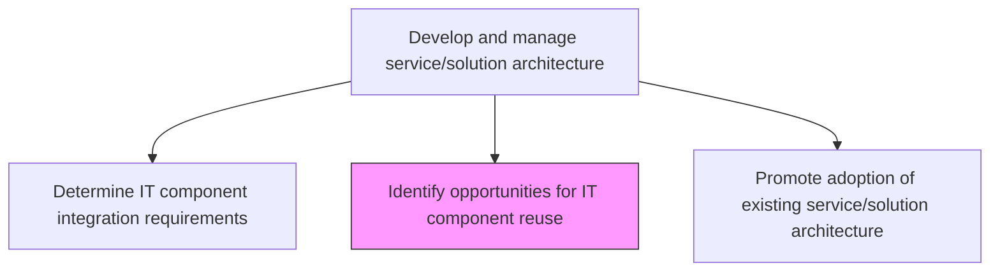
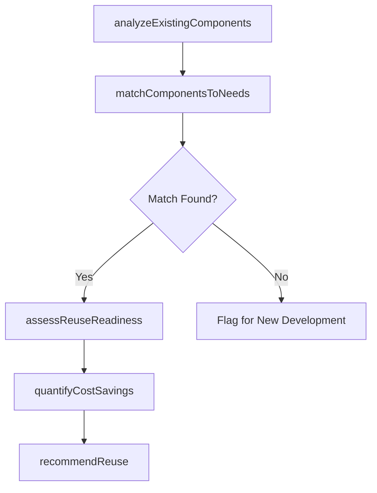

# Identify opportunities for IT component reuse

> Business-as-Code definition for systematically discovering and evaluating opportunities to reuse existing IT components across projects and services, reducing duplication and accelerating delivery.

## Overview

Identification of opportunities for reusing IT components so that they can be cost-effective and efficient.

## Process Hierarchy



## GraphDL

```yaml
identify:
  object: Opportunities For IT Component Reuse
  actor: ReuseAnalyst
  result: ReuseOpportunityReport
```

## Actions

| Action | Description |
|--------|-------------|
| analyzeExistingComponents | Review the current component inventory for reuse candidates |
| matchComponentsToNeeds | Compare existing components against new project requirements |
| assessReuseReadiness | Evaluate component adaptability, documentation, and maintainability for reuse |
| quantifyCostSavings | Calculate cost and time savings from reusing components versus building new |
| recommendReuse | Present reuse recommendations with supporting analysis to project teams |

## Events

| Event | Description |
|-------|-------------|
| existingComponentsAnalyzed | Current component inventory reviewed for reuse potential |
| componentsMatchedToNeeds | Existing components compared against new requirements |
| reuseReadinessAssessed | Component reuse readiness evaluation completed |
| costSavingsQuantified | Reuse cost and time savings calculated |
| reuseRecommended | Reuse recommendations presented to project teams |

## Searches

| Search | Description |
|--------|-------------|
| findReuseOpportunities | List reuse opportunities filtered by project, component type, or savings |
| getReuseReadinessScore | Retrieve the reuse readiness assessment for a specific component |
| getCostSavingsReport | Get the projected cost savings from component reuse |

## Process Flow



## RACI Matrix

| Activity | Responsible | Accountable | Consulted | Informed |
|----------|-------------|-------------|-----------|----------|
| analyzeExistingComponents | ReuseAnalyst | EnterpriseArchitect | ComponentLibrarian | DevelopmentLeads |
| matchComponentsToNeeds | ReuseAnalyst | EnterpriseArchitect | ProjectManagers | SolutionArchitects |
| quantifyCostSavings | ReuseAnalyst | EnterpriseArchitect | FinanceTeam | ITManagement |

## Related Processes

| Process | Relationship |
|---------|-------------|
| 8.5.1.5 Understand and select reusable service components | Parallel - component selection complements reuse identification |
| 8.5.3.3 Determine IT component integration requirements | Upstream - integration requirements reveal reuse potential |
| 8.5.1.6 Maintain service component portfolio | Downstream - reuse opportunities inform portfolio management |

## Related Departments

| Department | Role |
|-----------|------|
| Enterprise Architecture | Champions component reuse across the organization |
| Software Engineering | Identifies reuse candidates from project experience |
| IT Finance | Validates cost savings calculations |

## Related Occupations

| Occupation | Involvement |
|-----------|-------------|
| Reuse Analyst | Identifies and evaluates reuse opportunities |
| Enterprise Architect | Promotes reuse-first architecture principles |
| Software Engineer | Assesses technical feasibility of component reuse |

## KPIs

| KPI | Description | Unit |
|-----|-------------|------|
| Reuse Identification Rate | Number of reuse opportunities identified per quarter | Count |
| Reuse Adoption Rate | Percentage of identified reuse opportunities adopted by projects | % |
| Cost Savings from Reuse | Total cost savings achieved through component reuse | Currency |

## Usage

```typescript
import { identifyOpportunitiesForItComponentReuse } from '@headlessly/identify-opportunities-for-it-component-reuse'

const reuse = identifyOpportunitiesForItComponentReuse()

// Find reuse opportunities for a new project
const opportunities = await reuse.findReuseOpportunities({
  project: 'new-crm-integration',
  minSavingsPercentage: 20
})

// Check reuse readiness of a specific component
const readiness = await reuse.getReuseReadinessScore({
  componentId: 'shared-notification-service',
  targetProject: 'new-crm-integration'
})
```
